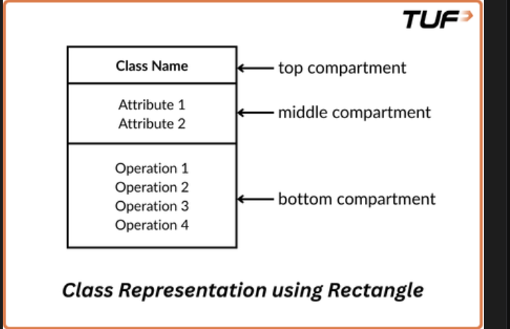
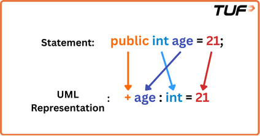
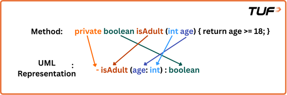
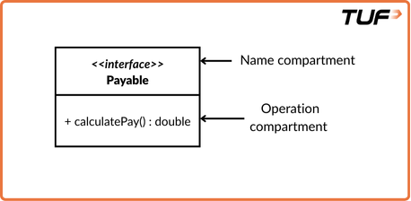
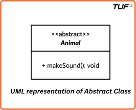
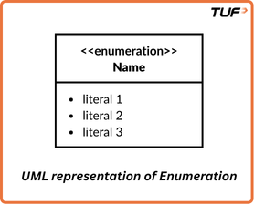
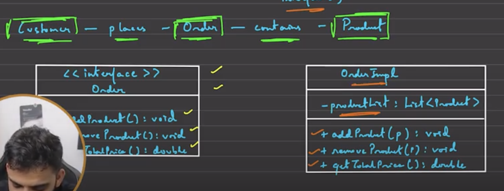
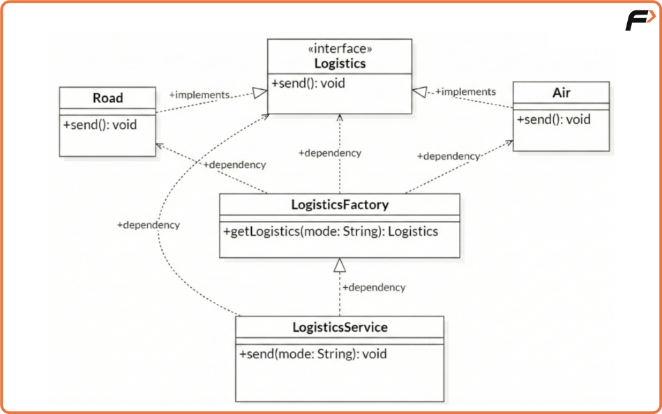
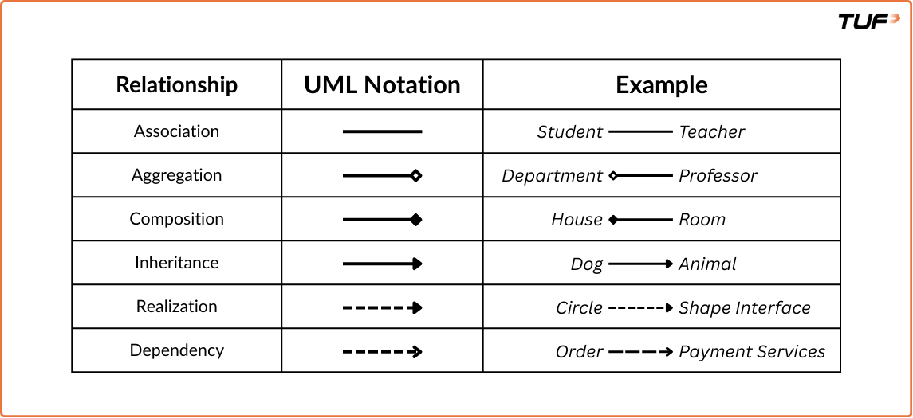

# LLD Basics — Revision Notes

> Design principles, SOLID, UML, and class relationships.
> Keep adding new topics as you learn more.

---

## Table of Contents

1. [HLD vs LLD](#1-hld-vs-lld)
2. [Core Design Principles — DRY, KISS, YAGNI](#2-core-design-principles)
3. [SOLID Principles](#3-solid-principles)
4. [UML — Unified Modeling Language](#4-uml--unified-modeling-language)
5. [Class Diagrams](#5-class-diagrams)
6. [Perspective Diagrams](#6-perspective-diagrams)
7. [Relationships Between Classes (UML)](#7-relationships-between-classes-uml)
8. [Design Patterns Introduction](#8-design-patterns-introduction)


---

## 1. HLD vs LLD

| Aspect          | High-Level Design (HLD)          | Low-Level Design (LLD)              |
|-----------------|----------------------------------|--------------------------------------|
| Purpose         | System overview & modules        | Detailed implementation & logic      |
| Level of Detail | Abstract                         | Highly Detailed                      |
| Focus           | Architecture, modules, interfaces| Class diagrams, methods, details     |
| Outcome         | Modules, System diagrams         | Detailed class/method diagrams       |

---

## 2. Core Design Principles

These three are **non-negotiable** cornerstone principles
for writing clean software:

1. **DRY** — Don't Repeat Yourself
2. **KISS** — Keep It Simple, Stupid
3. **YAGNI** — You Aren't Gonna Need It

---

### 2.1 DRY — Don't Repeat Yourself

Avoid duplication of code. If the same logic exists in
multiple places, extract it into a reusable function or class.
The risk of not doing so: you might forget to update all
occurrences when something changes.

**Applying DRY in Practice:**

- Identify repetitive code and replace it with a single,
  reusable code segment.
- Extract common functionality into methods or utility classes.
- Leverage libraries and frameworks when available.
- Refactor duplicate logic regularly across classes or layers.

**When NOT to Use DRY:**

- **Premature Abstraction:** Don't extract common code too
  early. Two code blocks might look similar now but could
  diverge later. Extracting them prematurely creates
  unnecessary coupling between unrelated parts.
- **Performance-Critical Code:** This is very important —
  you do not want to restrict flexibility for the sake of
  DRY. Sometimes, repeating optimized low-level logic is
  faster than calling a generalized, reusable method.
  Function calls, indirection, or generic wrappers might
  reduce performance or block compiler optimizations
  like inlining.
- **Sacrificing Readability:** If extracting repeated code
  makes the code less readable, prefer clarity over DRYness.
- **Legacy Codebases:** Don't refactor for DRY's sake in
  legacy code unless necessary and well-tested. Legacy code
  might lack tests or documentation. Introducing DRY by
  extracting shared logic can accidentally change behavior.
  Follow the "leave it alone unless you must touch it" rule.

---

### 2.2 KISS — Keep It Simple, Stupid

If you can solve a problem in a simple way, do it.
Avoid overengineering.

**Bad Code (Too Complex):**

```java
public class NumberUtils {
    public static boolean isEven(int number) {
        boolean isEven = false;
        if (number % 2 == 0) {
            isEven = true;
        } else {
            isEven = false;
        }
        return isEven;
    }
}
```

Problems: extra variables, unnecessary if-else,
longer and harder to follow.

**Good Code (Simple and Clear):**

```java
public class NumberUtils {
    public static boolean isEven(int number) {
        return number % 2 == 0;
    }
}
```

Simple, one-liner, easy to read, no overengineering.

---

### 2.3 YAGNI — You Aren't Gonna Need It

**"Always implement things when you actually need them,
never when you just foresee that you need them."**

Don't add functionality until it's necessary. If you're
building a note-taking app that only needs Create and View,
don't start preparing for categories, tagging, or
Google Drive sync just because you *think* you might
need them later. That creates unnecessary complexity and
wastes time.

**Benefits:** Reduced waste, simplified codebase,
faster development.

**When NOT to Use YAGNI:**

- **Well-Known Requirements:** If a feature is guaranteed
  and coming soon, preparing for it now is more efficient.
  *Example: A messaging service that currently supports
  only text, but image support is committed for 2 sprints
  from now — designing the data model for attachments
  now saves significant refactoring later.*

  > **Personal note:** This makes sense — like how I would
  > have sorted by sk,pk instead of pk,sk if I had not
  > thought about the future feature of record level restore.

- **Performance-Critical Areas:** Preemptively building and
  testing real-world usage patterns can catch bottlenecks
  early in systems where performance is a first-class
  concern.

---

## 3. SOLID Principles

A set of five principles for writing clean, scalable,
maintainable object-oriented code.

| # | Principle                          | One-liner                                                |
|---|------------------------------------|----------------------------------------------------------|
| S | Single Responsibility              | One class, one reason to change                          |
| O | Open/Closed                        | Open for extension, closed for modification              |
| L | Liskov Substitution                | Subclass must be substitutable for parent                |
| I | Interface Segregation              | Don't force unused methods on a class                    |
| D | Dependency Inversion               | Depend on abstractions, not concretions                  |

---

### 3.1 Single Responsibility Principle (SRP)

**"A class should have only one responsibility and only
one reason to change."**

If a class takes on more than one responsibility, it
becomes coupled. A change in one responsibility may
ripple into the other, causing bugs across the codebase.

**Example — TUF+ Compiler**

A compiler does many things: add driver code, check syntax,
run test cases, store output in DB, return output to user.

Putting all of that in one `TUFplusCompiler` class violates
SRP. Instead, break it down:

- `DriverCodeGenerator` — adds driver code
- `SyntaxChecker` — performs syntax checks
- `TestRunner` — runs code with test cases
- `DatabaseManager` — stores output in the database
- `UserOutputHandler` — returns output to the user
- `Coordinator` — coordinates between all modules

Each class can be modified or replaced independently.

**Common SRP Violations:**

- Mixing database logic (SQL, JDBC) with business logic.
- Coupling UI code with business logic.

**SRP is not just for classes.** It applies to methods,
modules, microservices, and entire systems. It's a mindset:
ensure each component has a single responsibility so that
changes in one area don't affect others unnecessarily.

---

### 3.2 Open/Closed Principle (OCP)

**"Software entities should be open for extension but
closed for modification."**

If a module is open for modification, any change in it
can affect other modules, making the codebase hard to
maintain.

**Bad Design — Violating OCP**

```java
class InvoiceProcessor {
    public double calculateTotal(
        String region, double amount
    ) {
        if (region.equalsIgnoreCase("India")) {
            return amount + amount * 0.18;
        } else if (region.equalsIgnoreCase("US")) {
            return amount + amount * 0.08;
        } else if (region.equalsIgnoreCase("UK")) {
            return amount + amount * 0.12;
        } else {
            return amount;
        }
    }
}
```

Problems: Adding a new region (e.g., Germany) requires
modifying this method. You risk breaking existing logic.
Hard to test, maintain, or scale.

**Good Design — Follows OCP**

```java
interface TaxCalculator {
    double calculateTax(double amount);
}

class IndiaTaxCalculator implements TaxCalculator {
    public double calculateTax(double amount) {
        return amount * 0.18; // GST
    }
}

class USTaxCalculator implements TaxCalculator {
    public double calculateTax(double amount) {
        return amount * 0.08; // Sales Tax
    }
}

class UKTaxCalculator implements TaxCalculator {
    public double calculateTax(double amount) {
        return amount * 0.12; // VAT
    }
}

class Invoice {
    private double amount;
    private TaxCalculator taxCalculator;

    public Invoice(
        double amount, TaxCalculator taxCalculator
    ) {
        this.amount = amount;
        this.taxCalculator = taxCalculator;
    }

    public double getTotalAmount() {
        return amount
            + taxCalculator.calculateTax(amount);
    }
}

class Main {
    public static void main(String[] args) {
        double amount = 1000.0;

        Invoice indiaInvoice = new Invoice(
            amount, new IndiaTaxCalculator()
        );
        System.out.println(
            "Total (India): ₹"
            + indiaInvoice.getTotalAmount()
        );

        Invoice usInvoice = new Invoice(
            amount, new USTaxCalculator()
        );
        System.out.println(
            "Total (US): $"
            + usInvoice.getTotalAmount()
        );
    }
}
```

The `Invoice` class is decoupled from specific tax types
by receiving a `TaxCalculator` from the outside — this is
**Dependency Injection**. New regions can be added by
creating a new class that implements `TaxCalculator`,
without touching existing code.

**When to Apply OCP:**

- When a class is becoming a **God Class** — handling too
  many responsibilities or branching logic.
- When developing frameworks, plugins, or extensible
  systems (billing engines, tax calculators, UI components).
- That said, applying it preemptively without clear
  extension needs can introduce unnecessary abstraction.
  Most effective when applied in response to observed
  patterns of change.

**Common Misconceptions:**

- *"Code should never be changed again."* — No. OCP
  emphasizes avoiding changes to core logic while allowing
  behavior to be extended safely.
- *"OCP leads to too many classes, so it's overkill."* —
  The trade-off typically improves modularity, testability,
  and maintainability in systems expected to evolve.
- *"OCP should always be applied upfront."* — Applying
  it preemptively can result in unnecessary abstraction.
  Use it in response to emerging patterns of change.
- *"Refactoring contradicts OCP."* — Refactoring is
  frequently a step toward making code OCP-compliant.
- *"OCP makes retesting legacy code unnecessary."* —
  New extensions still need thorough testing.

---

### 3.3 Liskov Substitution Principle (LSP)

**"If S is a subtype of T, then objects of type T may be
replaced with objects of type S without altering the
correctness of the program."**

Think of it like this: if you write code using a parent
class (say `Shape`), and later swap in a child class
(like `Circle`), the code should still work without errors
or unexpected behavior. If the subclass changes behavior
in a way that breaks expectations, it violates LSP.

**Classic Violation — Rectangle & Square**

```java
class Rectangle {
    int width, height;

    void setWidth(int w) { width = w; }
    void setHeight(int h) { height = h; }
    int getArea() { return width * height; }
}

class Square extends Rectangle {
    @Override
    void setWidth(int w) {
        width = w;
        height = w;
    }

    @Override
    void setHeight(int h) {
        height = h;
        width = h;
    }
}

class Main {
    public static void main(String args[]) {
        Rectangle r = new Square();
        printArea(r);
    }

    private static void printArea(Rectangle r) {
        r.setWidth(5);
        r.setHeight(10);
        // Expected: 50, Actual: 100
        System.out.println(r.getArea());
    }
}
```

`Square` violates LSP because it changes the behavior of
`setWidth` and `setHeight`, breaking the assumptions of
the parent class. We set width=5 and height=10, expecting
area=50, but we get 100 because both became 10.

The problem is with the shape contract — every shape
cannot have independent width and height.

**Correct Design — Separate Abstraction:**

```java
abstract class Shape {
    abstract int getArea();
}
```

**LSP in Practice — Notification System**

```java
class Notification {
    public void sendNotification() {
        System.out.println("Notification sent");
    }
}

class EmailNotification extends Notification {
    @Override
    public void sendNotification() {
        System.out.println("Email Notification sent");
    }
}

class TextNotification extends Notification {
    @Override
    public void sendNotification() {
        System.out.println("Text Notification sent");
    }
}

class Main {
    public static void main(String args[]) {
        Notification notification =
            new EmailNotification();
        notification.sendNotification();
    }
}
```

The only change needed to introduce new notification
types is creating subclasses with overridden
`sendNotification()`. The main class stays unchanged
except for the object declaration. This is the power
of LSP — extend the system without breaking existing code.

**Issues When LSP Is Violated:**

- Tight coupling between parent and child class.
- Less reusability and unpredictable behavior.

**How to Spot LSP Violations:**

- Does the subclass override methods in a way that
  changes meaning or assumptions?
- Can I replace the base class with the subclass
  everywhere without breaking correctness?
- Does the subclass throw unexpected exceptions or
  return wrong values?

**Key Principles to Avoid Violations:**

- Subclasses should honor the contract (expectations)
  of the parent class.
- Avoid overriding methods in a way that changes behavior
  drastically.
- **Prefer composition over inheritance** when possible —
  inheritance makes it easy to override behavior and
  break assumptions.
- Think in terms of interfaces and behavioral
  compatibility.
- Subclass should only **extend**, not restrict behavior.

---

### 3.4 Interface Segregation Principle (ISP)

**"Don't force a class to depend on methods it does
not use."**

In simpler terms: don't make large, bloated interfaces.
Make smaller, more specific interfaces.

**Uber Example — Bad Interface Design (Violates ISP):**

```java
interface UberUser {
    void bookRide();
    void acceptRide();
    void trackEarnings();
    void ratePassenger();
    void rateDriver();
}
```

This forces `Rider` to implement methods it never uses:

```java
class Rider implements UberUser {
    public void bookRide() { /* yes */ }
    public void acceptRide() { /* not needed */ }
    public void trackEarnings() { /* not needed */ }
    public void ratePassenger() { /* not needed */ }
    public void rateDriver() { /* yes */ }
}
```

Extremely messy. Rider is forced to implement stuff
it never uses.

**Good Interface Design (Follows ISP):**

```java
interface RiderInterface {
    void bookRide();
    void rateDriver();
}

interface DriverInterface {
    void acceptRide();
    void trackEarnings();
    void ratePassenger();
}
```

Each class gets exactly what it needs — no more, no less.

**When to Apply ISP:**

- You see a class implementing methods it doesn't use.
- An interface grows too big and is used by multiple
  types of classes.
- Adding a new feature requires modifying several
  unrelated classes — essentially, some classes start
  throwing errors or you are forced to implement methods
  you don't need.

> **Remember:** Fat interfaces are bad. Slim,
> purpose-specific interfaces are good.

---

### 3.5 Dependency Inversion Principle (DIP)

**"High-level modules should not depend on low-level
modules. Both should depend on abstractions.
Abstractions should not depend on details. Details
should depend on abstractions."**

In simpler words: rather than high-level classes
controlling and depending on the details of lower-level
ones, both should rely on interfaces or abstract classes.
This makes code flexible, testable, and easier to maintain.

**Key Terms:**

- **High-Level Modules** — the core logic, the "brains"
  of the application. They make big decisions and
  coordinate features. *Think: CEO.*
- **Low-Level Modules** — handle the details: database
  calls, API calls, file I/O. They support the
  high-level logic. *Think: Employees who execute.*

**Real-Life Analogy:**

You're hungry and want pizza. You use a food delivery
app, not contact the chef directly.

```
You (High-level) → Food App (Abstraction) → Restaurant (Low-level)
```

You don't care which chef makes the pizza, how it's made,
or who delivers it — you just want it delivered on time.
You depend on the food delivery system (abstraction),
not on any specific restaurant (implementation).

**Without DIP — Tightly Coupled Code:**

```java
class RecentlyAdded {
    public void getRecommendations() {
        System.out.println(
            "Showing recently added content..."
        );
    }
}

class RecommendationEngine {
    private RecentlyAdded recommender =
        new RecentlyAdded();

    public void recommend() {
        recommender.getRecommendations();
    }
}
```

The high-level module `RecommendationEngine` depends
directly on the low-level module `RecentlyAdded`. If we
want to switch to `TrendingNow` or `GenreBased`, we have
to modify the engine. We should never depend on a
low-level module while being a high-level module. Instead,
create fixed interfaces that everyone follows, and swap
the concrete object at runtime.

**With DIP — Using Abstraction:**

```java
interface RecommendationStrategy {
    void getRecommendations();
}

class RecentlyAdded implements RecommendationStrategy {
    public void getRecommendations() {
        System.out.println(
            "Showing recently added content..."
        );
    }
}

class TrendingNow implements RecommendationStrategy {
    public void getRecommendations() {
        System.out.println(
            "Showing trending content..."
        );
    }
}

class GenreBased implements RecommendationStrategy {
    public void getRecommendations() {
        System.out.println(
            "Showing content based on "
            + "your favorite genres..."
        );
    }
}

class RecommendationEngine {
    private RecommendationStrategy strategy;

    public RecommendationEngine(
        RecommendationStrategy strategy
    ) {
        this.strategy = strategy;
    }

    public void recommend() {
        strategy.getRecommendations();
    }
}

class Main {
    public static void main(String[] args) {
        RecommendationStrategy strategy =
            new TrendingNow();
        RecommendationEngine engine =
            new RecommendationEngine(strategy);
        engine.recommend();
    }
}
```

> **Important observation:** `RecommendationEngine` does
> NOT implement the `RecommendationStrategy` interface.
> That doesn't make sense because it's a high-level module
> orchestrating the entire recommendation flow — you don't
> want it implementing multiple interfaces. Instead, it
> uses **composition**: it holds a `strategy` field of type
> `RecommendationStrategy`, and that strategy is **injected
> through dependency injection** (passed via the
> constructor).

**Dependency Injection** is called that because we are
directly injecting the strategy we want at runtime.
We can inject `RecentlyAdded`, `GenreBased`, or
`TrendingNow` — the `RecommendationEngine` has no need
to know how the strategy object was ever created.

Here:
- `RecommendationEngine` doesn't care *how*
  recommendations are made — it just needs a
  recommendation.
- The strategies can be switched or upgraded anytime,
  without changing the engine.

---

## 4. UML — Unified Modeling Language

UML is a standardized modeling language used to
**visualize, specify, construct, and document** the
structure and behavior of software systems.

UML diagrams fall into two categories:

### 4.1 Structural Diagrams

Describe the **static structure** of a system — what it
contains, how parts relate, and how data is organized.
Like architectural blueprints showing the foundation,
components, and connections. Focus on elements that
**exist** in the system (classes, objects, hardware),
not what happens during execution.

**Types:** Class Diagram, Object Diagram,
Component Diagram, Deployment Diagram, Package Diagram,
Profile Diagram, Composite Structure Diagram.

### 4.2 Behavioral Diagrams

Describe the **dynamic behavior** of a system — how it
behaves over time, how users interact, how parts
communicate during execution. Like the scripts and
animations in a movie — showing what happens, when,
and who is involved. Focus on actions, interactions,
processes, and state changes.

**Types:** Activity Diagram, State Machine Diagram,
Sequence Diagram, Communication Diagram,
Interaction Overview Diagram, Timing Diagram,
Use Case Diagram.

> **Note for LLD:** The **Class Diagram** is the most
> important UML diagram for LLD. It provides a clear
> view of classes, their attributes, methods, and
> relationships — essential for designing and
> implementing software systems effectively.

---

## 5. Class Diagrams

A UML Class Diagram provides a high-level overview of
the system architecture. It captures classes, interfaces,
enumerations, their attributes and operations (methods),
and the relationships among them. It is used in both
forward and reverse engineering and is widely used in
modeling object-oriented systems.

### 5.1 Class Representation

A class is depicted as a rectangle divided into three
compartments:

| Compartment | Contains                              |
|-------------|---------------------------------------|
| Top         | Class name (bold, centered)           |
| Middle      | Attributes                            |
| Bottom      | Operations (methods)                  |



Each attribute or method is listed with its visibility
marker, name, and type (for attributes) or return type
(for methods). Parameters for methods are also specified
in the parentheses.

**Visibility Markers:**

| Symbol | Meaning   |
|--------|-----------|
| `+`    | public    |
| `-`    | private   |
| `#`    | protected |
| `~`    | default   |

### 5.2 Attributes and Methods Syntax

**Attributes:**
`visibility name: Type [multiplicity] = DefaultValue`

Example: `public int age = 21;` becomes `+ age: int = 21`



**Methods:**
`visibility name(parameterName1: Type1, ...): ReturnType`

Example: `private boolean isAdult(int age)` becomes
`- isAdult(age: int): boolean`



Optional elements like multiplicity, default values,
and stereotypes (e.g., `<<constructor>>`, `<<static>>`)
can also enrich the diagram.

### 5.3 Interface

- **Name compartment:** Contains `<<interface>>` stereotype
  and the interface name.
- **Operation compartment:** Contains method signatures
  (abstract operations to be implemented).

```java
public interface Payable {
    double calculatePay();
}
```



By default, interfaces don't have an attribute compartment
like regular classes. Exception: if the interface declares
constants, you may include one to show them.

### 5.4 Abstract Class

Represented with the `<<abstract>>` stereotype above
the class name, and the class name is in *italics*.



### 5.5 Enumeration (Enum)

A data type with a fixed set of named values (literals).
Represented with the `<<enumeration>>` stereotype above
the name in one compartment and a list of literals
in another.



---

## 6. Perspective Diagrams

Three perspectives determine how much detail a class
diagram should show, depending on the audience:

### 6.1 Conceptual Perspective

**Audience:** Business Analysts, Domain Experts.

Provides a high-level view focusing on main concepts and
their relationships. Used in the early stages of design
to establish common understanding among stakeholders.

> These people just want to know the relationship — like
> "customer places an order, which contains a product" —
> and nothing more than that.

**Diagram Style:**
- Classes represent real-world concepts
  (`Customer`, `Order`, `Invoice`).
- No attributes or operations unless absolutely necessary.
- Relationships depict business-level associations,
  not implementation details.

### 6.2 Specification Perspective

**Audience:** System Architects, Software Designers.

Defines structure and behavior of classes, focusing on
responsibilities, roles, and collaborations — without
code-level details. Highlights what operations a class
should support, enabling interface and design-level
planning.

> These people focus on what kind of design patterns
> we are going to use and how modular and reusable
> our code is.

**Diagram Style:**
- Includes abstract classes, interfaces, key public
  methods.
- Shows associations and inheritance relationships.
- Focuses on contract-based design (what a class
  promises to do).

### 6.3 Implementation Perspective

**Audience:** Developers, Software Engineers.

A concrete, code-level view. Includes complete class
definitions, access modifiers, attributes with types
and defaults, and full method signatures. Used during
the implementation phase.

> These people will actually implement the product,
> so they need to know everything.

**Diagram Style:**
- Shows all attributes (public, private, etc.)
  and methods.
- Includes visibility markers (`+`, `-`, `#`).
- May show data types, default values, constructors.
- All relationships — association, aggregation,
  composition, inheritance, dependency — are
  explicitly visualized.



---

## 7. Relationships Between Classes (UML)

```
Association
 ├── Aggregation  (weak ownership)
 └── Composition  (strong ownership)
Inheritance (IS-A)
Realization (Implements)
Dependency (Uses temporarily)
```

Aggregation and composition are specialized forms of
association with strict rules, while association itself
is a general relationship.

---

### 7.1 Association (USE-A)

A general relationship where one class uses or interacts
with another. Can be one-to-one, one-to-many, or
many-to-many.

*Example:* A teacher can teach multiple students, and a
student can be taught by multiple teachers
(many-to-many).

**UML Notation:** A solid line between the two classes.

---

### 7.2 Aggregation (HAS-A)

A "whole-part" relationship where a class is made up of
one or more classes, but the parts can **exist
independently**.

*Example:* A `Department` has multiple `Professor`s.
If the department is removed, the professors still exist.

**UML Notation:** A solid line with a **hollow diamond**
at the container (whole) class.

---

### 7.3 Composition (Strong HAS-A)

A stronger form of aggregation where the part **cannot
exist without the whole**. The part's lifecycle is
entirely dependent on the whole.

*Example:* A `House` has `Room`s. If the `House` is
destroyed, so are the `Room`s.

**UML Notation:** A solid line with a **filled diamond**
at the whole side.

> **Important insight:** Don't always map this 1:1 to
> the real world. Imagine a restaurant and a menu item.
> You might think "if I delete a restaurant, the items
> obviously won't exist." But items like "gobi manchuri"
> can be used by multiple restaurants. If one restaurant
> is deleted, another restaurant can still use that item.
> So this would be **aggregation**, not composition.

**Before drawing diamonds in UML, ask:**

Is this a **whole–part** relationship?
- If **no** → it is plain association.
- Aggregation and composition are **only** for
  whole–part modeling.
- If it's not whole–part → it is association.
- Like think, students and teachers. Are students part of teachers? Are teachers part of students? No, then it's probably going to be just association.

---

### 7.4 Inheritance (IS-A)

An IS-A relationship where a subclass inherits properties
and behavior from a superclass. The subclass can extend
or override the superclass's attributes and methods.

*Example:* A `Dog` IS-A `Animal`.

**UML Notation:** A solid line with a **hollow triangle**
pointing to the parent class.

---

### 7.5 Realization (Implementation)

The relationship between a class and an interface. The
class agrees to implement the behavior declared by the
interface.

*Example:* A `Circle` class implements the `Shape`
interface.

**UML Notation:** A dashed line with a **hollow triangle**
pointing to the interface.

---

### 7.6 Dependency

One class uses another class **temporarily**. Changes to
the used class may affect the dependent class. This is
not a one-to-one, many-to-one, or many-to-many
relationship — one service might depend on another, and
there is no object sharing at all.

*Example:* `OrderService` depends on `PaymentService`
to process payments.

**UML Notation:** A dashed line with an **open arrow**
pointing to the class being used.

---

### 7.7 How to Decide: Dependency vs Aggregation vs Composition

The key question is: **where does the other class appear
in your code — as a field, or only inside a method?**

**If the class appears only inside a method body**
(local variable, parameter, return type, or static
method call) and is **not stored as a field** →
it is a **Dependency**.

**If the class is stored as a field** → then ask:
- Does the parent **create** the child internally?
  → **Composition** (strong ownership, lifecycle tied)
- Is the child **passed in** from outside?
  → **Aggregation** (weak ownership, independent lifecycle)

#### Concrete Example — Factory Pattern Diagram

Look at the Factory Pattern logistics diagram:



Every dashed arrow in this diagram is a **dependency**.
Here's why for each one:

**LogisticsFactory → Air, Road, Logistics:**

```java
class LogisticsFactory {
    public static Logistics getLogistics(String mode) {
        if (mode.equalsIgnoreCase("AIR")) {
            return new Air();    // local, not stored
        } else if (mode.equalsIgnoreCase("ROAD")) {
            return new Road();   // local, not stored
        }
        throw new IllegalArgumentException("Not supported");
    }
}
```

`LogisticsFactory` creates `Air` and `Road` objects but
**does not store them as fields**. It creates them inside
a method and immediately returns them. There is no
`private Air air;` or `private List<Logistics> list;`.
No field = no ownership = not aggregation, not
composition. It's a pure **dependency** — the factory
*uses* these classes temporarily inside a method body,
then it's done.

**LogisticsService → LogisticsFactory:**

```java
class LogisticsService {
    public void send(String mode) {
        Logistics l = LogisticsFactory.getLogistics(mode);
        l.send();
    }
}
```

`LogisticsService` calls a **static method** on
`LogisticsFactory`. It doesn't hold a factory instance
as a field. It just *uses* the factory temporarily inside
`send()`. No field → **dependency**.

**LogisticsService → Logistics (the interface):**

In the same method, the `Logistics` object returned by
the factory is stored in a **local variable** `l`, used
for one call (`l.send()`), and then the variable dies
when the method ends. Again, no field, no ownership →
**dependency**.

#### The Decision Checklist

| Where does ClassB appear in ClassA?          | Relationship |
|----------------------------------------------|--------------|
| Only inside a method (local var, param, static call) | **Dependency** |
| As a field, and ClassA **creates** it internally      | **Composition** |
| As a field, and ClassB is **passed in** from outside  | **Aggregation** |
| As a field, general interaction, no whole-part        | **Association** |

> **Key insight:** The word "creates" alone doesn't make
> it composition. `LogisticsFactory` *creates* `Air` and
> `Road` objects, but it doesn't *own* them — it hands
> them off immediately. Composition requires both
> **creation AND storage as a field** with lifecycle
> ownership. If you create something and immediately
> give it away, that's just a dependency.


---



---

## 8. Design Patterns Introduction
The Three Categories of Design Patterns

### 8.1 Creational Patterns
These focus on object creation mechanisms, trying to create objects in a manner suitable to the situation. They abstract the instantiation process, making the system independent of how its objects are created.

Real-World Analogy
Imagine ordering a drink at a vending machine. You press a button (say “Orange Juice”), and the machine internally figures out how to prepare it — whether to pour from a bottle, mix a concentrate, or use a fresh dispenser. You don't care how it's made — you just get your drink.

This is similar to the Factory Pattern, where the creation logic is hidden from the user and abstracted for flexibility.

Examples include:
Singleton
Factory Method
Abstract Factory
Builder
Prototype

### 8.2 Structural Patterns
These deal with object composition — how classes and objects can be combined to form larger structures while keeping the system flexible and efficient. It helps systems to work together that otherwise could not because of incompatible interfaces.

Real-World Analogy
Suppose you have a modern smartphone (your system) that uses a USB-C charger, but your old power adapter only supports micro-USB. Instead of replacing either device, you use an adapter that connects the two.

That adapter is like a structural pattern (specifically, the Adapter Pattern) — it allows incompatible components to work together seamlessly without changing their internals.

Examples include:
Adapter
Bridge
Composite
Decorator
Facade
Flyweight
Proxy

### 8.3 Behavioral Patterns
These are concerned with object interaction and responsibility — how they communicate and assign responsibilities while ensuring loose coupling.
Mainly deals with how objects communicate with each other.
Real-World Analogy
Think of a restaurant. The waiter takes your order and passes it to the kitchen. You don't talk directly to the chef — the waiter acts as a mediator between you and the kitchen.

This reflects the Mediator Pattern, which defines an object that controls communication between other objects, preventing tight interdependencies.

Examples include:
Observer
Strategy
Command
Chain of Responsibility
Mediator
State
Template Method
Visitor
Iterator
Memento
Interpreter

This is just a brief overview of design patterns. Each pattern has its own unique characteristics, advantages, and use cases. In the following topics, we will delve deeper into each category and explore specific patterns in detail.


---
*Keep adding new sections below as you learn more.*
