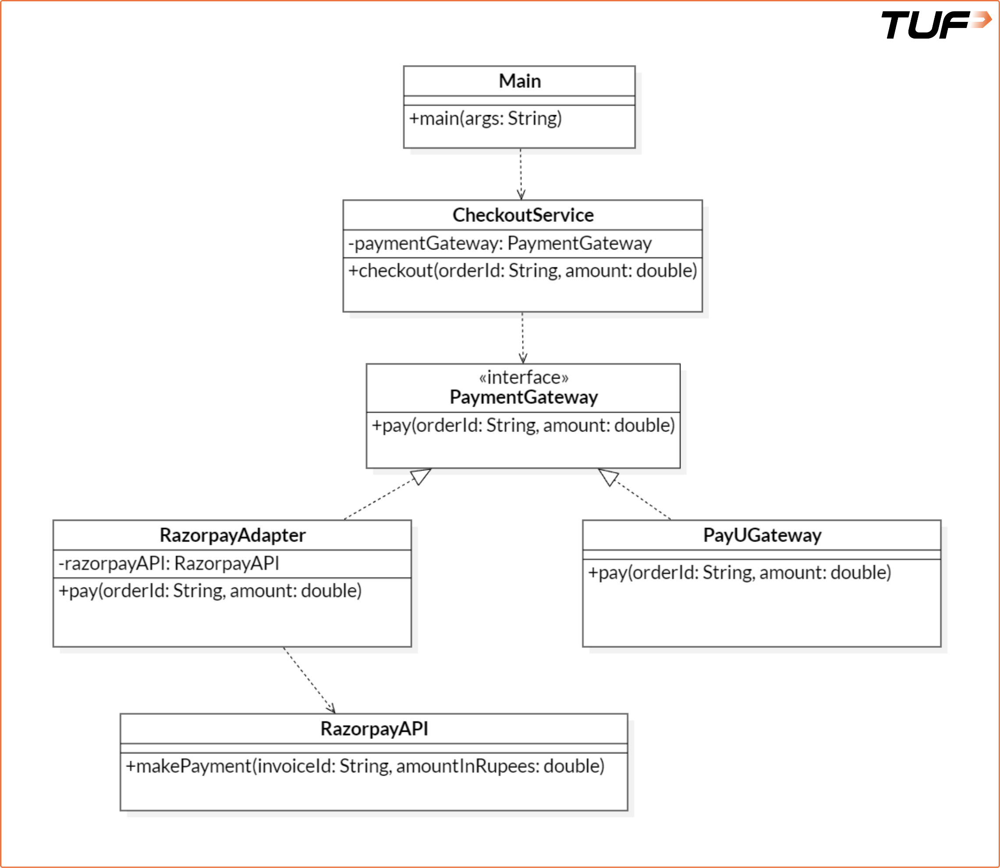
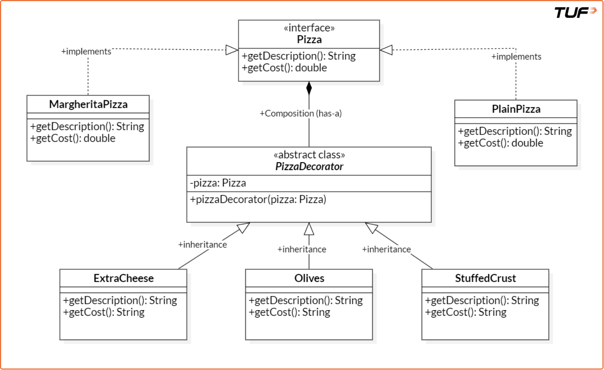
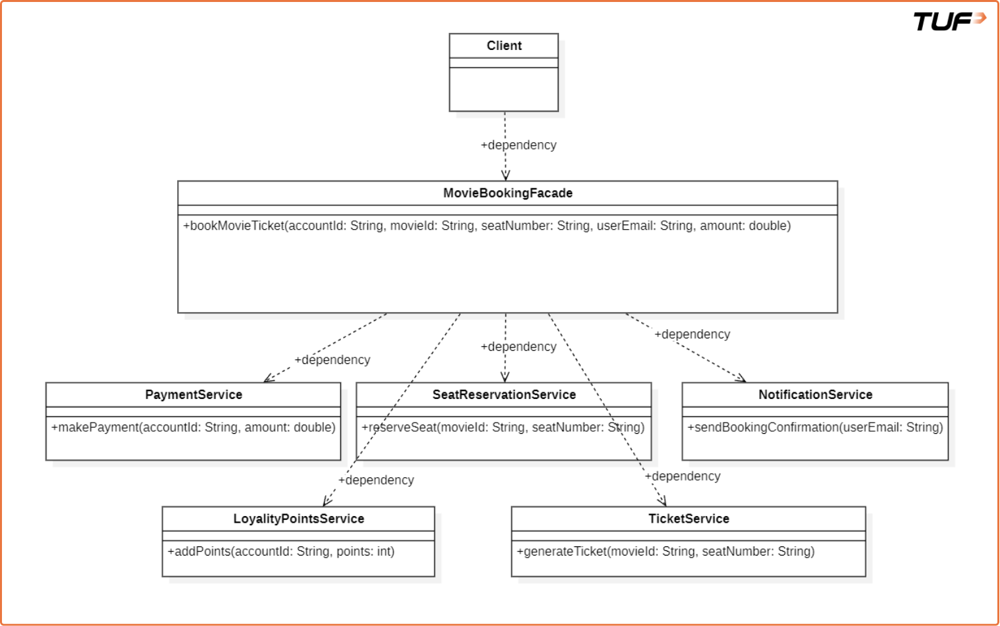
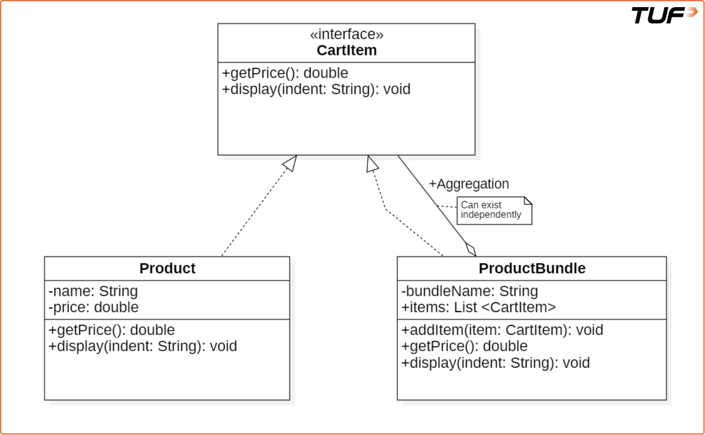
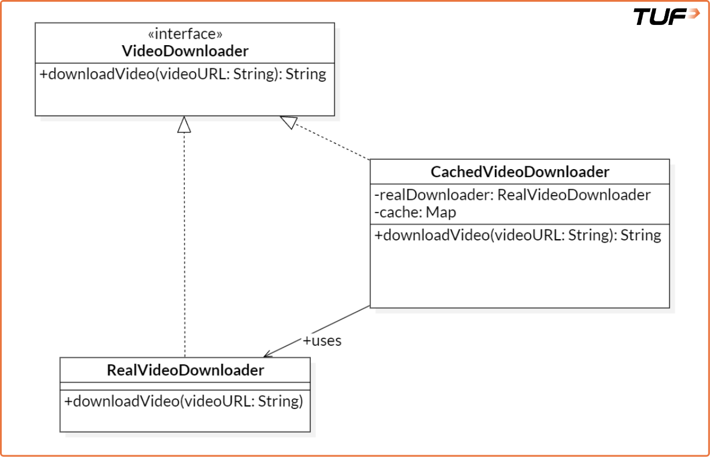
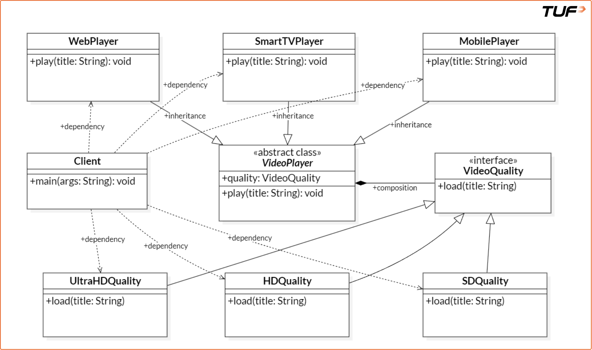

# Structural Design Patterns

Structural design patterns are concerned with the
composition of classes and objects. They focus on how to
assemble classes and objects into larger structures while
keeping these structures flexible and efficient.

Think of structural pattern as a way of designing smaller objects so that they support larger objects, but the smaller objects should be decoupled as much as possible.

## Table of Contents

1. [Adapter Pattern](#adapter-pattern)
2. [Decorator Pattern](#decorator-pattern)
3. [Facade Pattern](#facade-pattern)
4. [Composite Pattern](#composite-pattern)
5. [Proxy Pattern](#proxy-pattern)
6. [Bridge Pattern](#bridge-pattern)

---

## Adapter Pattern

The **Adapter Pattern** allows incompatible interfaces to
work together by acting as a translator or wrapper around
an existing class. It converts the interface of a class
into another interface that a client expects.

It acts as a bridge between the **Target** interface
(expected by the client) and the **Adaptee** (an existing
class with a different interface). This structural wrapping
enables integration and compatibility across diverse
systems.

### Real-Life Analogy

Imagine traveling from India to Europe. Your mobile charger
doesn't fit into European sockets. Instead of buying a new
charger, you use a plug adapter. The adapter allows your
charger (with its Indian plug) to fit the European socket,
enabling charging without modifying either the socket or
the charger.

### Problem It Solves

- Interface incompatibility between classes.
- Reusability of existing classes without modifying their
  source code.
- Enables systems to communicate that otherwise couldn't
  due to differing method signatures.

Similarly, the Adapter Pattern allows objects with
incompatible interfaces to collaborate by introducing an
adapter.

### Example: Payment Gateway System

Let's consider a scenario where we are implementing a
Payment Gateway System with two different payment methods:
PayU and Razorpay. While PayU already conforms to the
expected interface, Razorpay follows a different structure.

#### Without Adapter (Incompatible Interface)

```java
import java.util.*;

// Target Interface:
// Standard interface expected by the CheckoutService
interface PaymentGateway {
    void pay(String orderId, double amount);
}

// Concrete implementation of PaymentGateway for PayU
class PayUGateway implements PaymentGateway {
    @Override
    public void pay(String orderId, double amount) {
        System.out.println(
            "Paid Rs. " + amount
            + " using PayU for order: " + orderId);
    }
}

// Adaptee:
// An existing class with an incompatible interface
class RazorpayAPI {
    public void makePayment(
            String invoiceId, double amountInRupees) {
        System.out.println(
            "Paid Rs. " + amountInRupees
            + " using Razorpay for invoice: " + invoiceId);
    }
}

// Client Class:
// Uses PaymentGateway interface to process payments
class CheckoutService {
    private PaymentGateway paymentGateway;

    // Constructor injection for dependency inversion
    public CheckoutService(PaymentGateway paymentGateway) {
        this.paymentGateway = paymentGateway;
    }

    // Business logic to perform checkout
    public void checkout(String orderId, double amount) {
        paymentGateway.pay(orderId, amount);
    }
}

class Main {
    public static void main(String[] args) {
        CheckoutService checkoutService =
            new CheckoutService(new PayUGateway());

        checkoutService.checkout("12", 1780);
    }
}
```

#### Understanding the Issues

- `CheckoutService` expects any payment provider to
  implement the `PaymentGateway` interface.
- `PayUGateway` fits this requirement and works correctly.
- `RazorpayAPI`, however, uses a different method
  (`makePayment`) and does not implement `PaymentGateway`.
- Due to this mismatch, `RazorpayAPI` cannot be used
  directly with `CheckoutService`.

This is a case of **interface incompatibility**, where
similar functionalities can't work together because of
structural differences. To solve this without modifying
existing code, we use the Adapter Pattern.

#### With Adapter Pattern

> **Personal note:** The idea is that we create an adapter
> class which implements the methods defined in the
> interface, and each method in the adapter class
> essentially calls the actual class method. The only thing
> we need to figure out is where to initialize the actual
> object — and that we can do via the adapter's constructor.
> Always think of this as: putting an adapter plug over a
> USB charger essentially translates to putting another
> class which takes the original class as a parameter.

```java
// Adapter Class:
// Allows RazorpayAPI to be used where PaymentGateway
// is expected
class RazorpayAdapter implements PaymentGateway {
    private RazorpayAPI razorpayAPI;

    public RazorpayAdapter() {
        this.razorpayAPI = new RazorpayAPI();
    }

    // Translates the pay() call to RazorpayAPI's
    // makePayment() method
    @Override
    public void pay(String orderId, double amount) {
        razorpayAPI.makePayment(orderId, amount);
    }
}
```

### UML Note: Association vs. Dependency

When analyzing a UML diagram for the Adapter Pattern, it's
crucial to correctly identify the relationships:

- **Association (Solid Line)**: Used when a class maintains
  an instance variable (field) of another class. In our
  example, `RazorpayAdapter` contains
  `private RazorpayAPI razorpayAPI;` and `CheckoutService`
  contains `private PaymentGateway paymentGateway;`. Since
  they maintain a reference at the class level, these
  represent **Association**.
- **Dependency (Dashed Line)**: A weaker "uses-a"
  relationship, used when a class temporarily uses another
  (e.g., as a method parameter, local variable, or return
  type) but does *not* store it as an instance variable.

If a diagram shows a dashed line (dependency) where an
instance variable is maintained, it is technically less
precise. Because the Adapter stores the Adaptee as a field,
the relationship between Adapter and Adaptee is an
**Association**, not just a dependency.

### When to Use

- Existing class with an incompatible interface.
- Legacy code you don't want to modify.
- External library you cannot modify.

### Real-World Use Cases (VVIMP)

**1. Payment Gateways**

*Scenario:* Different payment providers (e.g., PayPal,
Stripe, Razorpay, PayU) expose their own APIs with varying
method names, parameters, and response formats.

*Adapter Use:* By implementing a common `PaymentGateway`
interface and creating adapters for each provider,
businesses can switch or support multiple gateways without
rewriting business logic. This decouples the checkout flow
from provider-specific implementations.

**2. Logging Frameworks**

> **Personal note:** I have implemented this in the
> `LoggingExample.java` file.

*Scenario:* Enterprise applications often need to support
different logging libraries like Log4j, SLF4J, or custom
logging solutions.

*Adapter Use:* An adapter can unify the logging interface so
developers can write `log.debug(...)`, regardless of
whether the underlying implementation is Log4j or
`java.util.logging`. This makes it easier to switch or
support multiple logging backends with minimal changes.

**3. Cloud Providers and SDKs**

*Scenario:* Cloud platforms like AWS, Azure, and Google
Cloud offer similar functionalities (storage, compute,
database) but expose them through different SDKs and APIs.

*Adapter Use:* Using an adapter layer, developers can
abstract cloud operations behind a common interface,
enabling them to change providers (e.g., from AWS S3 to
Google Cloud Storage) without impacting the rest of the
application. This is particularly useful for hybrid-cloud
or multi-cloud strategies.



> **Note about image:** In the Adapter Pattern,
> `RazorpayAdapter` stores `RazorpayAPI` as an instance
> variable and creates it via `new` — since the adaptee has
> no independent purpose outside the adapter wrapping it,
> this is **Composition**. `CheckoutService` holds
> `PaymentGateway` as a field but receives it via
> constructor injection — the gateway exists independently,
> so this is **Association**. Neither is a dependency. If a
> diagram shows dashed lines (dependency) where instance
> variables are maintained, it is technically imprecise.

---

## Decorator Pattern

The **Decorator Pattern** is a structural design pattern
that allows behavior to be added to individual objects,
dynamically at runtime, without affecting the behavior of
other objects from the same class. It wraps an object
inside another object that adds new behaviors or
responsibilities at runtime, keeping the original object's
interface intact.

### Problem It Solves

It solves the problem of **class explosion** that occurs
when you try to use inheritance to add combinations of
behavior. For example, imagine you have:
- A Pizza
- A CheesePizza
- A CheeseAndOlivePizza
- A CheeseAndOliveStuffedPizza

> **Personal note:** Assume you only know DS & algorithms.
> What will you do?

```java
// Each combination requires a new class
class PlainPizza {}
class CheesePizza extends PlainPizza {}
class OlivePizza extends PlainPizza {}
class StuffedPizza extends PlainPizza {}
class CheeseStuffedPizza extends CheesePizza {}
class CheeseOlivePizza extends CheesePizza {}
class CheeseOliveStuffedPizza extends CheeseOlivePizza {}
```

This quickly becomes unmanageable. The Decorator Pattern
lets you compose behaviors using wrappers instead of
subclassing.

### Solution

The Decorator Pattern allows us to add responsibilities
(like toppings) to objects dynamically without modifying
their structure. Instead of relying on a rigid class
hierarchy, we compose objects using wrappers. This promotes
flexibility, scalability, and cleaner code architecture.

> **Personal note (read before the code):** The idea is
> that we create an interface with some methods, and
> concrete classes implement that interface. The main idea
> is that any non-concrete class depends on a **decorator**.
> A decorator is an abstract class that implements the base
> interface. Its constructor will ALWAYS take in the base
> class as a parameter. This enables:
> - Any extra methods can use the decorator constructor to
>   get a duplicate of the base object and add runtime
>   behavior to the interface methods.
> - The only reason we don't extend the base class ITSELF
>   is because we want to depend on abstractions, not on
>   actual classes.

```java
import java.util.*;

// =========== Component Interface ============
interface Pizza {
    String getDescription();
    double getCost();
}

// ========= Concrete Components: Base pizza =========
class PlainPizza implements Pizza {
    @Override
    public String getDescription() {
        return "Plain Pizza";
    }

    @Override
    public double getCost() {
        return 150.00;
    }
}

class MargheritaPizza implements Pizza {
    @Override
    public String getDescription() {
        return "Margherita Pizza";
    }

    @Override
    public double getCost() {
        return 200.00;
    }
}

// ============ Abstract Decorator =============
// Implements Pizza and holds a reference to a Pizza object
abstract class PizzaDecorator implements Pizza {
    protected Pizza pizza;

    public PizzaDecorator(Pizza pizza) {
        this.pizza = pizza;
    }
}

// ====== Concrete Decorator: Adds Extra Cheese ======
class ExtraCheese extends PizzaDecorator {
    public ExtraCheese(Pizza pizza) {
        super(pizza);
    }

    @Override
    public String getDescription() {
        return pizza.getDescription() + ", Extra Cheese";
    }

    @Override
    public double getCost() {
        return pizza.getCost() + 40.0;
    }
}

// ======== Concrete Decorator: Adds Olives =========
class Olives extends PizzaDecorator {
    public Olives(Pizza pizza) {
        super(pizza);
    }

    @Override
    public String getDescription() {
        return pizza.getDescription() + ", Olives";
    }

    @Override
    public double getCost() {
        return pizza.getCost() + 30.0;
    }
}

// ==== Concrete Decorator: Adds Stuffed Crust ======
class StuffedCrust extends PizzaDecorator {
    public StuffedCrust(Pizza pizza) {
        super(pizza);
    }

    @Override
    public String getDescription() {
        return pizza.getDescription() + ", Stuffed Crust";
    }

    @Override
    public double getCost() {
        return pizza.getCost() + 50.0;
    }
}

// Driver code
public class Main {
    public static void main(String[] args) {
        Pizza myPizza = new MargheritaPizza();
        myPizza = new ExtraCheese(myPizza);
        myPizza = new Olives(myPizza);
        myPizza = new StuffedCrust(myPizza);

        System.out.println(
            "Pizza Description: "
            + myPizza.getDescription());
        System.out.println(
            "Total Cost: ₹" + myPizza.getCost());
    }
}
```

### How Decorator Pattern Solves the Issue

- **Avoids Class Explosion:** No separate class for each
  combination of toppings. Just create new decorators.
- **Flexible & Scalable:** Toppings can be added, removed,
  or reordered at runtime, offering high customization.
- **Follows Open/Closed Principle:** Base Pizza classes are
  open for extension (via decorators) but closed for
  modification.
- **Cleaner Code Architecture:** Composition over
  inheritance, resulting in loosely coupled components.
- **Promotes Reusability:** Each topping is a self-contained
  decorator, reusable across different pizza compositions.

> **Personal note:** When you want to add new methods or
> calculate cost at runtime based on whatever the user has
> added dynamically, use a decorator. For building an
> immutable object where the configuration is clear upfront,
> use a builder.

### Builder Pattern vs. Decorator Pattern

Both Builder and Decorator involve step-by-step
construction and both use the Pizza analogy, which can be
confusing. But they solve fundamentally different problems.

| Aspect          | Builder Pattern            | Decorator Pattern            |
|-----------------|----------------------------|------------------------------|
| Type            | Creational                 | Structural                   |
| Purpose         | Construct a complex object | Add behavior to an existing  |
|                 | step by step               | object at runtime            |
| When it acts    | At object creation time    | After object is already      |
|                 |                            | created (runtime)            |
| Result          | One final immutable object | A chain of wrapped objects,  |
|                 |                            | each adding behavior         |
| Flexibility     | Configures WHAT to build   | Configures HOW it behaves    |
| Interface       | Does NOT need a shared     | All decorators and the base  |
|                 | interface across steps     | share the same interface     |

Think of it this way:
- **Builder:** "I want a Margherita pizza with olives and
  stuffed crust." You tell the builder what you want, it
  constructs one final pizza object, and you're done.
  The object is built once.
- **Decorator:** "I already have a plain pizza. Now wrap it
  with cheese. Now wrap that with olives. Now wrap that
  with stuffed crust." Each wrap is a new object layered on
  top of the previous one, each layer adds behavior
  dynamically.

**Builder is the better choice when:**
- Constructing a complex object with many optional
  parameters (solves constructor explosion / telescoping
  constructor anti-pattern).
- You want a clean, readable, fluent API:
  `new BurgerMeal.Builder().bun("wheat").patty("veg").build()`
- You want the final object to be immutable.
- Less boilerplate overall for simple configuration.

**Decorator is the better choice when:**
- You need to add/remove/combine responsibilities at
  runtime.
- You want to avoid class explosion from every combination
  of features (`CheesePizza`, `OlivePizza`,
  `CheeseOlivePizza`...).
- You need to stack behaviors in arbitrary order
  dynamically.
- Yes, it requires more lines of code — you need an
  abstract decorator class plus a concrete class for each
  behavior. But this trade-off is worth it when runtime
  flexibility and open/closed compliance matter more than
  brevity.

**Key takeaway:** Builder builds objects. Decorator modifies
behavior. Builder is about *construction*; Decorator is
about *composition of behavior*.

#### Why Can't We Use Builder Here?

```java
public class Pizza {
    private boolean extraCheese;
    private boolean olives;

    public static class PizzaBuilder {
        private boolean extraCheese;
        private boolean olives;
        public PizzaBuilder withExtraCheese() {
            this.extraCheese = true;
            return this;
        }
        public PizzaBuilder withOlives() {
            this.olives = true;
            return this;
        }
        public Pizza build() {
            return new Pizza(this);
        }
    }

    // The Pizza class must be modified every time
    // a new topping is introduced.
    public double getPrice() {
        double total = 10.0;
        if (extraCheese) total += 2.0;
        if (olives) total += 1.5;
        // VIOLATION: If we add Truffle Oil, we must
        // modify this existing class.
        return total;
    }
}
```

> **Personal note:** Even for Google Docs, at runtime I can
> make a text italic and immediately revert it. For that I
> would add then remove a decorator. Builder can't do this
> — once built, the object is immutable.

### Python's @decorator vs. the Decorator Design Pattern

**Short answer:** No, they are not the same. They share the
name but are different concepts.

Python's `@decorator` is a **language-level syntactic
feature**. The Decorator Design Pattern is an **OOP
structural pattern**. They are related in spirit (both
"wrap" something to add behavior) but differ significantly
in mechanism and scope.

**Python @decorator (Language Feature):**
- A function (or class) that takes another function/class
  as input and returns a modified version of it.
- Applied at definition time using the `@` syntax.
- Primarily used for cross-cutting concerns like logging,
  authentication, timing, caching, etc.
- Works on functions and classes, not on object instances.

```python
def log_calls(func):
    def wrapper(*args, **kwargs):
        print(f"Calling {func.__name__}")
        return func(*args, **kwargs)
    return wrapper

@log_calls
def checkout(order_id, amount):
    print(f"Processing order {order_id} for Rs.{amount}")

checkout("12", 1780)
# Output:
# Calling checkout
# Processing order 12 for Rs.1780
```

Here, `@log_calls` wraps the `checkout` function at
definition time. There is no interface, no class hierarchy,
no object wrapping.

**Decorator Design Pattern (OOP Pattern):**
- A class that wraps another object of the same interface.
- Applied at runtime to object instances.
- Uses inheritance (implements same interface) + composition
  (holds a reference to the wrapped object).
- Supports dynamic stacking: you can add/remove layers.

```java
Pizza myPizza = new MargheritaPizza();     // base
myPizza = new ExtraCheese(myPizza);        // wrap
myPizza = new Olives(myPizza);             // wrap again
```

Each wrapper is a new object that holds a reference to the
previous one, and they all conform to the `Pizza` interface.

| Aspect          | Python @decorator          | Decorator Pattern (OOP)     |
|-----------------|----------------------------|-----------------------------|
| What it wraps   | Functions or classes       | Object instances            |
| When applied    | Definition time (static)   | Runtime (dynamic)           |
| Mechanism       | Higher-order function      | Interface + Composition     |
| Stacking        | Possible but static        | Dynamic, arbitrary order    |
| Language        | Python-specific syntax     | Language-agnostic OOP       |
| Requires        | Just a function            | Abstract class + concrete   |
|                 |                            | decorators sharing interface|

So when someone says "decorator" in Python, they usually
mean the `@` syntax for wrapping functions. When someone
says "Decorator Pattern" in a design patterns context, they
mean the OOP structural pattern with interface-based
wrapping of objects.

### Takeaways

- **Abstract Classes and Constructors:** Abstract classes
  can have constructors, and these constructors are executed
  when a subclass is instantiated. This is important for
  initializing common properties shared across subclasses.
- **Decorator as Layers:** Each decorator acts like a layer,
  similar to wrapping a gift box. Every decorator adds
  behavior on top of the previous one, allowing flexible
  and dynamic composition of functionality.
- **Call Stack Analogy:** The Decorator Pattern functions
  like a call stack, where behavior is accumulated step by
  step as each decorator wraps the component. This stacked
  behavior is then unwrapped during method calls, preserving
  the order and layering.
- **Loose Coupling Between Classes:** The use of interfaces
  and composition ensures loose coupling between components.
  This makes the system more flexible, testable, and easier
  to extend without affecting existing code.

### When to Use

- **Add responsibilities dynamically:** Instead of
  hardcoding behaviors, decorators allow you to attach
  additional functionality at runtime.
- **Avoid subclass explosion:** For every possible
  combination of features, creating separate subclasses
  leads to unmanageable hierarchies. Decorators eliminate
  this by composing behaviors.
- **Reusable and composable behaviors:** Decorators can be
  reused across different components and composed in various
  combinations.
- **Layered, step-by-step enhancements:** Decorators can be
  applied one after another, layering features gradually —
  much like wrapping layers around an object.

### Real-World Use Cases

**1. Food Delivery Apps (e.g., Swiggy, Zomato)**

*Context:* Customers customize food items with add-ons like
extra cheese, sauces, toppings, or side dishes.

*Role of Decorator:* Each add-on modifies the base food
item's description and price dynamically. Instead of
creating subclasses for every combination (e.g.,
`PizzaWithCheeseAndOlives`), decorators like
`CheeseDecorator`, `OliveDecorator`, etc., can be stacked
over a base `Pizza`. The system stays open for extension
but closed for modification.

**2. Google Docs or Word Processors**

*Context:* Users can apply text formatting like bold,
italic, or underline independently or in combination.

*Role of Decorator:* Each text style is a decorator that
wraps the plain text object. Allows flexible layering:
`UnderlineDecorator(BoldDecorator(ItalicDecorator(Text)))`.
Avoids subclassing for all combinations like
`BoldItalicUnderlineText`.

### Trade-offs

- **Can result in many small classes.**
- **Stack trace debugging is difficult:** Debugging layered
  decorators can be challenging, as stack traces become
  complex and harder to trace.
- **Overhead of multiple wrapping classes.**
- **Developers must understand decorator flow.**



> **Personal note:** The only reason why `PizzaDecorator`
> is not something like "implements" is because it is an
> abstract class. It doesn't actually implement the methods,
> even though Java says it is implementing them. It stores
> a variable of `Pizza`, and `PizzaDecorator` has no
> existence if `Pizza` doesn't exist, so it is a
> **composition**.

---

## Facade Pattern

The **Facade Pattern** is a structural design pattern that
acts as a single entry point for clients to interact with a
system, hiding the underlying complexity and making the
system easier to use.

### Real-Life Analogy

Think of **Manual vs. Automatic Car:**

- **Complex Subsystem (Manual Car):** Driving a manual car
  requires intricate knowledge of multiple components
  (clutch, gear shifter, accelerator) and their precise
  coordination. It's complex and requires the driver to
  manage many interactions.
- **Facade (Automatic Car):** An automatic car provides a
  simplified interface (e.g., "Drive," "Reverse," "Park")
  to the complex underlying mechanics of gear shifting. The
  driver no longer needs to manually coordinate the clutch
  and gears; the automatic transmission handles these
  complexities internally.

In short, the manual car exposes the complexity, while the
automatic car (the facade) simplifies it for the user.

### Problem: Without Facade

```java
// Service class responsible for handling payments
class PaymentService {
    public void makePayment(
            String accountId, double amount) {
        System.out.println(
            "Payment of ₹" + amount
            + " successful for account " + accountId);
    }
}

// Service class responsible for reserving seats
class SeatReservationService {
    public void reserveSeat(
            String movieId, String seatNumber) {
        System.out.println(
            "Seat " + seatNumber
            + " reserved for movie " + movieId);
    }
}

// Service class responsible for sending notifications
class NotificationService {
    public void sendBookingConfirmation(String userEmail) {
        System.out.println(
            "Booking confirmation sent to " + userEmail);
    }
}

// Service class for managing loyalty/reward points
class LoyaltyPointsService {
    public void addPoints(String accountId, int points) {
        System.out.println(
            points + " loyalty points added to account "
            + accountId);
    }
}

// Service class for generating movie tickets
class TicketService {
    public void generateTicket(
            String movieId, String seatNumber) {
        System.out.println(
            "Ticket generated for movie " + movieId
            + ", Seat: " + seatNumber);
    }
}

// Client Code
class Main {
    public static void main(String[] args) {
        PaymentService paymentService =
            new PaymentService();
        paymentService.makePayment("user123", 500);

        SeatReservationService seatReservationService =
            new SeatReservationService();
        seatReservationService
            .reserveSeat("movie456", "A10");

        NotificationService notificationService =
            new NotificationService();
        notificationService
            .sendBookingConfirmation("user@example.com");

        LoyaltyPointsService loyaltyPointsService =
            new LoyaltyPointsService();
        loyaltyPointsService.addPoints("user123", 50);

        TicketService ticketService = new TicketService();
        ticketService
            .generateTicket("movie456", "A10");
    }
}
```

While this works, it's tightly coupled:
- High complexity for the client.
- Duplicate code in multiple places.
- Main class knows too much — **SRP violation**.

### Solution: With Facade

```java
// ========== The MovieBookingFacade class ==========
class MovieBookingFacade {
    private PaymentService paymentService;
    private SeatReservationService seatReservationService;
    private NotificationService notificationService;
    private LoyaltyPointsService loyaltyPointsService;
    private TicketService ticketService;

    public MovieBookingFacade() {
        this.paymentService = new PaymentService();
        this.seatReservationService =
            new SeatReservationService();
        this.notificationService =
            new NotificationService();
        this.loyaltyPointsService =
            new LoyaltyPointsService();
        this.ticketService = new TicketService();
    }

    public void bookMovieTicket(
            String accountId, String movieId,
            String seatNumber, String userEmail,
            double amount) {
        paymentService.makePayment(accountId, amount);
        seatReservationService
            .reserveSeat(movieId, seatNumber);
        ticketService
            .generateTicket(movieId, seatNumber);
        loyaltyPointsService.addPoints(accountId, 50);
        notificationService
            .sendBookingConfirmation(userEmail);

        System.out.println(
            "Movie ticket booking completed!");
    }
}

// Client Code
class Main {
    public static void main(String[] args) {
        MovieBookingFacade movieBookingFacade =
            new MovieBookingFacade();
        movieBookingFacade.bookMovieTicket(
            "user123", "movie456", "A10",
            "user@example.com", 500);
    }
}
```

### When to Use

- **Subsystems are complex:** Too many classes and too many
  dependencies within the system you're trying to simplify.
- **Simpler API for the outer world:** The Facade acts as a
  simplified entry point, hiding complexity from clients.
- **Reduce coupling:** By interacting with the facade,
  client code becomes less dependent on individual
  components.
- **Layer your architecture cleanly:** The Facade helps
  organize the system into distinct, modular layers.

### Advantages

- Simplifies client design — just give params and call one
  method.
- Loose coupling and flexibility for the client.
- Layered architecture and easier to test/mock, since
  services are injectable.

### Disadvantages

- **Fragile coupling:** If the facade itself changes
  frequently, it can still cause ripple effects on client
  code.
- **Hidden complexity:** The underlying complexity still
  exists, just hidden. Can make debugging harder for
  developers working on the subsystem.
- **Runtime errors:** Errors from the complex subsystem
  might be harder to diagnose when only interacting through
  the facade.
- **Difficult to trace:** The facade adds another layer of
  indirection.
- **Violation of SRP:** A facade might take on too many
  responsibilities if it orchestrates a very large and
  diverse set of operations, potentially becoming a "god
  object."



### UML Note: Dependency vs. Association vs. Composition

The diagram labels every relationship as "+dependency"
(dashed lines). This is incorrect for most relationships.

**1. Client -> MovieBookingFacade:**

If the Client only creates a local variable of the Facade
and calls a method (like in our Main class), this IS a
**dependency** — the Client uses the Facade temporarily
but does not store it as a field. The dashed line here
is correct.

**2. MovieBookingFacade -> Services:**

The Facade stores each service as a private instance
variable (field) and creates them in its constructor:

```java
this.paymentService = new PaymentService();
this.seatReservationService =
    new SeatReservationService();
```

This is NOT a dependency. It is an **Association**.

**Why not Composition?** At first glance it looks like
Composition because the Facade creates these objects via
`new` in its constructor. But Composition means the part
**conceptually cannot exist independently** of the whole
(e.g., `Human` and `Heart` — a Heart has no independent
existence outside a Human).

`PaymentService`, `SeatReservationService`, etc. are
general-purpose services. They can absolutely be used by
other facades, other services, other parts of the system. A
`PaymentService` has a perfectly valid independent
existence — it is not "owned" by `MovieBookingFacade` in
any conceptual sense. The fact that this particular Facade
creates them via `new` is just an implementation detail,
not a statement of conceptual ownership. If you refactored
to inject them via DI, the conceptual relationship
wouldn't change — which proves it was never composition.

**Why not Aggregation?** Aggregation (hollow diamond)
implies a whole-part relationship where parts CAN exist
independently. But "whole-part" still implies containment
or ownership semantics (e.g., a `Department` has
`Employees` — the employees can outlive the department, but
there is a containment relationship). The Facade doesn't
"contain" these services in a whole-part sense; it simply
uses them to orchestrate a workflow.

So it is **Association** (solid arrow in UML): The Facade
holds references to these services as instance variables — a
structural "has-a" / "uses-a" relationship. The services
are independent entities that the Facade references and
delegates to.

**3. SeatReservationService -> LoyaltyPointsService /
TicketService:**

The diagram shows these as dependencies too, but in our
code, `SeatReservationService` does NOT use
`LoyaltyPointsService` or `TicketService` at all. The
Facade orchestrates all of them independently. These arrows
in the diagram appear misleading.

**Quick Reference:**

| Relationship | UML Symbol       | Meaning                      |
|--------------|------------------|------------------------------|
| Dependency   | Dashed arrow     | Temporary use (method param, |
|              |                  | local var, return type)      |
| Association  | Solid arrow      | Has-a via instance variable  |
| Aggregation  | Hollow diamond   | Has-a, part can exist        |
|              |                  | independently                |
| Composition  | Filled diamond   | Has-a, part is owned and     |
|              |                  | created by the whole; cannot |
|              |                  | exist independently          |

**Rule of thumb:**
- Can the part exist without the whole? **No** ->
  Composition (`Human`-`Heart`, `Order`-`OrderLineItem`)
- Can the part exist without the whole? **Yes**, and
  there's clear whole-part/containment semantics ->
  Aggregation (`Department`-`Employee`, `Playlist`-`Song`)
- Just "class A holds a reference to class B" with no
  containment semantics -> Association
  (`Facade`-`Service`, `Controller`-`Service`)

### "But isn't Facade just... putting code in another class?"

This is a very valid and important question. On the
surface, yes — the Facade just moves orchestration logic
from the client into a separate class. And this is
something we do all the time: we don't put everything in
`main()`, we create service classes, and higher-level
services call lower-level services. That's just basic
layered architecture.

So what makes Facade a "design pattern" and not just good
coding practice?

**1. Normal Layered Architecture / Service Decomposition:**

This is just a hierarchical structure where an upper-level
service (e.g., `OrderService`) calls mid-level services
(e.g., `PaymentService`, `InventoryService`), which in turn
call lower-level services (e.g., `DatabaseService`).

```
Controller -> OrderService -> PaymentService -> DB
                           -> InventoryService -> DB
                           -> NotificationService
```

This is standard separation of concerns / SRP. Every
well-designed application does this. The services are
general-purpose — they can be used by any part of the
system. There is no "simplification" intent; it's just
good architecture.

**2. Facade Pattern — Specific Intent:**

A Facade is specifically created to simplify access to a
complex subsystem for an external client. The key
differences:
- **Intent:** The explicit goal is to hide complexity from
  a specific consumer. It's not just "organizing code."
- **Subsystem boundary:** The Facade sits at the boundary
  of a subsystem (module, library, or microservice). It
  says: "Dear client, you don't need to know about my 5
  internal services. Just call this one method."
- **No new business logic:** The Facade itself does not add
  business logic. It only orchestrates and delegates. A
  regular service layer may contain its own logic.
- **Decoupling:** If the subsystem internals change (e.g.,
  `TicketService` is replaced, a new step is added), the
  client code does not change at all. Only the Facade
  changes.

**When is it truly a Facade vs. just good code?**
- If you're organizing YOUR OWN code into layers within a
  single application, that's just layered architecture. You
  don't need to call it a Facade.
- If you're providing a simplified, stable interface to a
  complex subsystem (especially for external consumers, or
  across module/library boundaries), THAT is the Facade
  Pattern.

**Real examples where Facade makes clear sense:**
- A library like **AWS SDK** providing a simple `upload()`
  method that internally handles multipart upload, retries,
  checksums, and progress tracking.
- A **microservice** exposing a single `bookMovie()` API
  endpoint that internally coordinates 5 different internal
  services.
- **SLF4J** providing a simple logging facade over Log4j,
  java.util.logging, Logback, etc.

The honest answer: yes, the Facade Pattern overlaps heavily
with what good developers already do instinctively. The
pattern just gives it a name and formalizes the intent. The
value of recognizing it as a pattern is that it helps
communicate intent ("this class is a Facade") and helps you
think about where subsystem boundaries should be.

> **Personal note:** At the end of the day, it is for the
> client. We just need to provide a simplified interface to
> the client.

> **Expert tip:** Always depend on abstractions, not on
> actual classes.

---

## Composite Pattern

The **Composite Pattern** is a structural design pattern
that allows you to compose objects into tree structures to
represent part-whole hierarchies. It lets clients treat
individual objects and compositions of objects uniformly.

### Problem It Solves

The Composite Pattern solves the problem of treating
individual objects and groups of objects in the same way.
The main problem arises when:

- You want to work with a hierarchy of objects.
- You want the client code to be agnostic to whether it's
  dealing with a single object or a collection of them.

### Understanding the Problem

> **Personal note:** Think of the checkout service of an
> e-commerce app. A product could be anything — think
> Amazon. A product bundle is a combination of products,
> like buying an iPhone with headphones and a charger.

#### Without Composite Pattern

```java
import java.util.*;

// Represents a single product
class Product {
    private String name;
    private double price;

    public Product(String name, double price) {
        this.name = name;
        this.price = price;
    }

    public double getPrice() {
        return price;
    }

    public void display(String indent) {
        System.out.println(
            indent + "Product: " + name
            + " - ₹" + price);
    }
}

// Represents a bundle of products
class ProductBundle {
    private String bundleName;
    private List<Product> products = new ArrayList<>();

    public ProductBundle(String bundleName) {
        this.bundleName = bundleName;
    }

    public void addProduct(Product product) {
        products.add(product);
    }

    public double getPrice() {
        double total = 0;
        for (Product product : products) {
            total += product.getPrice();
        }
        return total;
    }

    public void display(String indent) {
        System.out.println(
            indent + "Bundle: " + bundleName);
        for (Product product : products) {
            product.display(indent + "  ");
        }
    }
}

// Main logic
class Main {
    public static void main(String[] args) {
        Product book =
            new Product("Book", 500);
        Product headphones =
            new Product("Headphones", 1500);
        Product charger =
            new Product("Charger", 800);
        Product pen = new Product("Pen", 20);
        Product notebook =
            new Product("Notebook", 60);

        ProductBundle iphoneCombo =
            new ProductBundle("iPhone Combo Pack");
        iphoneCombo.addProduct(headphones);
        iphoneCombo.addProduct(charger);

        ProductBundle schoolKit =
            new ProductBundle("School Kit");
        schoolKit.addProduct(pen);
        schoolKit.addProduct(notebook);

        List<Object> cart = new ArrayList<>();
        cart.add(book);
        cart.add(iphoneCombo);
        cart.add(schoolKit);

        double total = 0;
        System.out.println("Cart Details:\n");

        for (Object item : cart) {
            if (item instanceof Product) {
                ((Product) item).display("  ");
                total +=
                    ((Product) item).getPrice();
            } else if (item instanceof ProductBundle) {
                ((ProductBundle) item).display("  ");
                total +=
                    ((ProductBundle) item).getPrice();
            }
        }

        System.out.println("\nTotal Price: ₹" + total);
    }
}
```

#### Understanding the Issues

In the above example, individual products (`Product`) and
product bundles (`ProductBundle`) are completely separate
types with no shared interface or superclass. This means we
cannot write code that treats both uniformly — the logic
always has to check which type we're working with.

Other problems:

- `instanceof` is used repeatedly, breaking polymorphism.
- Cart uses `List<Object>`, which is unsafe and violates
  abstraction. Using `Object` is never a good idea.
- `ProductBundle` cannot contain another `ProductBundle`
  (no recursive structure).
- Display and price logic are duplicated instead of
  unified.

#### With Composite Pattern

```java
import java.util.*;

// Interface for items that can be added to the cart
interface CartItem {
    double getPrice();
    void display(String indent);
}

// Product class implementing CartItem
class Product implements CartItem {
    private String name;
    private double price;

    public Product(String name, double price) {
        this.name = name;
        this.price = price;
    }

    @Override
    public double getPrice() {
        return price;
    }

    @Override
    public void display(String indent) {
        System.out.println(
            indent + "Product: " + name
            + " - ₹" + price);
    }
}

// ProductBundle class implementing CartItem
class ProductBundle implements CartItem {
    private String bundleName;
    private List<CartItem> items = new ArrayList<>();

    public ProductBundle(String bundleName) {
        this.bundleName = bundleName;
    }

    public void addItem(CartItem item) {
        items.add(item);
    }

    @Override
    public double getPrice() {
        double total = 0;
        for (CartItem item : items) {
            total += item.getPrice();
        }
        return total;
    }

    @Override
    public void display(String indent) {
        System.out.println(
            indent + "Bundle: " + bundleName);
        for (CartItem item : items) {
            item.display(indent + "  ");
        }
    }
}

// Main class
class Main {
    public static void main(String[] args) {
        CartItem book =
            new Product("Atomic Habits", 499);
        CartItem phone =
            new Product("iPhone 15", 79999);
        CartItem earbuds =
            new Product("AirPods", 15999);
        CartItem charger =
            new Product("20W Charger", 1999);

        ProductBundle iphoneCombo =
            new ProductBundle(
                "iPhone Essentials Combo");
        iphoneCombo.addItem(phone);
        iphoneCombo.addItem(earbuds);
        iphoneCombo.addItem(charger);

        ProductBundle iphoneBundleWithschoolKit =
            new ProductBundle("Back to School Kit");
        iphoneBundleWithschoolKit.addItem(
            new Product("Notebook Pack", 249));
        iphoneBundleWithschoolKit.addItem(iphoneCombo);

        List<CartItem> cart = new ArrayList<>();
        cart.add(book);
        cart.add(iphoneCombo);
        cart.add(iphoneBundleWithschoolKit);

        System.out.println("Your Amazon Cart:");
        double total = 0;
        for (CartItem item : cart) {
            item.display("  ");
            total += item.getPrice();
        }

        System.out.println("\nTotal: ₹" + total);
    }
}
```

### Understanding Leaf and Composite

In the Composite Design Pattern, we categorize components
into two main roles:

- **Leaf (Individual Object):** A simple, atomic object
  with no child components. In our example, `Product` is
  the Leaf — it represents individual purchasable items
  like books, phones, pens, etc. It implements `CartItem`
  and provides its own `getPrice()` and `display()` logic.
- **Composite (Container of Components):** A complex object
  that can hold multiple `CartItem` objects, including both
  Leaf and other Composite objects. In our example,
  `ProductBundle` is the Composite — it can contain
  `Product`s (leaves) and even other `ProductBundle`s
  (nested composites). It implements `CartItem` and
  delegates actions (`getPrice()` and `display()`) to its
  children.

> **Personal note:** Composite is just where the whole and
> the part both implement the same interface. The interface
> has some common methods which both of them have to
> implement. The leaves are always described as the
> interface item so that they can be easily injected into a
> composite item. The composite items are initially treated
> as the composite object itself because it allows us to
> use the additional methods that it might have, like
> `addItem()` in this case. Once that is done, we can type
> cast all the composite and leaf to the initial interface
> so that we can call the common methods on all of them and
> treat them uniformly.

> **SIMPLE:** Leaf and composite both implement the same
> interface, allowing us to treat them uniformly. However,
> this is true during *usage* — during *construction*, the
> composite is declared as the concrete type so that we can
> use the additional methods that it might have, like
> `addItem()` in this case.

### "But the Composite has more methods than the interface.
### Don't the extra methods get removed when I add it?"

**No. Nothing gets removed, stripped, or compressed.**

This is a very common confusion. Here's what actually
happens:

**The object in memory NEVER changes.** When you create a
`ProductBundle`, it lives in heap memory with ALL of its
methods — `addProduct()`, `getPrice()`, `display()`, etc.
This object does not change just because you pass it
somewhere that expects a `CartItem`.

**The variable type is just a lens.** When you pass
`iphoneCombo` (a `ProductBundle`) into `addProduct(CartItem
product)`, you're not "shrinking" the object. You're just
looking at it through a narrower lens. The `CartItem`
parameter type tells the compiler: "I only promise to use
`getPrice()` and `display()` on this object." But the
object itself is still a full `ProductBundle`.

Think of it like this:

```
Real Object (in memory):     [addProduct, getPrice, display]
                                  ↑
CartItem reference:           [getPrice, display]
                              (you can only SEE these two)
```

The reference type restricts your VIEW, not the object's
CAPABILITIES. If you cast it back, you get full access:
```java
((ProductBundle) item).addProduct(something); // works!
```

**The Two-Phase Mental Model:**

| Phase         | Variable Type   | Available Methods   |
|---------------|-----------------|---------------------|
| Construction  | `ProductBundle` | addProduct,         |
|               |                 | getPrice, display   |
| Usage (cart)  | `CartItem`      | getPrice, display   |

During **construction**, you use the concrete type
(`ProductBundle`) so you can call `addProduct()` to build
the tree. During **usage**, you put everything into
`List<CartItem>` and treat it uniformly — you only care
about `getPrice()` and `display()`. The extra methods are
still there; you just choose not to use them.

This is exactly how polymorphism works in Java: the object
is always the "full" object. The reference type just
controls what the compiler lets you call on it. The
Composite Pattern exploits this by having both Leaf and
Composite implement the same interface, so the client code
in the usage phase doesn't need to know whether it's
dealing with a `Product` or a `ProductBundle`.

### How It Solves the Issues

- **Uniform Treatment via Shared Interface (`CartItem`):**
  Both `Product` and `ProductBundle` implement `CartItem`,
  so the cart can contain any of them without special
  handling. This eliminates the need for type checking
  (`instanceof`).
- **Enables Polymorphism:** All operations like
  `getPrice()` and `display()` are defined in the
  `CartItem` interface, so they can be called uniformly on
  both products and bundles. This simplifies logic and
  improves code extensibility.
- **Recursive Composition Made Easy:** Bundles can now
  include other bundles or products seamlessly. This
  supports deeply nested combos or kits — a common
  real-world scenario.
- **No Code Duplication:** The cart-handling logic (like
  computing total and displaying items) is written once
  and works for any `CartItem`. This promotes cleaner,
  DRY (Don't Repeat Yourself) code.

### When to Use

- **You have a hierarchical structure:** Use the Composite
  Pattern when your objects form a tree-like structure
  (e.g., folders inside folders, or products inside
  bundles).
- **You want to treat individual and groups the same way:**
  When operations on single items and collections of items
  should be uniform (e.g., calculating total price,
  displaying structure).
- **You want to avoid client-side logic to differentiate
  leaf and composite:** Let polymorphism handle the
  differences between simple and composite objects, keeping
  client code clean and maintainable.



---

## Proxy Pattern

The **Proxy Pattern** is a structural design pattern that
provides a surrogate or placeholder for another object to
control access to it. A proxy acts as an intermediary that
implements the same interface as the original object,
allowing it to intercept and manage requests to the real
object.

### Real-Life Analogy

Think of a **personal assistant:**

- A busy CEO may not respond to everyone directly.
- Instead, their assistant takes calls, filters emails,
  manages the calendar, and only involves the CEO when
  necessary.
- The assistant controls access to the CEO while still
  providing essential services to others.

Here, the assistant is the proxy that controls and
optimizes access to the real resource (the CEO).

### Problem It Solves

It solves the problem of **uncontrolled or expensive access
to an object**. For example, consider a scenario where:

- You have a heavy object like a video player that consumes
  a lot of resources on initialization.
- You want to delay its creation until it's actually needed
  (lazy loading).
- Or maybe the object resides on a remote server and you
  want to add a layer to manage the network communication.

The Proxy Pattern allows you to control access, defer
initialization, add logging, caching, or security without
modifying the original object.

### Example: Video Streaming Download Cache

Imagine you're building a feature like a video streaming
app (think YouTube or Netflix) where users can download
videos. Multiple users might try to download the same video
multiple times — or even the same user may repeat the
request. If we download the video from the internet every
single time, it leads to unnecessary network calls, longer
wait times, and wasted bandwidth.

#### Without Proxy Pattern

```java
// ========== RealVideoDownloader Class ==========
class RealVideoDownloader {
    public String downloadVideo(String videoUrl) {
        System.out.println(
            "Downloading video from URL: " + videoUrl);
        String content =
            "Video content from " + videoUrl;
        System.out.println(
            "Downloaded Content: " + content);
        return content;
    }
}

// ================ Main Class ===================
class Main {
    public static void main(String[] args) {
        System.out.println(
            "User 1 tries to download the video.");
        RealVideoDownloader downloader1 =
            new RealVideoDownloader();
        downloader1.downloadVideo(
            "https://video.com/proxy-pattern");

        System.out.println();

        System.out.println(
            "User 2 tries to download the same video.");
        RealVideoDownloader downloader2 =
            new RealVideoDownloader();
        downloader2.downloadVideo(
            "https://video.com/proxy-pattern");
    }
}
```

#### Understanding the Issues

- There's no caching, so the same video is downloaded again
  and again even if it's already available.
- There's no access control or content filtering — any
  video URL is downloaded without restrictions.
- The client directly depends on `RealVideoDownloader`,
  meaning there's no way to intercept, log, or modify the
  download behavior without changing core logic.
- It results in multiple object creations and redundant
  resource usage.

#### With Proxy Pattern

> **Personal note:** Use another class so that proxy and
> video downloader both have SRP.

```java
import java.util.*;

interface VideoDownloader {
    String downloadVideo(String videoURL);
}

// ========== RealVideoDownloader Class ==========
class RealVideoDownloader implements VideoDownloader {

    @Override
    public String downloadVideo(String videoUrl) {
        System.out.println(
            "Downloading video from URL: " + videoUrl);
        return "Video content from " + videoUrl;
    }
}

// =============== Proxy With Cache ==============
class CachedVideoDownloader
        implements VideoDownloader {

    private RealVideoDownloader realDownloader;
    private Map<String, String> cache;

    public CachedVideoDownloader() {
        this.realDownloader =
            new RealVideoDownloader();
        this.cache = new HashMap<>();
    }

    @Override
    public String downloadVideo(String videoUrl) {
        if (cache.containsKey(videoUrl)) {
            System.out.println(
                "Returning cached video for: "
                + videoUrl);
            return cache.get(videoUrl);
        }

        System.out.println(
            "Cache miss. Downloading...");
        String video =
            realDownloader.downloadVideo(videoUrl);
        cache.put(videoUrl, video);
        return video;
    }
}

// ================ Main Class ===================
class Main {
    public static void main(String[] args) {
        VideoDownloader cacheVideoDownloader =
            new CachedVideoDownloader();

        System.out.println(
            "User 1 tries to download the video.");
        cacheVideoDownloader.downloadVideo(
            "https://video.com/proxy-pattern");

        System.out.println();

        System.out.println(
            "User 2 tries to download the same video.");
        cacheVideoDownloader.downloadVideo(
            "https://video.com/proxy-pattern");
    }
}
```

This way, the real object is accessed only when absolutely
necessary, while repeated requests are served efficiently
through the proxy — resulting in faster response times and
optimized performance.

### When to Use

- When object creation is expensive, and you want to delay
  or control its instantiation.
- When you need to control access to sensitive operations
  or enforce permission checks.
- When interacting with remote objects that are costly or
  slow to fetch.
- When lazy loading is needed to optimize system
  performance and resource use.

### Types of Proxy

At a high level, proxies can be categorized into several
types based on the specific purpose they serve:

**1. Virtual Proxy**

- *Purpose:* Controls access to a resource that is
  expensive to create.
- *Use Case:* Commonly used for lazy initialization — the
  real object is created only when absolutely necessary.
- *Example:* A video downloader app that only fetches and
  loads the video data when the user hits "Play."

**2. Protection Proxy**

- *Purpose:* Controls access to an object based on user
  permissions or roles.
- *Use Case:* Useful in systems with multi-level access
  control, such as admin vs. regular users.
- *Example:* In a document editor, only editors can modify
  content while viewers can only read.

**3. Remote Proxy**

- *Purpose:* Controls access to an object located on a
  remote server or in a different address space.
- *Use Case:* Enables local code to access remote services
  as if they were local.
- *Example:* A Java RMI object or API wrapper that
  abstracts out network communication.

**4. Smart Proxy**

- *Purpose:* Adds additional behavior when accessing the
  real object.
- *Use Case:* Often used for logging, access counting, or
  reference counting.
- *Example:* Automatically logging every time a file is
  accessed or updated.



---

## Bridge Pattern

The **Bridge Pattern** is a structural design pattern that
is used to decouple an abstraction from its implementation
so that the two can vary independently.

### Problem It Solves

When you have **multiple dimensions of variability** — such
as different types of features (abstractions) and multiple
implementations of those features — you might end up with a
combinatorial explosion of subclasses if you try to use
inheritance to handle all combinations. The Bridge Pattern:

- Avoids tight coupling between abstraction and
  implementation.
- Eliminates code duplication that would occur if every
  combination of abstraction and implementation had its
  own class.
- Promotes composition over inheritance, allowing more
  flexible code evolution.

### Real-Life Analogy

Think of a **TV remote and a TV:**

- The remote is the abstraction (the thing the user
  interacts with).
- The TV is the implementation (actual functionality).

You can have different types of remotes (basic, advanced)
and different brands of TVs (Samsung, Sony). Bridge Pattern
allows any remote to work with any TV without creating a
separate class for each combination.

### Example: Video Player with Multiple Qualities

Assume we are building a video player that aims to model
different video players (like Web, Mobile, Smart TV) each
with different quality types (HD, Ultra HD, 4K).

The naive approach: you make a class for every combination.

|            | SD        | HD        | Ultra HD       | 4K        |
|------------|-----------|-----------|----------------|-----------|
| Web        | WebSD     | WebHD     | WebUltraHD     | Web4K     |
| Mobile     | MobileSD  | MobileHD  | MobileUltraHD  | Mobile4K  |
| Smart TV   | SmartTVSD | SmartTVHD | SmartTVUltraHD | SmartTV4K |

#### Without Bridge Pattern

```java
import java.util.*;

// ======= Interface for video quality =======
interface PlayQuality {
    void play(String title);
}

class WebHDPlayer implements PlayQuality {
    public void play(String title) {
        System.out.println(
            "Web Player: Playing "
            + title + " in HD");
    }
}

class MobileHDPlayer implements PlayQuality {
    public void play(String title) {
        System.out.println(
            "Mobile Player: Playing "
            + title + " in HD");
    }
}

class SmartTVUltraHDPlayer implements PlayQuality {
    public void play(String title) {
        System.out.println(
            "Smart TV: Playing "
            + title + " in ultra HD");
    }
}

class Web4KPlayer implements PlayQuality {
    public void play(String title) {
        System.out.println(
            "Web Player: Playing "
            + title + " in 4K");
    }
}

// ============ Main class ================
class Main {
    public static void main(String[] args) {
        PlayQuality player = new WebHDPlayer();
        player.play("Interstellar");
    }
}
```

As new platforms or quality types are introduced, the
number of classes grows rapidly. Adding just one new
platform or one new quality level leads to multiple new
classes. If you have 5 platforms and 5 quality types, you
end up with **25 distinct classes** — most of which share
very similar code.

Such tightly coupled designs are hard to test, extend, and
manage over time. This is where the Bridge Pattern proves
valuable — by decoupling the abstraction (platform) from
its implementation (quality), it allows both to evolve
independently, eliminating unnecessary class combinations.

### Demystifying "Abstraction" and "Implementation"

> **Personal note:** Forget the CS jargon. In the Bridge
> Pattern, these words mean something very specific and
> practical:
>
> **"Abstraction"** = the thing the user/client interacts
> with. In this case, the `VideoPlayer` (Web, Mobile,
> SmartTV). It's the "front-facing" concept. It's called
> an abstraction because it represents a high-level concept
> ("play a video on some platform") without worrying about
> details.
>
> **"Implementation"** = the detail/strategy that can be
> plugged in. In this case, `VideoQuality` (SD, HD,
> UltraHD). It's the behind-the-scenes behavior.
>
> Think of it as:
> - **Abstraction** = the **WHAT** (what kind of player?)
> - **Implementation** = the **HOW** (how does the quality
>   work?)

#### With Bridge Pattern

```java
import java.util.*;

// ======== Implementor Interface =========
interface VideoQuality {
    void load(String title);
}

// ============ Concrete Implementors ==============
class SDQuality implements VideoQuality {
    public void load(String title) {
        System.out.println(
            "Streaming " + title
            + " in SD Quality");
    }
}

class HDQuality implements VideoQuality {
    public void load(String title) {
        System.out.println(
            "Streaming " + title
            + " in HD Quality");
    }
}

class UltraHDQuality implements VideoQuality {
    public void load(String title) {
        System.out.println(
            "Streaming " + title
            + " in 4K Ultra HD Quality");
    }
}

// ========== Abstraction ==========
abstract class VideoPlayer {
    protected VideoQuality quality;

    public VideoPlayer(VideoQuality quality) {
        this.quality = quality;
    }

    public abstract void play(String title);
}

// =========== Refined Abstractions ==============
class WebPlayer extends VideoPlayer {
    public WebPlayer(VideoQuality quality) {
        super(quality);
    }

    public void play(String title) {
        System.out.println("Web Platform:");
        quality.load(title);
    }
}

class MobilePlayer extends VideoPlayer {
    public MobilePlayer(VideoQuality quality) {
        super(quality);
    }

    public void play(String title) {
        System.out.println("Mobile Platform:");
        quality.load(title);
    }
}

// Client Code
class Main {
    public static void main(String[] args) {
        VideoPlayer player1 =
            new WebPlayer(new HDQuality());
        player1.play("Interstellar");

        VideoPlayer player2 =
            new MobilePlayer(new UltraHDQuality());
        player2.play("Inception");
    }
}
```

### How Bridge Pattern Solves the Issue

- **Separation of Concerns:** `VideoPlayer` (abstraction)
  focuses on the platform-specific behavior, while
  `VideoQuality` (implementor) handles quality-specific
  streaming logic.
- **Flexible Combinations:** You can mix and match any
  platform with any quality at runtime without creating
  new classes.
- **Easier to Extend:** Adding a new platform or a new
  quality only requires one new class, not multiple
  combinations:
  - Add `SmartTVPlayer` → works with all existing
    qualities.
  - Add `FullHDQuality` → works with all existing players.
- **Cleaner Code Structure:** Each class has a single
  responsibility. This promotes maintainability,
  scalability, and adheres to the Open/Closed Principle.

> **Personal note (IMP):** `VideoPlayer` doesn't know or
> care which quality it's using. It just delegates to
> `quality.load(...)`. And `VideoQuality` doesn't know or
> care which platform is using it.
>
> The entire point is: **split two things that change
> independently into two separate hierarchies, and connect
> them with association instead of inheritance.** That's it.

### Why Abstract Class for VideoPlayer, Interface for VideoQuality?

> **Personal note (VVIMP):** The reason why `VideoPlayer`
> is an abstract class is because it has a variable
> (`VideoQuality quality`) that every subclass shares. We
> also need a constructor where we **must** receive a
> `VideoQuality`. Abstract classes give you a **template**
> — they define shared state (fields) and enforce
> initialization (constructors), not just the methods that
> need to be implemented.
>
> Since `VideoQuality` has no shared variables at all, and
> it only cares about the few methods that every class
> needs to implement, we can just use an interface there.

**The decision rule:**

| What you need                                | Use            |
|----------------------------------------------|----------------|
| Shared state (fields) + enforced constructor | Abstract class |
| Just method contracts, no shared state       | Interface      |

In concrete terms:

- `VideoPlayer` **needs** an abstract class because:
  - It holds `protected VideoQuality quality` — shared
    state across all subclasses.
  - It defines `public VideoPlayer(VideoQuality quality)`
    — a constructor that **forces** every subclass to
    provide a quality. You cannot create a `WebPlayer`
    without passing in a `VideoQuality`.
  - Interfaces cannot have constructors. If `VideoPlayer`
    were an interface, there would be no way to enforce
    that every implementation holds and initializes a
    `quality` field.

- `VideoQuality` **only needs** an interface because:
  - It has zero shared fields.
  - It has zero shared initialization logic.
  - It is a pure behavioral contract: "you must implement
    `load(String title)`."
  - `SDQuality`, `HDQuality`, `UltraHDQuality` each have
    completely independent implementations of `load()`.

### UML Note: The Diagram Labels it "Composition" — That's Imprecise

> **Correction:** The UML diagram shows a filled diamond
> (composition) from `VideoPlayer` to `VideoQuality`. This
> is technically incorrect. The actual relationship is
> **Association**.

The diagram shows `VideoPlayer` → `VideoQuality` with a
**filled diamond** labeled "+composition." But let's apply
the same reasoning from the Facade section:

- **Can `VideoQuality` (like `HDQuality`) exist
  independently without `VideoPlayer`?** YES. An
  `HDQuality` object is a perfectly valid, independent
  object. Other systems could use it. It's not "owned" by
  `VideoPlayer`.
- **Is there a whole-part containment relationship?** NO.
  A `WebPlayer` doesn't "contain" `HDQuality` the way a
  `Human` contains a `Heart`. The player just *uses* a
  quality strategy.
- **Composition** means the part **cannot exist without the
  whole** (e.g., `Human`-`Heart`, `Order`-`OrderLineItem`).
  That is not the case here.

The actual relationship: `VideoPlayer` has a
`protected VideoQuality quality` field. That's a **has-a
via instance variable** = **Association** (solid arrow in
correct UML). The quality object lives independently and is
merely referenced by the player.

**Why the "bridge" is still valid despite not being
composition:** The Bridge Pattern doesn't require
composition in the strict UML sense. It requires
*composition over inheritance* in the design sense — meaning
"hold a reference to another object and delegate to it"
rather than "inherit from a combined class." The field
`protected VideoQuality quality` inside `VideoPlayer` IS
the bridge. It connects two independent hierarchies via
association, allowing them to vary independently.

| Relationship | UML Symbol     | Meaning                      |
|--------------|----------------|------------------------------|
| Dependency   | Dashed arrow   | Temporary use (method param, |
|              |                | local var, return type)      |
| Association  | Solid arrow    | Has-a via instance variable  |
| Aggregation  | Hollow diamond | Has-a, part can exist        |
|              |                | independently                |
| Composition  | Filled diamond | Has-a, part is owned and     |
|              |                | created by the whole; cannot |
|              |                | exist independently          |

The `Client` → `VideoPlayer` and `Client` →
`UltraHDQuality`/`HDQuality` arrows in the diagram are
labeled "+dependency" (dashed lines). These are correct
because `Client` (the `Main` class) only uses them as local
variables — it does not store them as fields.

The `WebPlayer`/`SmartTVPlayer`/`MobilePlayer` →
`VideoPlayer` arrows labeled "+inheritance" are also
correct — these are standard inheritance (extends)
relationships.

### When to Use

Bridge Pattern is particularly useful when:

- **You have multiple dimensions of variation** — e.g.,
  platform AND quality, shape AND color, notification type
  AND delivery channel.
- **You want to decouple abstraction from implementation**
  so both can evolve without affecting each other.
- **You anticipate frequent changes or additions** in
  either dimension.
- **You want runtime flexibility** — swap implementations
  without changing the abstraction.



"Where's the whole-part? This isn't composition." — You're absolutely right. The diagram labels it "composition" but that's incorrect. VideoQuality can exist independently without VideoPlayer (just like PaymentService can exist without MovieBookingFacade). The correct UML relationship is Association — VideoPlayer holds a reference to VideoQuality as a field, nothing more.


*Keep adding new sections below as you learn more.*
