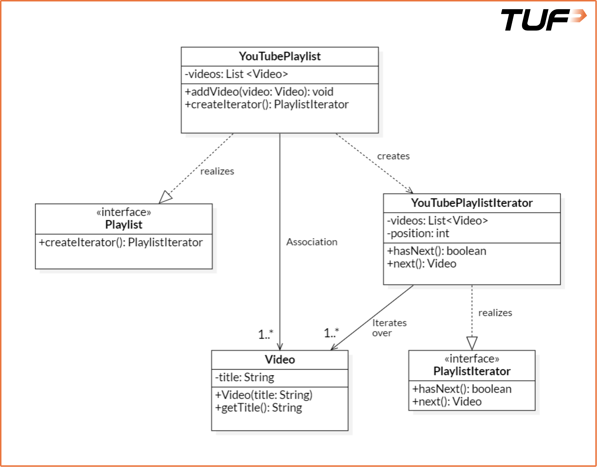
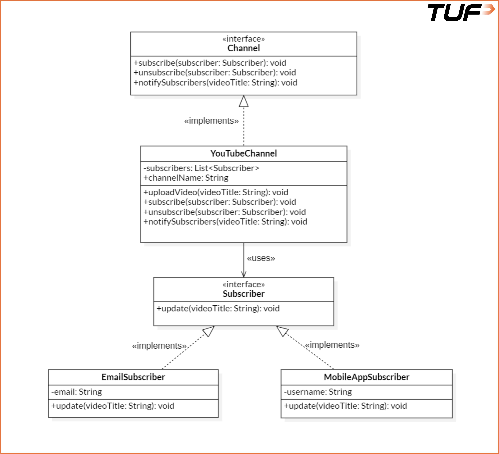
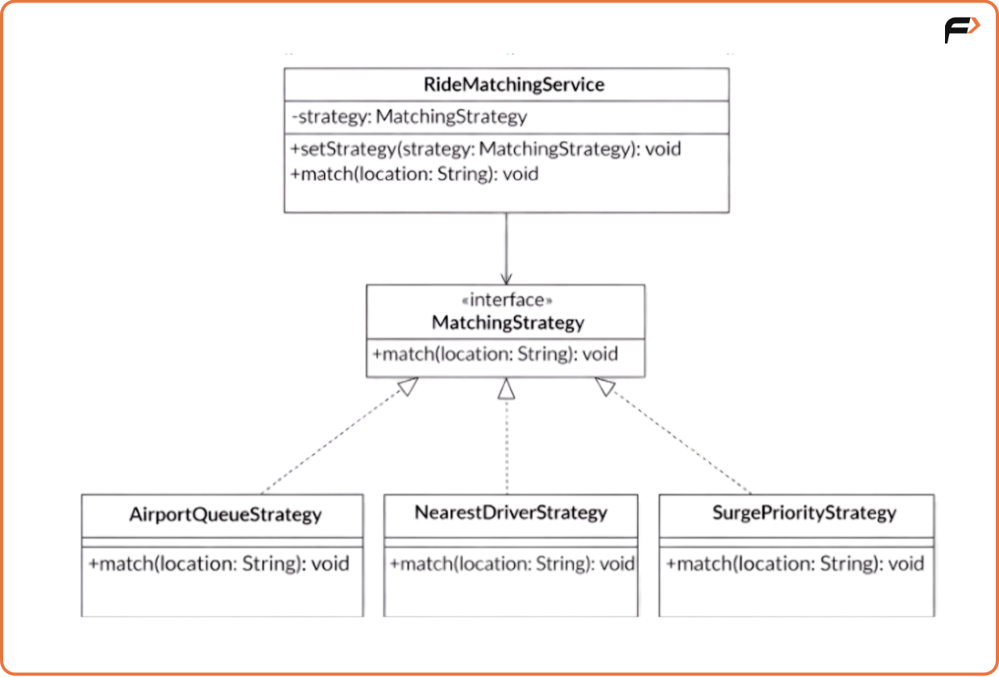
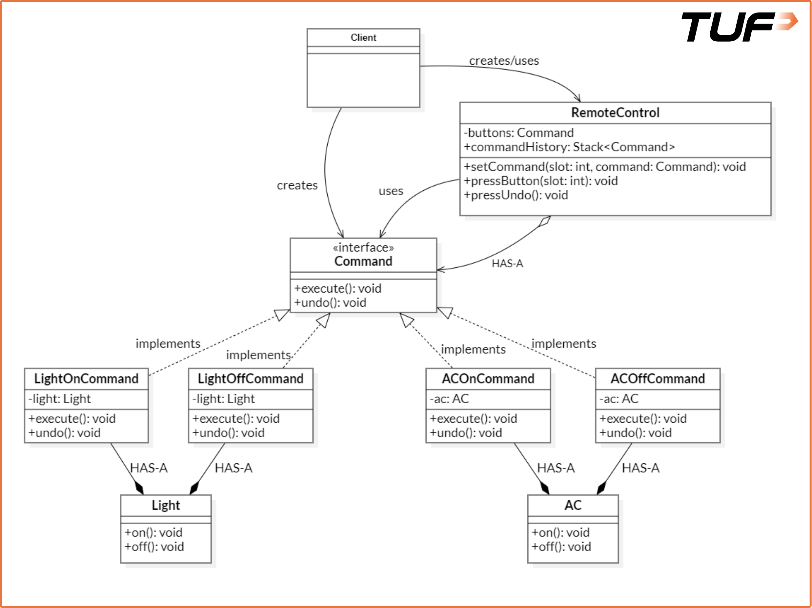
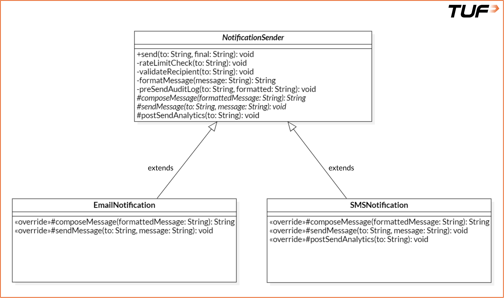
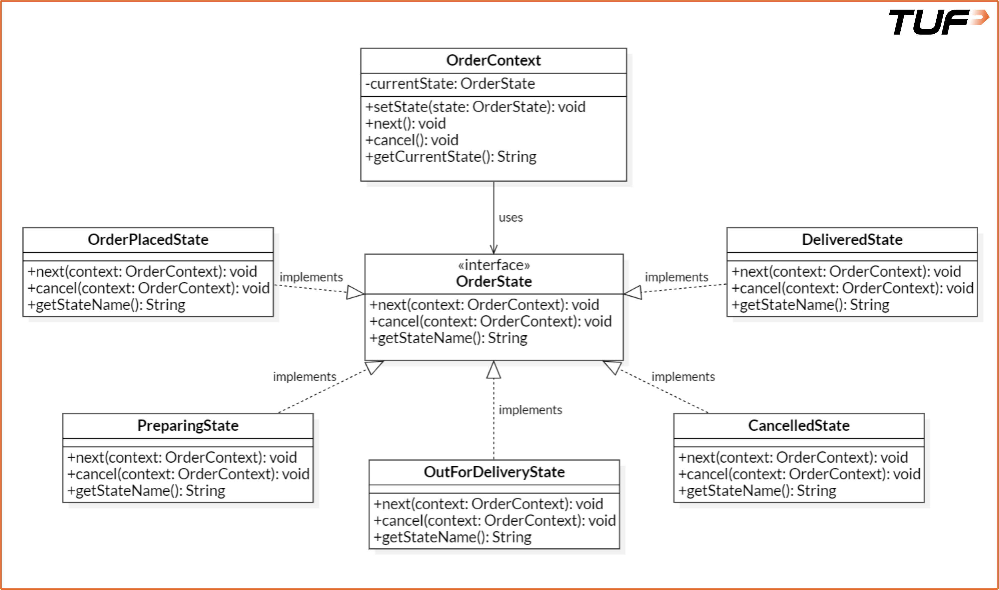
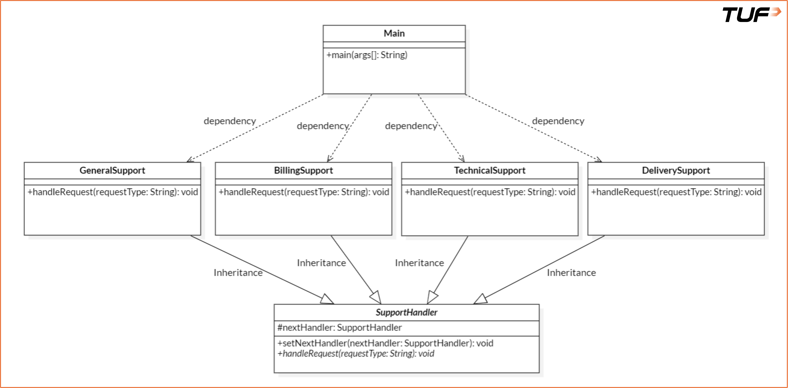
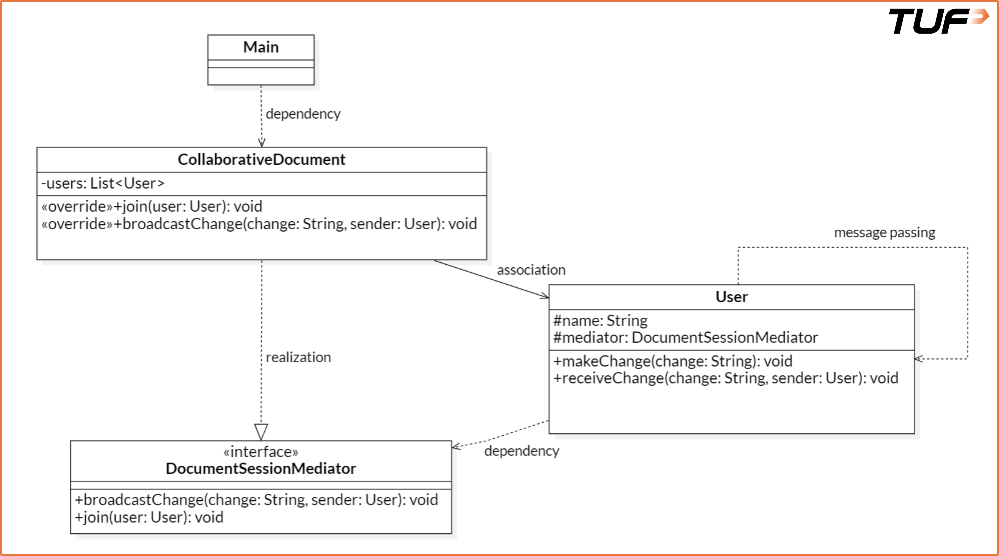
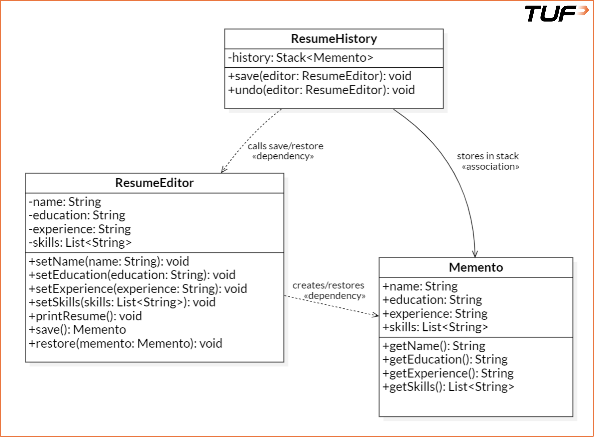

# Behavioural Design Patterns

Behavioural design patterns focus on how objects interact and
communicate with each other, helping to define the flow of control
in a system. These patterns simplify complex communication logic
between objects while promoting loose coupling.

## Table of Contents

- [Iterator Pattern](#iterator-pattern)
- [Observer Pattern](#observer-pattern)
- [Strategy Pattern](#strategy-pattern)
- [Command Pattern](#command-pattern)
- [Template Pattern](#template-pattern)
- [State Pattern](#state-pattern)
- [Chain of Responsibility Pattern](#chain-of-responsibility-pattern)
- [Mediator Pattern](#mediator-pattern)
- [Memento Pattern](#memento-pattern)

---

## Iterator Pattern

The **Iterator Pattern** is a behavioural design pattern that
provides a way to access the elements of a collection sequentially
without exposing the underlying representation.

This means whether your collection is an array, a list, a tree,
or something custom, you can use an iterator to traverse it in a
consistent manner, one element at a time, without worrying about
how the data is stored or managed internally.

### Understanding the Problem

Imagine a YouTube playlist system:

```java
import java.util.*;

class Video {
    String title;

    public Video(String title) {
        this.title = title;
    }

    public String getTitle() {
        return title;
    }
}

class YouTubePlaylist {
    private List<Video> videos = new ArrayList<>();

    public void addVideo(Video video) {
        videos.add(video);
    }

    public List<Video> getVideos() {
        return videos;
    }
}

class Main {
    public static void main(String[] args) {
        YouTubePlaylist playlist = new YouTubePlaylist();
        playlist.addVideo(new Video("LLD Tutorial"));
        playlist.addVideo(new Video("System Design Basics"));

        for (Video v : playlist.getVideos()) {
            System.out.println(v.getTitle());
        }
    }
}
```

### What Are the Issues?

While the code works, there are several design-level concerns:

| Problem | Explanation |
|---------|-------------|
| **Exposes internal structure** | The internal list or array is directly returned via `getVideos()`. This breaks encapsulation, as clients can access or even modify the internal collection. |
| **Tight coupling with underlying structure** | External code is tightly bound to the specific type of collection used (like `Vector`, `List`, etc.). Any change in the internal structure may require changes in client code. |
| **No control over traversal** | Traversal logic is managed outside the class. You can't enforce custom traversal behaviours (e.g., reverse, skip, filter) without modifying external code. |
| **Difficult to support multiple independent traversals** | If two parts of your program want to iterate over the same playlist independently, there's no built-in way to do that cleanly. You have to manage indexing and traversal state manually. |

### The Solution (Intermediate)

```java
// Video and Playlist classes — no change

// ========== Iterator interface ==========
interface PlaylistIterator {
    boolean hasNext();
    Video next();
}

// ========== Concrete Iterator class ==========
class YouTubePlaylistIterator implements PlaylistIterator {
    private List<Video> videos;
    private int position;

    public YouTubePlaylistIterator(List<Video> videos) {
        this.videos = videos;
        this.position = 0;
    }

    @Override
    public boolean hasNext() {
        return position < videos.size();
    }

    @Override
    public Video next() {
        return hasNext() ? videos.get(position++) : null;
    }
}

// ========== Main method (Client code) ==========
public class Main {
    public static void main(String[] args) {
        YouTubePlaylist playlist = new YouTubePlaylist();
        playlist.addVideo(new Video("LLD Tutorial"));
        playlist.addVideo(new Video("System Design Basics"));

        PlaylistIterator iterator =
            new YouTubePlaylistIterator(playlist.getVideos());

        while (iterator.hasNext()) {
            System.out.println(iterator.next().getTitle());
        }
    }
}
```

| Problem | How Iterator Pattern Solves It |
|---------|-------------------------------|
| Direct access to internal data structure | The collection no longer exposes its internal data directly for traversal. Instead, an iterator is used to access elements one-by-one, encapsulating the structure. |
| No standard way to iterate | All traversal is handled through a consistent interface (`hasNext()` / `next()`), regardless of how data is stored internally. |
| Traversal logic spread across client code | The logic for maintaining iteration state (e.g., index or position) is encapsulated within the iterator class itself, keeping client code clean. |
| Difficult to customize traversal | Custom iterator classes can be extended to provide different traversal strategies (e.g., reverse, filtering, skipping), without changing the underlying collection. |
| Tight coupling to collection type | Client code no longer depends on the exact type of data structure. It interacts only with the iterator, reducing dependencies and improving flexibility. |

### One Major Issue Still Remains

Even though we've abstracted the traversal logic into an iterator
class, the client is still responsible for creating the iterator,
which is not ideal. The goal of true encapsulation would be to
hide even the creation of the iterator — something we address
with a more refined approach below.

### Complete Code

```java
import java.util.*;

class Video {
    private String title;

    public Video(String title) {
        this.title = title;
    }

    public String getTitle() {
        return title;
    }
}

interface Playlist {
    PlaylistIterator createIterator();
}

class YouTubePlaylist implements Playlist {
    private List<Video> videos = new ArrayList<>();

    public void addVideo(Video video) {
        videos.add(video);
    }

    @Override
    public PlaylistIterator createIterator() {
        return new YouTubePlaylistIterator(videos);
    }
}

interface PlaylistIterator {
    boolean hasNext();
    Video next();
}

class YouTubePlaylistIterator implements PlaylistIterator {
    private List<Video> videos;
    private int position;

    public YouTubePlaylistIterator(List<Video> videos) {
        this.videos = videos;
        this.position = 0;
    }

    @Override
    public boolean hasNext() {
        return position < videos.size();
    }

    @Override
    public Video next() {
        return hasNext() ? videos.get(position++) : null;
    }
}

public class Main {
    public static void main(String[] args) {
        YouTubePlaylist playlist = new YouTubePlaylist();
        playlist.addVideo(new Video("LLD Tutorial"));
        playlist.addVideo(new Video("System Design Basics"));

        PlaylistIterator iterator = playlist.createIterator();

        while (iterator.hasNext()) {
            System.out.println(iterator.next().getTitle());
        }
    }
}
```

> **Personal note:**
> +++ Client doesn't need to know about the structure and way of
> declaring the iterator either.
> ++ `createIterator()` does everything for us, no need to set up
> the iterator manually.
> +++ We can have multiple iterators for the same playlist:
> `createIterator(ENUM.FORWARD, ENUM.BACKWARD, ENUM.RANDOM)`.

### Ideal Scenarios for Using the Iterator Pattern

- **Traverse without exposing internals:** Instead of revealing
  whether it's an `ArrayList`, `Vector`, or a custom tree, the
  pattern lets clients access elements one-by-one, safely and
  uniformly.
- **Multiple ways to traverse:** Forward, reverse, or skipping
  every second element — each handled by a different iterator
  implementation without changing the collection itself.
- **Unified traversal across collection types:** Whether it's a
  list of videos, a set of songs, or a stack of documents, clients
  iterate using a common interface.
- **Decouple iteration from collection logic:** Separating how
  elements are stored from how they're accessed reduces complexity
  and improves maintainability.

### Real-World Examples

**1. Java Collection Framework**

Every collection class like `ArrayList`, `HashSet`, `TreeSet`
implements the `Iterable` interface, which returns an `Iterator`
via the `iterator()` method:

```java
List<String> fruits = new ArrayList<>();
fruits.add("Apple");
fruits.add("Banana");

Iterator<String> iterator = fruits.iterator();
while (iterator.hasNext()) {
    System.out.println(iterator.next());
}
```

The client doesn't need to know how the list is implemented
internally — just how to get the next element.

**2. Python's `iter()` and `next()` Functions**

You can turn any iterable (like a list or tuple) into an iterator
using `iter()`, and manually traverse it using `next()`:

```python
nums = [10, 20, 30]
it = iter(nums)

print(next(it))  # 10
print(next(it))  # 20
```

Under the hood, this is Python's version of the Iterator Pattern.
It works the same way across lists, sets, file streams, and even
custom objects if you implement `__iter__` and `__next__`.



---

## Observer Pattern

The **Observer Pattern** is a behavioural design pattern that
defines a one-to-many dependency between objects so that when one
object (the **subject**) changes its state, all its dependents
(called **observers**) are notified and updated automatically.

If multiple objects are watching another object for updates, they
don't need to keep checking repeatedly. Instead, they get notified
as soon as something changes — making the system more efficient
and loosely coupled.

### Real-Life Analogy

Think of subscribing to a YouTube channel. Once you hit the
Subscribe button and turn on notifications, you don't have to keep
visiting the channel to check for new videos. As soon as a new
video is uploaded, you get notified instantly.

- The **channel** is the subject.
- The **subscribers** are the observers.
- The **notification** is the automatic update mechanism triggered
  by the subject.

### Understanding the Problem

YouTube-like Notification System:

```java
import java.util.*;

class YouTubeChannel {
    public void uploadNewVideo(String videoTitle) {
        System.out.println("Uploading: " + videoTitle + "\n");

        System.out.println(
            "Sending email to user1@example.com");
        System.out.println(
            "Pushing in-app notification to user3@example.com");
    }
}

class Main {
    public static void main(String[] args) {
        YouTubeChannel channel = new YouTubeChannel();
        channel.uploadNewVideo("Design Patterns in Java");
    }
}
```

> **Personal note:**
> - Tight coupling
> - Violation of SRP
> - No scalability — can't keep adding new observers.

### The Solution

```java
import java.util.*;

// ==============================
// Observer Interface
// ==============================
interface Subscriber {
    void update(String videoTitle);
}

// ==============================
// Concrete Observer: Email
// ==============================
class EmailSubscriber implements Subscriber {
    private String email;

    public EmailSubscriber(String email) {
        this.email = email;
    }

    @Override
    public void update(String videoTitle) {
        System.out.println(
            "Email sent to " + email
            + ": New video uploaded - " + videoTitle);
    }
}

// ==============================
// Concrete Observer: Mobile App
// ==============================
class MobileAppSubscriber implements Subscriber {
    private String username;

    public MobileAppSubscriber(String username) {
        this.username = username;
    }

    @Override
    public void update(String videoTitle) {
        System.out.println(
            "In-app notification for " + username
            + ": New video - " + videoTitle);
    }
}

// ==============================
// Subject Interface
// ==============================
interface Channel {
    void subscribe(Subscriber subscriber);
    void unsubscribe(Subscriber subscriber);
    void notifySubscribers(String videoTitle);
}

// ==============================
// Concrete Subject: YouTubeChannel
// ==============================
class YouTubeChannel implements Channel {
    private List<Subscriber> subscribers = new ArrayList<>();
    private String channelName;

    public YouTubeChannel(String channelName) {
        this.channelName = channelName;
    }

    @Override
    public void subscribe(Subscriber subscriber) {
        subscribers.add(subscriber);
    }

    @Override
    public void unsubscribe(Subscriber subscriber) {
        subscribers.remove(subscriber);
    }

    @Override
    public void notifySubscribers(String videoTitle) {
        for (Subscriber subscriber : subscribers) {
            subscriber.update(videoTitle);
        }
    }

    public void uploadVideo(String videoTitle) {
        System.out.println(
            channelName + " uploaded: " + videoTitle + "\n");
        notifySubscribers(videoTitle);
    }
}

// ==============================
// Client Code
// ==============================
class Main {
    public static void main(String[] args) {
        YouTubeChannel tuf =
            new YouTubeChannel("takeUforward");

        tuf.subscribe(new MobileAppSubscriber("raj"));
        tuf.subscribe(
            new EmailSubscriber("rahul@example.com"));

        tuf.uploadVideo("observer-pattern");
    }
}
```

> **Personal note:**
> + Each subscriber handles its own notification via `update()`
> + Upload logic stays in `YouTubeChannel`; notification logic
>   is external
> + `subscribe()` and `unsubscribe()` methods handle this cleanly

### Use Cases and Limitations

**Recommended Scenarios:**

- **State Change Propagation:** When a change in one object must
  be immediately reflected across multiple dependent objects.
- **Decoupling Between Core Components:** When the subject should
  remain agnostic of how many observers exist or what actions they
  perform.
- **Dynamic Subscriptions at Runtime:** Modules being added or
  removed dynamically (e.g., plugins, UI listeners, notification
  modules) benefit from flexible attach/detach of observers.

**Where Observer May Fall Short:**

- **Excessive Observer Load:** In high-scale systems with millions
  of observers (e.g., a celebrity with 10M followers goes live), a
  direct notification loop becomes inefficient. Better handled by
  event queues, pub-sub architectures, or broadcast systems.
- **Strict Control Over Notification Timing:** In financial systems
  or real-time analytics, deterministic control is critical. Message
  brokers (e.g., Kafka, RabbitMQ) are more suitable, providing
  buffering, retries, and ordering.

In short, Observer Pattern works really well with a small number of
observers, but to scale, it becomes essential to move toward an
event-driven architecture.

### Observer Pattern at Scale

> **Important:**
> The Observer pattern fails at high scale because the Subject
> synchronously iterates over a list of Observer references,
> blocking the execution thread and risking memory or failure
> bottlenecks. The **Publish-Subscribe (Pub-Sub)** pattern solves
> this by introducing a middleman (an **Event Broker**), allowing
> asynchronous message delivery and decoupling the Publisher
> entirely from the Subscribers' execution states.



> **Personal note:**
> It has 2 interfaces — observer and subject. Most important
> nuance is the **subject** holds all **observers** and calls
> observer methods to notify them.

> **Correction:** The original note stated "observer has all
> subject and calls subject methods." It's the other way around —
> the **subject** maintains a list of **observers** and calls
> *their* `update()` method. Also, the note "This only works at
> scale since we store all observers in heap memory" contradicts
> the paragraph above — the Observer Pattern does *not* work well
> at scale for exactly that reason (synchronous in-memory
> iteration). At scale, use Pub-Sub.

---

## Strategy Pattern

The **Strategy Pattern** is a behavioural design pattern that
defines a family of algorithms, encapsulates each one into a
separate class, and makes them interchangeable at runtime depending
on the context.

It is primarily focused on changing the behaviour of an object
dynamically, without modifying its class. This promotes better
organisation of related algorithms and enhances code flexibility
and scalability.

### Real-Life Analogy

Consider how Uber matches a rider with a driver. The underlying
algorithm may change depending on the context — matching with the
nearest driver, giving priority to surge zones, or choosing from
an airport queue.

- The **ride-matching service** is the context.
- The different **matching algorithms** (nearest, surge-priority,
  airport-queue) are the strategies.
- The **strategy interface** allows the system to switch between
  these algorithms seamlessly, depending on real-time conditions.

### Understanding the Problem

```java
import java.util.*;

class RideMatchingService {
    public void matchRider(
            String riderLocation, String matchingType) {
        if (matchingType.equals("NEAREST")) {
            System.out.println(
                "Matching rider at " + riderLocation
                + " with nearest driver.");
        } else if (matchingType.equals("SURGE_PRIORITY")) {
            System.out.println(
                "Matching rider at " + riderLocation
                + " based on surge pricing priority.");
        } else if (matchingType.equals("AIRPORT_QUEUE")) {
            System.out.println(
                "Matching rider at " + riderLocation
                + " from airport queue.");
        } else {
            System.out.println(
                "Invalid matching strategy provided.");
        }
    }
}

public class Main {
    public static void main(String[] args) {
        RideMatchingService service =
            new RideMatchingService();

        service.matchRider("Downtown", "NEAREST");
        service.matchRider("City Center", "SURGE_PRIORITY");
        service.matchRider(
            "Airport Terminal 1", "AIRPORT_QUEUE");
    }
}
```

**Problems with This Approach:**

| Issue | Explanation |
|-------|-------------|
| Violation of Open/Closed Principle | Adding a new strategy (e.g., VIP rider matching) would require modifying `RideMatchingService`. |
| Code becomes messy | As more conditions are added, the if-else branches grow, making code harder to maintain. |
| Difficult to test or reuse | Individual strategies are not reusable or testable in isolation. All logic is embedded in a single method. |
| No separation of concerns | The class handles both coordination (service logic) and implementation (strategy logic). |

### The Solution

```java
import java.util.*;

// ==============================
// Strategy Interface
// ==============================
interface MatchingStrategy {
    void match(String riderLocation);
}

// ==============================
// Concrete Strategy: Nearest Driver
// ==============================
class NearestDriverStrategy implements MatchingStrategy {
    @Override
    public void match(String riderLocation) {
        System.out.println(
            "Matching with the nearest available driver to "
            + riderLocation);
    }
}

// ==============================
// Concrete Strategy: Airport Queue
// ==============================
class AirportQueueStrategy implements MatchingStrategy {
    @Override
    public void match(String riderLocation) {
        System.out.println(
            "Matching using FIFO airport queue for "
            + riderLocation);
    }
}

// ==============================
// Concrete Strategy: Surge Priority
// ==============================
class SurgePriorityStrategy implements MatchingStrategy {
    @Override
    public void match(String riderLocation) {
        System.out.println(
            "Matching rider using surge pricing priority near "
            + riderLocation);
    }
}

// ==============================
// Context Class: RideMatchingService
// ==============================
class RideMatchingService {
    private MatchingStrategy strategy;

    public RideMatchingService(MatchingStrategy strategy) {
        this.strategy = strategy;
    }

    public void setStrategy(MatchingStrategy strategy) {
        this.strategy = strategy;
    }

    public void matchRider(String location) {
        strategy.match(location);
    }
}

// ==============================
// Client Code
// ==============================
public class Main {
    public static void main(String[] args) {
        RideMatchingService rideMatchingService =
            new RideMatchingService(
                new AirportQueueStrategy());
        rideMatchingService.matchRider("Terminal 1");

        RideMatchingService rideMatchingService2 =
            new RideMatchingService(
                new NearestDriverStrategy());
        rideMatchingService2.matchRider("Downtown");
        rideMatchingService2.setStrategy(
            new SurgePriorityStrategy());
        rideMatchingService2.matchRider("Downtown");
    }
}
```

### Suitable Scenarios

- **Multiple Interchangeable Algorithms:** When a system supports
  different algorithms that can be swapped based on context.
- **Compliance with Open/Closed Principle:** New strategies can
  be introduced without modifying existing business logic.
- **Elimination of Conditionals:** Large if-else or switch blocks
  are separated into dedicated classes.
- **Behaviour-Specific Unit Testing:** Each strategy can be tested
  independently, in isolation from the context.
- **Runtime Behaviour Selection:** Behaviour can be selected
  dynamically during execution based on user input, configuration,
  or environment.

### Key Questions & Answers

#### 1. "Why is `RideMatchingService` even needed? It just holds an object and calls its method."

On the surface, it looks like a useless wrapper. But the
**Context class** serves a real purpose: **it decouples the caller
from knowing which strategy exists.**

Without it, every place in your codebase that needs ride matching
would do:

```java
NearestDriverStrategy s = new NearestDriverStrategy();
s.match(location);
```

If you later add `SurgeAwareStrategy`, `PoolMatchingStrategy`,
etc., **every caller** must be updated. The Context
(`RideMatchingService`) acts as a **stable API** — callers just
talk to it, and it delegates internally:

```java
rideService.matchRider(location);
```

It also gives you a **single place** to swap the algorithm at
runtime (via `setStrategy`), add logging/metrics around matching,
or compose pre/post-processing logic.

That said — if you only ever call the strategy in one place and
never swap it, then the context class adds nothing. The pattern is
justified when **multiple callers exist** or **runtime swapping is
needed**.

#### 2. "Strategy is just polymorphism. Why is it a 'pattern'?"

**100% correct.** Strategy Pattern *is* just polymorphism —
specifically, programming to an interface and injecting the
concrete implementation.

The "pattern" isn't introducing new mechanics. It's giving a
**name** to a specific *application* of polymorphism:

- **Polymorphism** = a language feature (interface + override)
- **Strategy Pattern** = a design *decision*: "I will extract
  interchangeable algorithms behind an interface and inject them
  into a context"

The value of calling it a "pattern" is **communication**. When
someone says "we used Strategy here," the whole team immediately
knows:
- There's an interface for the algorithm
- There are multiple swappable implementations
- A context class holds and delegates to the current one
- The algorithm can be changed at runtime

So no — it IS just polymorphism. The pattern is the
*architectural intent*, not a new mechanism.

#### 3. "How does it eliminate if-else? We still need a conditional to choose which strategy."

This is the most important question. **It doesn't eliminate
conditionals — it relocates them.**

Before (without Strategy):

```java
class RideMatchingService {
    public void matchRider(String location, String mode) {
        if (mode.equals("nearest")) {
            // 30 lines of nearest-driver logic
        } else if (mode.equals("rated")) {
            // 30 lines of highest-rated logic
        } else if (mode.equals("pool")) {
            // 30 lines of pool matching logic
        }
    }
}
```

After (with Strategy), the conditional still exists, but it moves
to the **composition root** (where you wire things up — e.g., a
factory, config, or DI container):

```java
MatchingStrategy strategy = switch (config.getMode()) {
    case "nearest" -> new NearestDriverStrategy();
    case "rated"   -> new HighestRatedStrategy();
    case "pool"    -> new PoolMatchingStrategy();
};
RideMatchingService service =
    new RideMatchingService(strategy);
```

**What changed?**

| Aspect | Before | After |
|--------|--------|-------|
| Where is the conditional? | Inside business logic | At the wiring/factory layer |
| What happens when you add a new algorithm? | Modify `RideMatchingService` (violates Open-Closed) | Add a new class, update the factory |
| Does `matchRider()` know about all strategies? | Yes, tightly coupled | No, only knows the interface |
| Can you test one algorithm in isolation? | Hard (embedded in if-else) | Easy (each strategy is its own class) |

So the claim "eliminates if-else" is **overstated** in most
explanations. The honest version is: **it moves the conditional
out of the core logic into a single decision point, and each
algorithm branch becomes its own testable, extendable class.**

> **Personal note (TL;DR):**
> Strategy *is* polymorphism, the context class is only useful when
> you have multiple callers or runtime swapping, and it doesn't
> eliminate conditionals — it centralises them. The pattern's value
> is in **separation of concerns**, not in any new mechanism.



---

## Command Pattern

The **Command Pattern** is a behavioural design pattern that
encapsulates a request as an object, allowing for parameterisation
of clients with different requests, queuing of requests, and
logging of the requests. It lets you add features like undo, redo,
logging, and dynamic command execution without changing the core
business logic.

### Real-Life Analogy

Think of a remote control used to turn on or off the lights or an
air conditioner (AC). When you press a button, you don't need to
understand how the internal circuits work or how the AC receives
the signal. You just press "On" or "Off", and the remote control
takes care of sending the command.

The Command Pattern decouples the **sender** of a request (the
remote control) from the **receiver** (the light or AC), providing
flexibility and simplicity in handling commands.

### Four Key Components

| Component | Role |
|-----------|------|
| **Client** | Initiates the request and sets up the command object. |
| **Invoker** | Asks the command to execute the request. |
| **Command** | Defines a binding between a receiver object and an action. |
| **Receiver** | Knows how to perform the actions to satisfy a request. |

### Understanding the Problem

A simple remote control system where devices like lights and AC
can be turned on and off — naive implementation:

```java
import java.util.*;

class Light {
    public void on() {
        System.out.println("Light turned ON");
    }

    public void off() {
        System.out.println("Light turned OFF");
    }
}

class AC {
    public void on() {
        System.out.println("AC turned ON");
    }

    public void off() {
        System.out.println("AC turned OFF");
    }
}

class NaiveRemoteControl {
    private Light light;
    private AC ac;
    private String lastAction = "";

    public NaiveRemoteControl(Light light, AC ac) {
        this.light = light;
        this.ac = ac;
    }

    public void pressLightOn() {
        light.on();
        lastAction = "LIGHT_ON";
    }

    public void pressLightOff() {
        light.off();
        lastAction = "LIGHT_OFF";
    }

    public void pressACOn() {
        ac.on();
        lastAction = "AC_ON";
    }

    public void pressACOff() {
        ac.off();
        lastAction = "AC_OFF";
    }

    public void pressUndo() {
        switch (lastAction) {
            case "LIGHT_ON":
                light.off();
                lastAction = "LIGHT_OFF";
                break;
            case "LIGHT_OFF":
                light.on();
                lastAction = "LIGHT_ON";
                break;
            case "AC_ON":
                ac.off();
                lastAction = "AC_OFF";
                break;
            case "AC_OFF":
                ac.on();
                lastAction = "AC_ON";
                break;
            default:
                System.out.println("No action to undo.");
                break;
        }
    }
}

public class Main {
    public static void main(String[] args) {
        Light light = new Light();
        AC ac = new AC();
        NaiveRemoteControl remote =
            new NaiveRemoteControl(light, ac);

        remote.pressLightOn();
        remote.pressACOn();
        remote.pressLightOff();
        remote.pressUndo();  // Undo LIGHT_OFF -> Light ON
        remote.pressUndo();  // Undo AC_ON -> AC OFF
    }
}
```

**Issues in the Code:**

- **Tight coupling:** `NaiveRemoteControl` directly calls methods
  on `Light` and `AC`. Adding new devices requires modifying the
  remote control class — violates Open/Closed Principle.
- **Undo is fragile:** `pressUndo` is tightly coupled with every
  command. Adding complex undo for multiple actions or varied
  devices becomes very difficult.
- **No command history:** No centralised mechanism to track
  previously executed commands, making undo/redo hard to implement
  cleanly.

> **Personal note:**
> Undo is too complex and both Light and AC are baked into the
> remote control — VERY VERY tightly coupled.
>
> In this naive version:
> - **Receiver:** Light, AC
> - **Command:** pressLightOn, pressLightOff, pressACOn,
>   pressACOff, pressUndo
> - **Invoker:** NaiveRemoteControl
> - **Client:** Main

### The Solution

```java
import java.util.*;

// ========= Receiver classes ===========
class Light {
    public void on() {
        System.out.println("Light turned ON");
    }

    public void off() {
        System.out.println("Light turned OFF");
    }
}

class AC {
    public void on() {
        System.out.println("AC turned ON");
    }

    public void off() {
        System.out.println("AC turned OFF");
    }
}

// ========= Command interface ===========
interface Command {
    void execute();
    void undo();
}

class LightOnCommand implements Command {
    private Light light;

    public LightOnCommand(Light light) {
        this.light = light;
    }

    public void execute() {
        light.on();
    }

    public void undo() {
        light.off();
    }
}

class LightOffCommand implements Command {
    private Light light;

    public LightOffCommand(Light light) {
        this.light = light;
    }

    public void execute() {
        light.off();
    }

    public void undo() {
        light.on();
    }
}

class AConCommand implements Command {
    private AC ac;

    public AConCommand(AC ac) {
        this.ac = ac;
    }

    public void execute() {
        ac.on();
    }

    public void undo() {
        ac.off();
    }
}

class ACOffCommand implements Command {
    private AC ac;

    public ACOffCommand(AC ac) {
        this.ac = ac;
    }

    public void execute() {
        ac.off();
    }

    public void undo() {
        ac.on();
    }
}

// ========== Remote control (Invoker) ==========
class RemoteControl {
    private Command[] buttons = new Command[4];
    private Stack<Command> commandHistory = new Stack<>();

    public void setCommand(int slot, Command command) {
        buttons[slot] = command;
    }

    public void pressButton(int slot) {
        if (buttons[slot] != null) {
            buttons[slot].execute();
            commandHistory.push(buttons[slot]);
        } else {
            System.out.println(
                "No command assigned to slot " + slot);
        }
    }

    public void pressUndo() {
        if (!commandHistory.isEmpty()) {
            commandHistory.pop().undo();
        } else {
            System.out.println("No commands to undo.");
        }
    }
}

// ========= Client code ===========
public class Main {
    public static void main(String[] args) {
        Light light = new Light();
        AC ac = new AC();

        Command lightOn = new LightOnCommand(light);
        Command lightOff = new LightOffCommand(light);
        Command acOn = new AConCommand(ac);
        Command acOff = new ACOffCommand(ac);

        RemoteControl remote = new RemoteControl();
        remote.setCommand(0, lightOn);
        remote.setCommand(1, lightOff);
        remote.setCommand(2, acOn);
        remote.setCommand(3, acOff);

        remote.pressButton(0); // Light ON
        remote.pressButton(2); // AC ON
        remote.pressButton(1); // Light OFF
        remote.pressUndo();    // Undo Light OFF -> Light ON
        remote.pressUndo();    // Undo AC ON -> AC OFF
    }
}
```

### Key Questions & Answers

#### 1. "Why not just add methods directly to AC/Light? Why separate Command classes?"

If you put `execute()` and `undo()` directly on `AC` and `Light`,
you're coupling the remote control to every specific device:

```java
class RemoteControl {
    private Light light;
    private AC ac;
    // Tomorrow: private Fan fan;
    // Tomorrow: private TV tv;

    public void pressButton(int slot) {
        if (slot == 0) light.on();
        else if (slot == 1) light.off();
        else if (slot == 2) ac.on();
        // ... grows forever, violates Open-Closed Principle
    }
}
```

The remote control now knows about every device. Every time you
add a new device, you modify `RemoteControl`. That's the real
problem — the invoker becoming a god class.

**With Commands:** the remote just knows about `Command`. It
doesn't care if it's controlling a light, AC, TV, or a nuclear
reactor. You can add 50 new devices and `RemoteControl` stays
exactly the same — zero modifications.

The "bloat" you see (one class per action) is the price of
decoupling the invoker from the receiver. The remote doesn't
import `Light` or `AC`. It only knows `Command`.

#### 2. "Stack only supports undo. How would you do redo?"

The stack-only implementation is a simplified version. A real
implementation uses **two stacks** (or a pointer into a list):

```java
class RemoteControl {
    private Stack<Command> undoStack = new Stack<>();
    private Stack<Command> redoStack = new Stack<>();

    public void pressButton(int slot) {
        if (buttons[slot] != null) {
            buttons[slot].execute();
            undoStack.push(buttons[slot]);
            redoStack.clear(); // new action invalidates redo
        }
    }

    public void pressUndo() {
        if (!undoStack.isEmpty()) {
            Command cmd = undoStack.pop();
            cmd.undo();
            redoStack.push(cmd);
        }
    }

    public void pressRedo() {
        if (!redoStack.isEmpty()) {
            Command cmd = redoStack.pop();
            cmd.execute();
            undoStack.push(cmd);
        }
    }
}
```

This is exactly how **Ctrl+Z / Ctrl+Y** works in every text
editor. The Command Pattern is the standard way to implement
undo/redo. Without commands as objects, you'd have no clean way
to "remember" what was done and reverse it.

> **Personal note:**
> Command Pattern turns actions into objects — and once an action
> is an object, you can **store it, queue it, undo it, redo it,
> log it, serialize it, and replay it.**
>
> Without the pattern, actions are just method calls. Method calls
> vanish the moment they execute. You can't put a method call in
> a stack. But you *can* put a Command object in a stack.

### Impact Without the Command Pattern

- **Tight Coupling Between Invoker and Receiver:** The invoker
  and receiver are directly linked, making future changes
  difficult without modifying both components.
- **Lack of Reusability:** No abstraction for actions limits the
  ability to reuse code across different parts of the application.
- **Undo/Redo Not Supported:** Implementing undo or redo becomes
  complex and error-prone when operations are directly tied to
  specific actions.
- **Difficulty in Batch Actions:** Implementing batch operations
  (like night mode changes) becomes cumbersome as each action
  needs to be handled individually.
- **No Plug-and-Play Flexibility:** The system lacks the
  flexibility to add or modify commands dynamically.
- **Scalability Issues:** As the system grows, managing commands
  and new features becomes increasingly difficult.

### When to Use the Command Pattern

- **Decoupling Sender from Receiver:** When the Invoker must be
  independent of the object performing the action.
- **Undo/Redo Support:** When you require built-in support for
  undoing or redoing actions.
- **Batch Operations:** When multiple actions need to be executed
  as part of a batch (e.g., night mode = turn on AC + off light
  via a macro command).
- **Plug-in Architecture:** New commands can be added without
  affecting the core system.
- **Creating Macros or Composite Commands:** Group multiple
  commands together, enabling complex actions to be executed in
  sequence as a single macro.



> **Personal note:**
> The line between command and remote control in the diagram might
> be wrong.


---

## Template Pattern

The **Template Pattern** is a behavioral design pattern that
provides a blueprint for executing an algorithm. It allows
subclasses to override specific steps of the algorithm, but the
overall structure remains the same. This ensures that the invariant
parts of the algorithm are not changed, while enabling
customization in the variable parts.

### Real-Life Analogy

Imagine you are following a recipe to bake a cake. The overall
process (preheat oven, mix ingredients, bake, and cool) is fixed,
but the specific ingredients or flavors may vary (chocolate,
vanilla, etc.).

The Template Pattern is like the recipe: it defines the basic
structure of the process (steps), while allowing the specific
ingredients (or steps) to be varied depending on the cake type.

### Understanding the Problem

Let's assume we are building a Notification Service where we need
to send notifications via multiple channels, such as Email and
SMS. Below is a simple implementation:

```java
import java.util.*;

class EmailNotification {

    public void send(String to, String message) {
        System.out.println("Checking rate limits for: " + to);
        System.out.println(
            "Validating email recipient: " + to
        );
        String formatted = message.trim();
        System.out.println(
            "Logging before send: " + formatted + " to " + to
        );

        String composedMessage =
            "<html><body><p>" + formatted
            + "</p></body></html>";

        System.out.println(
            "Sending EMAIL to " + to
            + " with content:\n" + composedMessage
        );

        System.out.println("Analytics updated for: " + to);
    }
}

class SMSNotification {

    public void send(String to, String message) {
        System.out.println("Checking rate limits for: " + to);
        System.out.println("Validating phone number: " + to);
        String formatted = message.trim();
        System.out.println(
            "Logging before send: " + formatted + " to " + to
        );

        String composedMessage = "[SMS] " + formatted;

        System.out.println(
            "Sending SMS to " + to
            + " with message: " + composedMessage
        );

        System.out.println(
            "Custom SMS analytics for: " + to
        );
    }
}

class Main {
    public static void main(String[] args) {
        EmailNotification emailNotification =
            new EmailNotification();
        SMSNotification smsNotification =
            new SMSNotification();

        emailNotification.send(
            "example@example.com",
            "Your order has been placed!"
        );

        System.out.println(" ");

        smsNotification.send(
            "1234567890", "Your OTP is 1234."
        );
    }
}
```

### Issues in This Code

| Issue | Explanation |
|-------|-------------|
| **Code Duplication** | Both `EmailNotification` and `SMSNotification` contain nearly identical logic for rate limit checking, message formatting, logging, and analytics. This violates the DRY principle, making the code harder to maintain. |
| **Hardcoded Behaviour** | The behaviour for sending emails and SMS is tightly coupled with the `send()` method. Adding a new notification type (e.g., Push Notification) requires duplicating the entire logic. |

### Key Steps in the Template Pattern

The Template Pattern generally consists of four key steps:

| Step | Description |
|------|-------------|
| **Template Method** (Final Method in Base Class) | Defines the skeleton of the algorithm. Calls the various steps and determines their sequence. This method is `final` to prevent overriding, ensuring the algorithm's structure stays consistent. |
| **Primitive Operations** (Abstract Methods) | Abstract methods that subclasses must implement. These represent the variable parts of the algorithm. |
| **Concrete Operations** (Final or Concrete Methods) | Methods containing behaviour common to all subclasses. Defined in the base class and shared by all subclasses. |
| **Hooks** (Optional Methods with Default Behaviour) | Optional methods in the base class that provide default behaviour. Subclasses can override them when needed, but it's not mandatory. |

### The Solution

The Template Pattern eliminates duplicated logic (rate limit
checks, recipient validation, logging, etc.) by defining a
skeleton method in a base class, while allowing subclasses to
define the specific steps such as message composition and sending.

```java
import java.util.*;

abstract class NotificationSender {

    // Template method — final, defines sequence of steps.
    public final void send(String to, String rawMessage) {
        // Common Logic
        rateLimitCheck(to);
        validateRecipient(to);
        String formatted = formatMessage(rawMessage);
        preSendAuditLog(to, formatted);

        // Specific Logic: defined by subclasses
        String composedMessage = composeMessage(formatted);
        sendMessage(to, composedMessage);

        // Optional Hook
        postSendAnalytics(to);
    }

    // Concrete operations — private, cannot be overridden
    private void rateLimitCheck(String to) {
        System.out.println("Checking rate limits for: " + to);
    }

    private void validateRecipient(String to) {
        System.out.println("Validating recipient: " + to);
    }

    private String formatMessage(String message) {
        return message.trim();
    }

    private void preSendAuditLog(
            String to, String formatted) {
        System.out.println(
            "Logging before send: "
            + formatted + " to " + to
        );
    }

    // Primitive operations — must be overridden
    protected abstract String composeMessage(
        String formattedMessage
    );

    protected abstract void sendMessage(
        String to, String message
    );

    // Optional hook — can be overridden
    protected void postSendAnalytics(String to) {
        System.out.println("Analytics updated for: " + to);
    }
}

class EmailNotification extends NotificationSender {

    @Override
    protected String composeMessage(
            String formattedMessage) {
        return "<html><body><p>"
            + formattedMessage + "</p></body></html>";
    }

    @Override
    protected void sendMessage(
            String to, String message) {
        System.out.println(
            "Sending EMAIL to " + to
            + " with content:\n" + message
        );
    }
}

class SMSNotification extends NotificationSender {

    @Override
    protected String composeMessage(
            String formattedMessage) {
        return "[SMS] " + formattedMessage;
    }

    @Override
    protected void sendMessage(
            String to, String message) {
        System.out.println(
            "Sending SMS to " + to
            + " with message: " + message
        );
    }

    @Override
    protected void postSendAnalytics(String to) {
        System.out.println(
            "Custom SMS analytics for: " + to
        );
    }
}

class Main {
    public static void main(String[] args) {
        NotificationSender emailSender =
            new EmailNotification();
        emailSender.send(
            "john@example.com", "Welcome to TUF+!"
        );

        System.out.println(" ");

        NotificationSender smsSender =
            new SMSNotification();
        smsSender.send(
            "9876543210", "Your OTP is 4567."
        );
    }
}
```

> **Personal note:**
> `private` for if no override capability is needed.
> `protected` for if override capability is needed but not
> mandatory.
> `protected + abstract` for if override is NOT OPTIONAL.
> That's it: now define a template method which is `public final`
> and defines the sequence of methods to be called, where each
> method is one of the above.

### Key Steps Applied in the Above Code

| Step | How It's Used |
|------|---------------|
| **Template Method** | The `send()` method defines the skeleton. It calls common steps like `rateLimitCheck`, `validateRecipient`, `preSendAuditLog`, and delegates customizable actions like `composeMessage` and `sendMessage` to subclasses. |
| **Primitive Operations** | `composeMessage()` and `sendMessage()` are abstract — subclasses (`EmailNotification`, `SMSNotification`) must implement them for specific behaviour. |
| **Concrete Operations** | `rateLimitCheck`, `validateRecipient`, `preSendAuditLog`, and `postSendAnalytics` are defined in the base class as shared logic. |
| **Hooks** | `postSendAnalytics` is an optional hook. `SMSNotification` overrides it for custom analytics; `EmailNotification` uses the default. |

### When to Use the Template Pattern

- **Multiple classes follow the same algorithm but differ in a
  few steps.** The core structure remains the same while enabling
  flexibility in specific steps.
- **Avoid code duplication** of common steps. The base class
  centralizes shared logic, promoting reusability.
- **Enforce a fixed order of steps.** The pattern ensures steps
  follow a specific sequence.
- **Provide optional customizations.** Subclasses can override
  specific steps while maintaining the overall algorithm.
- **Need a structured flow.** Subclasses follow a certain
  framework with flexibility to implement specific details.

### Real-World Examples

1. **TUF+ Payment Flow** — The payment flow for both Indian and
   International transactions follows a predefined sequence
   (validate payment method, process payment, update account).
   The specifics (validating a UPI ID vs. a credit card) vary
   between subclasses.
2. **Game Engines** — Unity or Unreal Engine use this pattern in
   their game loop and rendering process. The framework for
   rendering a frame is common (input handling, physics update,
   rendering), but specific actions (rendering techniques, AI
   decision-making) are customized through subclassing.
3. **Web Frameworks** — Spring and Django define the common flow
   for handling HTTP requests (URL mapping, request handling,
   response formatting), but allow developers to override steps
   like request validation, database queries, or rendering logic.



---

## State Pattern

The **State Pattern** is a behavioral design pattern that
encapsulates state-specific behavior into separate classes and
delegates the behavior to the appropriate state object. This allows
the object to change its behavior without altering the underlying
code.

This pattern makes it easy to manage state transitions by isolating
state-specific behavior into distinct classes. It helps achieve
loose coupling by ensuring that each state class is independent and
can evolve without affecting others.

### Real-Life Analogy

Consider a food delivery app. As an order progresses, its state
changes through multiple stages:

- The order is placed.
- The order is being prepared.
- A delivery partner is assigned.
- The order is picked up.
- The order is out for delivery.
- Finally, the order is delivered.

At each stage, the app behaves differently:

- In the "Order Placed" state, you can cancel the order.
- In the "Order Preparing" state, you can track the preparation
  status.
- In the "Delivery Partner Assigned" state, you can see the
  details of the assigned driver.
- And so on until the order is delivered.

Each of these states represents a distinct phase, and the app's
behavior changes based on which state the order is in. The State
Pattern manages these transitions seamlessly, with each state class
controlling the behavior for that phase. It also follows the
**Open/Closed Principle (OCP)**, as states can be added without
modifying the existing code.

### Understanding the Problem

Let's assume we are building a food delivery app, and we need to
manage the different states of an order. The order can transition
between multiple states, such as placed, preparing, out for
delivery, and delivered.

```java
import java.util.*;

class Order {
    private String state;

    public Order() {
        this.state = "ORDER_PLACED";
    }

    public void cancelOrder() {
        if (state.equals("ORDER_PLACED")
                || state.equals("PREPARING")) {
            state = "CANCELLED";
            System.out.println("Order has been cancelled.");
        } else {
            System.out.println(
                "Cannot cancel the order now."
            );
        }
    }

    public void nextState() {
        switch (state) {
            case "ORDER_PLACED":
                state = "PREPARING";
                break;
            case "PREPARING":
                state = "OUT_FOR_DELIVERY";
                break;
            case "OUT_FOR_DELIVERY":
                state = "DELIVERED";
                break;
            default:
                System.out.println(
                    "No next state from: " + state
                );
                return;
        }
        System.out.println("Order moved to: " + state);
    }

    public String getState() {
        return state;
    }
}

class Main {
    public static void main(String[] args) {
        Order order = new Order();

        System.out.println(
            "Initial State: " + order.getState()
        );

        order.nextState(); // ORDER_PLACED -> PREPARING
        order.nextState(); // PREPARING -> OUT_FOR_DELIVERY
        order.nextState(); // OUT_FOR_DELIVERY -> DELIVERED

        order.cancelOrder(); // Should not allow cancellation

        System.out.println(
            "Final State: " + order.getState()
        );
    }
}
```

### Issues in the Code

| Issue | Explanation |
|-------|-------------|
| **No resilience to failures** | Like DynamoDB code — in case of a crash, we don't know where to start from. |
| **Hardcoded State Transitions** | The state transitions are hardcoded in `nextState()` using a switch statement. This becomes cumbersome if new states need to be added. |
| **Lack of Encapsulation** | The state transition logic and cancel behavior are directly handled within the `Order` class. This violates the Single Responsibility Principle by combining multiple responsibilities. |
| **Code Duplication** | The logic for `cancelOrder()` and `nextState()` could lead to duplicate logic if more states and actions are added. |
| **Missing Flexibility** | Adding new states or changing existing behaviors is error-prone and cumbersome, as the `Order` class needs to be updated each time. |

### The Solution

```java
import java.util.*;

class OrderContext {
    private OrderState currentState;

    public OrderContext() {
        this.currentState = new OrderPlacedState();
    }

    public void setState(OrderState state) {
        this.currentState = state;
    }

    public void next() {
        currentState.next(this);
    }

    public void cancel() {
        currentState.cancel(this);
    }

    public String getCurrentState() {
        return currentState.getStateName();
    }
}

interface OrderState {
    void next(OrderContext context);
    void cancel(OrderContext context);
    String getStateName();
}

class OrderPlacedState implements OrderState {
    public void next(OrderContext context) {
        context.setState(new PreparingState());
        System.out.println(
            "Order is now being prepared."
        );
    }

    public void cancel(OrderContext context) {
        context.setState(new CancelledState());
        System.out.println("Order has been cancelled.");
    }

    public String getStateName() {
        return "ORDER_PLACED";
    }
}

class PreparingState implements OrderState {
    public void next(OrderContext context) {
        context.setState(new OutForDeliveryState());
        System.out.println("Order is out for delivery.");
    }

    public void cancel(OrderContext context) {
        context.setState(new CancelledState());
        System.out.println("Order has been cancelled.");
    }

    public String getStateName() {
        return "PREPARING";
    }
}

class OutForDeliveryState implements OrderState {
    public void next(OrderContext context) {
        context.setState(new DeliveredState());
        System.out.println("Order has been delivered.");
    }

    public void cancel(OrderContext context) {
        System.out.println(
            "Cannot cancel. Order is out for delivery."
        );
    }

    public String getStateName() {
        return "OUT_FOR_DELIVERY";
    }
}

class DeliveredState implements OrderState {
    public void next(OrderContext context) {
        System.out.println("Order is already delivered.");
    }

    public void cancel(OrderContext context) {
        System.out.println(
            "Cannot cancel a delivered order."
        );
    }

    public String getStateName() {
        return "DELIVERED";
    }
}

class CancelledState implements OrderState {
    public void next(OrderContext context) {
        System.out.println(
            "Cancelled order cannot move to next state."
        );
    }

    public void cancel(OrderContext context) {
        System.out.println("Order is already cancelled.");
    }

    public String getStateName() {
        return "CANCELLED";
    }
}

public class Main {
    public static void main(String[] args) {
        OrderContext order = new OrderContext();

        System.out.println(
            "Current State: " + order.getCurrentState()
        );

        order.next();   // ORDER_PLACED -> PREPARING
        order.next();   // PREPARING -> OUT_FOR_DELIVERY
        order.cancel(); // Should fail
        order.next();   // OUT_FOR_DELIVERY -> DELIVERED
        order.cancel(); // Should fail

        System.out.println(
            "Final State: " + order.getCurrentState()
        );
    }
}
```

### When to Use the State Pattern

- **Object behavior depends on internal state** — When an object
  needs to change its behavior based on its current phase.
- **Well-defined and finite state transitions** — When the states
  and their transitions are clearly structured and limited.
- **Avoiding complex if-else or switch-case blocks** — When you
  want to eliminate bulky conditional logic that checks current
  state and executes accordingly.
- **Need for explicit state transitions** — When it's important to
  have clear and maintainable transitions from one state to
  another.
- **Distinct behavior for each state** — When each state has its
  own behavior and rules, making it better to isolate them into
  separate classes.

### State Pattern vs Strategy Pattern

| Aspect | State Pattern | Strategy Pattern |
|--------|---------------|------------------|
| **Intent** | Change behavior based on the object's internal state. | Select an algorithm or behavior at runtime based on context. |
| **Dependency** | States can be dependent — you can jump from one state to another. | Strategies are completely independent and unaware of each other. |
| **Final Result** | Different things happen based on the state, so results may vary. | Strategies may end up having the same result, depending on the algorithm selected. |
| **Usage** | Workflow models, lifecycle processes, and state machines. | Algorithm selection, formatting, and dynamic behavior handling. |

### Real-World Examples

1. **Swiggy (Food Delivery App)** — The order lifecycle goes
   through: Order Placed -> Preparing -> Out for Delivery ->
   Delivered -> Cancelled. Each state has distinct behaviors.
   When "Order Placed," the user can cancel. When "Out for
   Delivery," cancellation is blocked and live tracking becomes
   available. Each state is managed by its own class implementing
   the `OrderState` interface.
2. **Uber (Ride-Hailing App)** — The ride goes through: Ride
   Requested -> Driver Assigned -> Ride Accepted -> In Progress
   -> Completed -> Cancelled. The app's behavior varies based on
   the current state. Cancellation is blocked once the ride is
   in progress, and the interface changes to show real-time
   tracking.
3. **ATM (Automated Teller Machine)** — States: Idle -> Card
   Inserted -> PIN Entered -> Transaction In Progress ->
   Transaction Completed -> Out of Service. Each state dictates
   machine behavior and prevents invalid actions (e.g., entering
   a PIN after completing a transaction).



### Problems with the Above Code

> **Personal note:**
> Our concerns are valid:

- **Transition logic hardcoded inside each state** — Each state
  "knows" what comes next (`OrderPlacedState` creates
  `PreparingState`). If you change the flow (e.g., add a
  `PaymentPendingState` between placed and preparing), you must
  edit the state class itself. That violates Open/Closed Principle.
- **Passing the entire StateMachine into each state** — Every
  state gets full access to `setState()`, meaning any state can
  set any other state. There's no enforcement of valid
  transitions. A bug in one state class could corrupt the entire
  flow.

The better approach: **externalize transitions into a transition
table.** The state machine owns the rules for which state leads to
which. Individual states only hold their identity and behaviour —
they don't decide what comes next. This is closer to how real
state machines (finite automata) work.

Checkout the code at
[State.java](./lld_basics/src/main/java/com/karthik/lld_basics/state/State.java)

---

## Chain of Responsibility Pattern

The **Chain of Responsibility Pattern** is a behavioral design
pattern that transforms particular behaviors into standalone
objects called handlers. It allows a request to be passed along a
chain of handlers, where each handler decides whether to process
the request or pass it to the next handler in the chain.

This pattern decouples the sender of a request from its receivers,
giving multiple objects a chance to handle the request.

### Key Components

| Component | Description |
|-----------|-------------|
| **Handler** | An abstract class or interface that defines the method for handling requests and a reference to the next handler in the chain. |
| **Concrete Handler** | A class that implements the handler and processes the request if it can. Otherwise, it forwards the request to the next handler. |
| **Client** | The object that sends the request, typically unaware of the specific handler that will process it. |

### Real-Life Analogy: Customer Support

Imagine a customer support system. A customer submits a request
that can be handled by multiple support teams, such as basic
inquiries, technical issues, or billing problems. The Chain of
Responsibility Pattern allows the system to forward the request
through a chain of support teams (handlers), with each team
deciding if they can resolve the issue or pass it along to the
next team. Each team handles only the requests they are best
suited to process, and the customer remains unaware of the chain.

The client sends a request to the first handler. If that handler
can process it, it does so. If not, it forwards the request to
the next handler. This continues until either the request is
handled or the end of the chain is reached.

### Understanding the Problem

Assume we are building a customer support system for an e-commerce
platform, where users raise tickets of various types: general
inquiries, refund requests, technical issues, and delivery
complaints.

```java
import java.util.*;

class SupportService {

    public void handleRequest(String type) {
        if (type.equals("general")) {
            System.out.println(
                "Handled by General Support"
            );
        } else if (type.equals("refund")) {
            System.out.println(
                "Handled by Billing Team"
            );
        } else if (type.equals("technical")) {
            System.out.println(
                "Handled by Technical Support"
            );
        } else if (type.equals("delivery")) {
            System.out.println(
                "Handled by Delivery Team"
            );
        } else {
            System.out.println("No handler available");
        }
    }
}

public class Main {

    public static void main(String[] args) {
        SupportService supportService =
            new SupportService();

        supportService.handleRequest("general");
        supportService.handleRequest("refund");
        supportService.handleRequest("technical");
        supportService.handleRequest("delivery");
        supportService.handleRequest("unknown");
    }
}
```

### Issues in the Above Code

| Issue | Description |
|-------|-------------|
| **Violation of Open-Closed Principle** | Every time a new type of request is added, the `handleRequest` method must be modified. |
| **Monolithic Code** | All logic is in a single method, making it difficult to maintain, test, and extend. Each handler is tightly coupled with the others. |
| **Scalability and Flexibility** | As the number of support teams grows, we cannot change the order of processing without modifying core logic. |

### The Solution

In this refactor, the `SupportHandler` class acts as the base
class, and each specific support type extends it. This creates a
chain of responsibility where each handler checks if it can
process the request and, if not, passes it to the next handler.

```java
import java.util.*;

abstract class SupportHandler {
    protected SupportHandler nextHandler;

    public void setNextHandler(
            SupportHandler nextHandler) {
        this.nextHandler = nextHandler;
    }

    public abstract void handleRequest(
        String requestType
    );
}

class GeneralSupport extends SupportHandler {
    public void handleRequest(String requestType) {
        if (requestType.equalsIgnoreCase("general")) {
            System.out.println(
                "GeneralSupport: Handling general query"
            );
        } else if (nextHandler != null) {
            nextHandler.handleRequest(requestType);
        }
    }
}

class BillingSupport extends SupportHandler {
    public void handleRequest(String requestType) {
        if (requestType.equalsIgnoreCase("refund")) {
            System.out.println(
                "BillingSupport: Handling refund request"
            );
        } else if (nextHandler != null) {
            nextHandler.handleRequest(requestType);
        }
    }
}

class TechnicalSupport extends SupportHandler {
    public void handleRequest(String requestType) {
        if (requestType.equalsIgnoreCase("technical")) {
            System.out.println(
                "TechnicalSupport: Handling technical issue"
            );
        } else if (nextHandler != null) {
            nextHandler.handleRequest(requestType);
        }
    }
}

class DeliverySupport extends SupportHandler {
    public void handleRequest(String requestType) {
        if (requestType.equalsIgnoreCase("delivery")) {
            System.out.println(
                "DeliverySupport: Handling delivery issue"
            );
        } else if (nextHandler != null) {
            nextHandler.handleRequest(requestType);
        } else {
            System.out.println(
                "DeliverySupport: No handler found"
            );
        }
    }
}

class Main {
    public static void main(String[] args) {
        SupportHandler general = new GeneralSupport();
        SupportHandler billing = new BillingSupport();
        SupportHandler technical =
            new TechnicalSupport();
        SupportHandler delivery =
            new DeliverySupport();

        // Chain: general -> billing -> technical -> delivery
        general.setNextHandler(billing);
        billing.setNextHandler(technical);
        technical.setNextHandler(delivery);

        general.handleRequest("refund");
        general.handleRequest("delivery");
        general.handleRequest("unknown");
    }
}
```

### When to Use

- **Multiple objects can handle a request, but the handler is
  not known beforehand.** The request passes along the chain
  until one handler processes it.
- **Decouple request senders and receivers.** In systems where
  requests can be processed by different entities, this pattern
  decouples them, making it easier to manage flow.
- **Dynamically specify the chain of processing.** The chain can
  be altered based on various conditions, offering greater
  flexibility.

### Real-Life Examples

1. **Sign-Up Process in a Website** — Multiple steps like email
   validation, age confirmation, terms acceptance, and CAPTCHA
   verification. Each check is handled by separate handlers in
   sequence.
2. **Customer Support Ticket Routing** — Multiple departments
   (general, billing, technical, delivery). A request passes
   through the chain, with each handler checking if it matches
   its domain.
3. **Event Handling in GUI Applications** — Events like mouse
   clicks or keyboard presses pass through a chain of listeners.
   Each handler checks if it should process the event or pass it
   to the next listener.



### Why Does This Pattern Actually Exist? (Honest Analysis)

> **Personal note:**
> The customer support example above feels forced. In a real
> system, you'd just use a `Map<String, Handler>` lookup —
> routing a ticket to "billing" or "technical" doesn't need a
> chain. The chain adds complexity for no reason when the routing
> key is known upfront.
>
> So when does the chain ACTUALLY make sense?

The Chain of Responsibility pattern is **not** for routing to a
known handler. It's for when **the request itself doesn't know
what it needs**, and each handler in the chain inspects the
request, does its part (or not), and optionally passes it along.

The key insight: **the chain is for layered processing or
progressive filtering, not for if-else routing.**

#### Where Chain of Responsibility Actually Belongs

**1. Servlet Filters / Middleware (the canonical real example)**

Every HTTP framework uses this pattern. When a request hits your
server, it passes through a chain of filters. Each filter does
one job and decides whether the request continues:

```java
// This is how servlet filters / Spring interceptors work.
// Each filter gets the request, does its job, and either
// passes it forward or stops the chain.

interface Filter {
    void doFilter(
        HttpRequest request,
        HttpResponse response,
        FilterChain chain
    );
}

class AuthFilter implements Filter {
    public void doFilter(
            HttpRequest req, HttpResponse res,
            FilterChain chain) {
        if (!isAuthenticated(req)) {
            res.setStatus(401);
            return; // STOP the chain — request rejected
        }
        chain.doFilter(req, res); // PASS to next filter
    }
}

class RateLimitFilter implements Filter {
    public void doFilter(
            HttpRequest req, HttpResponse res,
            FilterChain chain) {
        if (isRateLimited(req)) {
            res.setStatus(429);
            return; // STOP — too many requests
        }
        chain.doFilter(req, res); // PASS forward
    }
}

class LoggingFilter implements Filter {
    public void doFilter(
            HttpRequest req, HttpResponse res,
            FilterChain chain) {
        log("Incoming: " + req.getPath());
        chain.doFilter(req, res); // always passes forward
        log("Response: " + res.getStatus());
    }
}

// The chain: Auth -> RateLimit -> Logging -> YourController
// Each filter can STOP the chain or LET IT CONTINUE.
// No filter knows about any other filter.
// You can add/remove/reorder filters without touching code.
```

Notice: no filter "routes" to another. Every filter runs on
every request and independently decides pass-or-stop. **This**
is the real Chain of Responsibility.

**2. Java Exception Handling (the chain you already use)**

When an exception is thrown, the JVM walks up the call stack
looking for a `catch` block that can handle it. Each stack frame
is a "handler" — if it can't handle the exception, it passes it
up. This is literally CoR built into the language.

**3. Logging Frameworks (Log4j, SLF4J)**

A log message passes through a chain of appenders. The console
appender prints `DEBUG` and above, the file appender writes
`INFO` and above, the alert appender fires on `ERROR` only. Each
handler independently decides whether to act. No routing needed.

#### The Customer Support Example Is Misleading — Here's Why

In the example above, each handler checks `if type == "refund"`
or `if type == "technical"`. This is just a glorified switch
statement spread across classes. You already know the routing
key. A `Map<String, Handler>` does this better:

```java
// This is simpler and faster — O(1) lookup vs O(n) chain walk
Map<String, SupportHandler> handlers = Map.of(
    "refund", new BillingSupport(),
    "technical", new TechnicalSupport(),
    "delivery", new DeliverySupport(),
    "general", new GeneralSupport()
);

SupportHandler h = handlers.getOrDefault(
    type, defaultHandler
);
h.handle(request);
```

Chain of Responsibility shines when you **don't have a single
routing key** — when each handler needs to inspect the request
and make its own decision.

### Chain of Responsibility vs State Pattern

These two patterns are often confused because both involve
"passing control" and "multiple handlers." But they solve
completely different problems.

| Aspect | Chain of Responsibility | State Pattern |
|--------|------------------------|---------------|
| **What changes?** | Which handler processes the request | How an object behaves based on its internal state |
| **Who decides?** | Each handler independently decides if it can handle the request | The state machine / transition table decides which state to move to |
| **Direction** | Linear pass-through: request goes forward until handled or chain ends | State transitions: object jumps between states based on events |
| **Relationship between handlers/states** | Handlers are independent, don't know about each other, order can change | States represent a lifecycle — there are defined valid transitions |
| **Can multiple handle the same request?** | Yes — each handler can process AND pass forward (like middleware) | No — only the current state handles the event |
| **Real metaphor** | Airport security: bag goes through X-ray, then sniffer dog, then manual check — each independently decides pass/flag | Order delivery: placed -> preparing -> shipped -> delivered — specific lifecycle with rules |

> **Personal note:**
> The easiest way to tell them apart:
> - **State** = "I am in state X, event Y happened, I transition
>   to state Z." The object has memory (current state).
> - **Chain** = "Here's a request, pass it through filters A, B,
>   C. Each decides independently." No memory between calls.
>
> State is a **lifecycle**. Chain is a **pipeline**.

### When to ACTUALLY Use Chain of Responsibility

Use CoR when **all three** of these are true:

1. **Multiple handlers** need a chance to process the same
   request (not just one correct handler).
2. **The handler isn't known upfront** — each handler inspects
   the request and decides on its own.
3. **The chain order matters** but should be **configurable**
   without changing handler code.

If you already know which handler should process the request
(like the support ticket example), use a **Map lookup** or
**Strategy Pattern** instead. Don't use a chain just because
a tutorial told you to.

---

## Mediator Pattern

The **Mediator Pattern** is a behavioral design pattern that
centralizes complex communication between objects into a single
mediation object. It promotes loose coupling and organizes the
interaction between components.

Instead of objects communicating directly with each other, they
interact through the mediator, which helps simplify and manage
their communication.

### Real-Life Analogy: Air Traffic Control (ATC)

In an airport, multiple airplanes communicate with the air traffic
control (ATC) tower instead of directly with each other. The ATC
coordinates their movements, ensuring safe distances and smooth
operations. This simplifies communication, as planes rely on the
ATC to manage the flow of information, just like the Mediator
Pattern centralizes communication between objects in a system.

### Understanding the Problem

Let's imagine a collaborative document editor where users can make
changes to a shared document. Each user has the ability to give
access to other users, enabling them to collaborate on the same
document.

```java
import java.util.*;

class User {
    private String name;
    private List<User> others;

    public User(String name) {
        this.name = name;
        this.others = new ArrayList<>();
    }

    public void addCollaborator(User user) {
        others.add(user);
    }

    public void makeChange(String change) {
        System.out.println(
            name + " made a change: " + change
        );
        for (User u : others) {
            u.receiveChange(change, this);
        }
    }

    public void receiveChange(
            String change, User from) {
        System.out.println(
            name + " received: \"" + change
            + "\" from " + from.name
        );
    }
}

class Main {
    public static void main(String[] args) {
        User alice = new User("Alice");
        User bob = new User("Bob");
        User charlie = new User("Charlie");

        alice.addCollaborator(bob);
        alice.addCollaborator(charlie);

        alice.makeChange("Updated the document title");

        bob.makeChange(
            "Added a new section to the document"
        );
    }
}
```

### Issues with the Current Approach

| Issue | Explanation |
|-------|-------------|
| **Tight Coupling Between Users** | Each user has references to every other collaborator, creating tight coupling. Difficult to manage when changes (adding/removing users) need to be made. |
| **Adding/Removing Users Breaks the Structure** | Modifying the list of collaborators can easily break the structure, especially in larger systems where users are dynamically managed. |
| **Hard to Orchestrate Roles** | The design doesn't account for different roles (editor/viewer/admin). Managing roles would require significant changes, violating the Open-Closed Principle. |
| **Difficulty Managing Permissions and Notifications** | Hard to manage user-specific permissions and notifications. A single user's changes are broadcasted to all collaborators, with no role-based customization. |
| **Lack of Separation of Concerns** | The `User` class handles collaborator management, making changes, AND notifying collaborators. This violates the Single Responsibility Principle. |
| **Scalability Issues** | As the number of users increases, complexity grows rapidly due to direct references between users. |

> **Personal note:**
> ALL IN ALL: can't store too many users in a single object.

### The Solution

The current implementation can be improved by refactoring using
the Mediator Pattern. Instead of users directly communicating,
the `CollaborativeDocument` acts as the mediator. Users only
interact with the document (mediator) to communicate changes,
promoting loose coupling.

```java
import java.util.*;

interface DocumentSessionMediator {
    void broadcastChange(String change, User sender);
    void join(User user);
}

class CollaborativeDocument
        implements DocumentSessionMediator {
    private List<User> users = new ArrayList<>();

    @Override
    public void join(User user) {
        users.add(user);
    }

    @Override
    public void broadcastChange(
            String change, User sender) {
        for (User user : users) {
            if (user != sender) {
                user.receiveChange(change, sender);
            }
        }
    }
}

class User {
    protected String name;
    protected DocumentSessionMediator mediator;

    public User(
            String name,
            DocumentSessionMediator mediator) {
        this.name = name;
        this.mediator = mediator;
    }

    public void makeChange(String change) {
        System.out.println(
            name + " edited the document: " + change
        );
        mediator.broadcastChange(change, this);
    }

    public void receiveChange(
            String change, User sender) {
        System.out.println(
            name + " saw change from " + sender.name
            + ": \"" + change + "\""
        );
    }
}

class Main {
    public static void main(String[] args) {
        CollaborativeDocument doc =
            new CollaborativeDocument();

        User alice = new User("Alice", doc);
        User bob = new User("Bob", doc);
        User charlie = new User("Charlie", doc);

        doc.join(alice);
        doc.join(bob);
        doc.join(charlie);

        alice.makeChange("Added project title");
        bob.makeChange(
            "Corrected grammar in paragraph 2"
        );
    }
}
```

### When to Use the Mediator Pattern

- **Multiple Users or Services Interacting, but Should Remain
  Decoupled** — When several users/services need to interact
  but you want to avoid direct dependencies. The mediator
  centralizes communication so users don't need to know about
  each other.
- **Managing Rules or Permissions Centrally** — When you need to
  manage access control or user roles across multiple components.
  The mediator centralizes the logic, enforcing consistent rules.
- **Flexible Broadcasting, Filtering, or Transformation of
  Messages** — Like ATC telling only planes closer to the sender
  of a message. The mediator can introduce dynamic filtering or
  transformation without affecting communicating components.

### Real-World Examples

1. **Airline Management System** — Multiple services (booking,
   customer service, flight status, payment) communicate through
   a mediator. When flight status is updated, the mediator ensures
   booking, customer service, and payment all receive the update
   without directly connecting these services.
2. **Auction System** — Multiple bidders and the auctioneer. The
   auctioneer acts as a mediator. When a bid is placed, the
   auctioneer broadcasts the update to all participants, ensuring
   smooth real-time communication.



---

## Memento Pattern

> **Personal note:**
> Think DynamoDB memento — saves internal state based on workflow
> ID, and when we want to revert back state we can use memento.
> The storage service is the memento, `resumeOrStart` function is
> the caretaker, and the code is the originator.

The **Memento Pattern** is a behavioral design pattern that allows
an object to capture its internal state and restore it later
without violating encapsulation. It is especially useful when
implementing features like undo/redo or rollback.

### Key Components

| Component | Description |
|-----------|-------------|
| **Originator** | The object whose internal state we want to save and restore. |
| **Memento** | A storage object that holds the snapshot of the originator's state. |
| **Caretaker** | The object responsible for requesting the memento and keeping track of it. It neither modifies nor examines the contents of the memento. |

### Real-Life Analogy: Undo/Redo in Text Editors

Think of the Memento Pattern as an undo/redo mechanism. When you
type or edit something in a text editor, the application captures
snapshots of the document at different points. Each snapshot
(memento) is stored by an external caretaker (like a history
stack), and the editor (originator) can revert to these snapshots
when needed, without exposing its internal logic.

A key strength of the pattern is that the originator alone is
responsible for creating its snapshots, thus preserving
encapsulation while still allowing state recovery.

### Understanding the Problem

Assume we are building a resume editor where a user can make
changes (name, education, experience, skills) and may want the
ability to undo or redo changes. We need a way to take a snapshot
of the resume at any point in time and restore it later.

```java
import java.util.*;

class ResumeEditor {
    String name;
    String education;
    String experience;
    List<String> skills;
}

class ResumeSnapshot {
    public String name;
    public String education;
    public String experience;
    public List<String> skills;

    public ResumeSnapshot(ResumeEditor editor) {
        this.name = editor.name;
        this.education = editor.education;
        this.experience = editor.experience;
        this.skills = new ArrayList<>(editor.skills);
    }

    public void restore(ResumeEditor editor) {
        editor.name = this.name;
        editor.education = this.education;
        editor.experience = this.experience;
        editor.skills = new ArrayList<>(this.skills);
    }
}

class Main {
    public static void main(String[] args) {
        ResumeEditor editor = new ResumeEditor();
        editor.name = "Alice";
        editor.education = "B.Tech in CS";
        editor.experience = "2 years at ABC Corp";
        editor.skills = new ArrayList<>(
            Arrays.asList("Java", "SQL")
        );

        ResumeSnapshot snapshot =
            new ResumeSnapshot(editor);

        editor.name = "Alice Johnson";
        editor.skills.add("Spring Boot");

        System.out.println("After changes:");
        System.out.println("Name: " + editor.name);
        System.out.println(
            "Skills: " + editor.skills
        );

        snapshot.restore(editor);

        System.out.println("\nAfter undo:");
        System.out.println("Name: " + editor.name);
        System.out.println(
            "Skills: " + editor.skills
        );
    }
}
```

### Issues in the Above Code

| Issue | Explanation |
|-------|-------------|
| **No Caretaker Role** | The snapshot is manually handled inside `main()`. No dedicated class to manage multiple states. |
| **No Undo/Redo Stack** | Only a single snapshot is supported. You can't perform multiple levels of undo or redo. |
| **Breaks Encapsulation** | The fields in `ResumeSnapshot` are public. This exposes internal details and violates encapsulation. |
| **Tightly Coupled** | `ResumeSnapshot` directly accesses and depends on the internal structure of `ResumeEditor`. If the fields change, the snapshot class must change too. |
| **No Abstraction** | There's no abstraction to hide how snapshots are created or restored. Everything is directly visible and modifiable. |

### The Solution

The Memento Pattern introduces three components: the
**Originator** (`ResumeEditor`) produces a **Memento** (an
immutable snapshot of its internal state), which is then managed
by a **Caretaker** (`ResumeHistory`). The key advantage is that
the object's internal state is restored without breaking
encapsulation, and we can maintain a history of changes.

```java
import java.util.*;

class ResumeEditor {
    private String name;
    private String education;
    private String experience;
    private List<String> skills;

    public void setName(String name) {
        this.name = name;
    }

    public void setEducation(String education) {
        this.education = education;
    }

    public void setExperience(String experience) {
        this.experience = experience;
    }

    public void setSkills(List<String> skills) {
        this.skills = skills;
    }

    public void printResume() {
        System.out.println("x:----- Resume -----");
        System.out.println("Name: " + name);
        System.out.println("Education: " + education);
        System.out.println("Experience: " + experience);
        System.out.println("Skills: " + skills);
        System.out.println("x:------------------");
    }

    public Memento save() {
        return new Memento(
            name, education, experience,
            List.copyOf(skills)
        );
    }

    public void restore(Memento memento) {
        this.name = memento.getName();
        this.education = memento.getEducation();
        this.experience = memento.getExperience();
        this.skills = memento.getSkills();
    }

    public static class Memento {
        private final String name;
        private final String education;
        private final String experience;
        private final List<String> skills;

        private Memento(
                String name, String education,
                String experience,
                List<String> skills) {
            this.name = name;
            this.education = education;
            this.experience = experience;
            this.skills = skills;
        }

        private String getName() { return name; }
        private String getEducation() {
            return education;
        }
        private String getExperience() {
            return experience;
        }
        private List<String> getSkills() {
            return skills;
        }
    }
}

class ResumeHistory {
    private Stack<ResumeEditor.Memento> history =
        new Stack<>();

    public void save(ResumeEditor editor) {
        history.push(editor.save());
    }

    public void undo(ResumeEditor editor) {
        if (!history.isEmpty()) {
            editor.restore(history.pop());
        }
    }
}

public class Main {
    public static void main(String[] args) {
        ResumeEditor editor = new ResumeEditor();
        ResumeHistory history = new ResumeHistory();

        editor.setName("Alice");
        editor.setEducation("B.Tech CSE");
        editor.setExperience("Fresher");
        editor.setSkills(
            Arrays.asList("Java", "DSA")
        );
        history.save(editor);

        editor.setExperience("SDE Intern at TUF+");
        editor.setSkills(
            Arrays.asList(
                "Java", "DSA", "LLD", "Spring Boot"
            )
        );
        history.save(editor);

        editor.printResume();
        System.out.println("");

        history.undo(editor);
        editor.printResume();
        System.out.println("");

        history.undo(editor);
        editor.printResume();
    }
}
```

### How the Memento Pattern Solves the Issues

| Issue | How Memento Pattern Fixes It |
|-------|------------------------------|
| **No Caretaker** | `ResumeHistory` class manages all snapshots (mementos) and performs undo operations. |
| **Only one level of undo** | `Stack<ResumeEditor.Memento>` maintains history of states, enabling multiple undo levels. |
| **Public fields in snapshot** | Memento fields are `private final`, ensuring proper encapsulation. |
| **Tight coupling with ResumeEditor** | Memento acts as a data capsule, hiding internal structure of `ResumeEditor`. |
| **Snapshot logic spread outside class** | Snapshot creation/restoration is internal to `ResumeEditor`, improving cohesion. |

The Memento Pattern delegates the responsibility of creating state
snapshots to the actual owner of the state (the originator).
Since the originator has full access to its internal state, it is
the most suitable component to generate accurate and complete
mementos. This maintains encapsulation while enabling full
rollback capabilities.

### When to Use the Memento Pattern

- **Implement undo/redo functionality** — Store and restore
  previous states, enabling seamless undo/redo operations.
- **Preserve encapsulation of the object's state** — Save an
  object's internal state without exposing its private fields to
  the outside world.
- **Handle non-trivial state history management** — For scenarios
  requiring multiple checkpoints or rollbacks, mementos offer a
  structured and maintainable solution.

### Real-World Examples

1. **Text Editors (Notepad, Google Docs)** — Every edit stores the
   current state as a memento. When the user presses undo, the
   editor restores the previous state from the most recent memento.
   Users navigate back and forth through changes without accessing
   the internal details of the document object.
2. **Graphic Design Applications (Photoshop, Figma)** — Each
   significant operation (drawing, coloring, transforming) saves a
   snapshot of the canvas state. Users can undo to revert to a
   specific state, keeping the design process non-destructive while
   ensuring encapsulation of canvas data.



---

*Keep adding new sections below as you learn more.*
