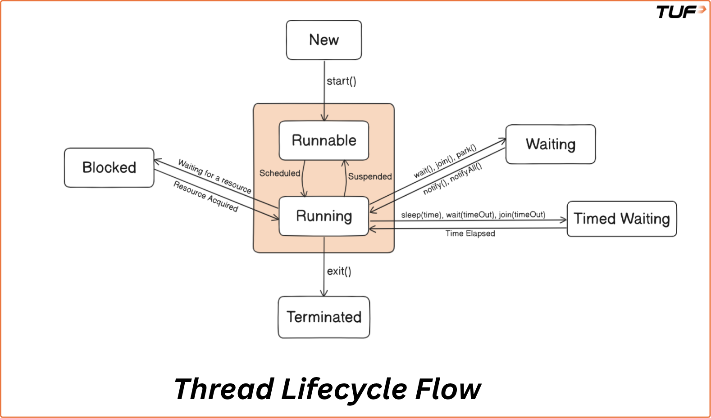

# LLD Misc: Concurrency, Synchronization, and Resilient System Design

## Table of Contents

1. [Program, Process and Thread](#program-process-and-thread)
2. [Cores in CPU](#cores-in-cpu)
3. [Hyperthreading](#hyperthreading)
4. [Context Switching](#context-switching)
5. [Multithreading](#multithreading)
6. [Concurrency vs. Parallelism](#concurrency-vs-parallelism)
7. [Race Conditions](#race-conditions)
8. [Process vs. Thread Comparison](#process-vs-thread-comparison)
9. [C++ Thread vs. Go Goroutine](#c-thread-vs-go-goroutine)
10. [Communication: Thread-Level vs. Process-Level](#communication-thread-level-vs-process-level)
11. [IPC Modes](#ipc-modes)
12. [When to Use Thread vs. Process](#when-to-use-thread-vs-process)
13. [Fault Tolerance](#fault-tolerance)
14. [Isolation](#isolation)
15. [Creating and Managing Threads in Java](#creating-and-managing-threads-in-java)
16. [Thread Lifecycle](#thread-lifecycle)
17. [Thread Pools and Executors](#thread-pools-and-executors)
18. [Thread Starvation and Fairness](#thread-starvation-and-fairness)
19. [Fixed vs. Cached vs. Scheduled Thread Pools](#fixed-vs-cached-vs-scheduled-thread-pools)
20. [Thread Safety and Synchronization](#thread-safety-and-synchronization)
21. [Locks and Synchronization Mechanisms](#locks-and-synchronization-mechanisms)
22. [Read-Write Locks](#read-write-locks)
23. [Semaphores](#semaphores)
24. [Comparing Monitors, Reentrant Locks, and Semaphores](#comparing-monitors-reentrant-locks-and-semaphores)
25. [Go Concurrency: Java Equivalents](#go-concurrency-java-equivalents)
26. [Deadlock](#deadlock)
27. [Producer-Consumer Problem](#producer-consumer-problem)
28. [Dependency Injection](#dependency-injection)
29. [Exception Handling](#exception-handling)
30. [Building Resilient Systems](#building-resilient-systems)
31. [Best Practices in LLD](#best-practices-in-lld)
32. [Database Design and Integration in LLD](#database-design-and-integration-in-lld)
33. [Strategic Guide: Approaching an LLD Interview](#strategic-guide-approaching-an-lld-interview)
34. [FAQs and Common Doubts](#faqs-and-common-doubts)

---

## Program, Process and Thread

In software development, we often come across the terms program, process, and thread. While they may seem similar
at first glance, they represent different concepts that are crucial to understanding how computers execute tasks.

### Program

A **program** is a collection of instructions written in a programming language that is intended to perform a
specific task or solve a particular problem. It's like a recipe book — static, not doing anything until it is run.

> **Example:** If you download `chrome.exe` from the internet, `chrome.exe` is a program. It's just a file sitting
> on your computer. It contains instructions on how to launch and interact with Google Chrome, but it's not doing
> anything until you run it.

### Process

A **process** is an instance of a program that is being executed. When you launch a program (like opening
`chrome.exe`), it gets loaded into memory and starts running. This running instance is called a process. A process
includes the program code, current activity, and other resources like memory, CPU usage, and input/output.

> **Example:** Once you double-click on the Chrome icon, a process is created. The program code in `chrome.exe` is
> now running in memory as a process, using system resources like memory and CPU time.

**Key points:**
- Each process has its own address space.
- Runs independently from other processes.
- Can execute without interfering unless allowed (e.g., inter-process communication).
- Managed by the operating system, ensuring it gets the necessary resources.

### Thread

A **thread** is the smallest unit of execution within a process. A process can contain multiple threads, which
share the same resources but run independently. Each thread can perform a separate task within the same process.
Threads allow for parallelism, where multiple tasks are executed simultaneously.

> **Example:** Within the `chrome.exe` process, there might be several threads running concurrently — one for
> rendering the UI, another for managing network requests, and another for handling user inputs. These threads all
> operate within the `chrome.exe` process but perform different tasks at the same time.

**Key points:**
- Threads are referred to as "lightweight" processes.
- They share resources like memory and CPU time with other threads in the same process.
- Threads within the same process share memory, allowing them to communicate more easily than separate processes.

### Why Understanding These Concepts Matters

- **Program:** Understanding the program is essential for writing efficient code that can be turned into a process.
- **Process:** Processes allow us to execute programs, but they come with limitations like memory and resource
  allocation, which is why understanding how processes are managed is crucial for optimizing applications.
- **Thread:** Threads are at the heart of performance optimization. By breaking a process into multiple threads,
  we can perform tasks concurrently, speeding up execution and improving user experience.

> **Personal note:**
> - program — executable file, e.g. `chrome.exe`
> - process — A process executing the instance of a program. Might be daemon (background) or foreground process.
> - Thread — smallest unit of execution within a process. SHARE Memory between threads of same process.
>   Has own stack/registers but shares heap with other threads of same process.

---

## Cores in CPU

A **core** in a CPU (Central Processing Unit) is a physical processing unit capable of executing instructions.
Modern CPUs often have multiple cores, allowing them to handle several tasks simultaneously.

Each core can independently execute a thread, meaning more cores lead to the ability to run more threads
concurrently, thus improving performance and speed. A single-core CPU is like having only one worker handling all
tasks one by one, while a multi-core CPU is like having several workers who can work on different tasks at the
same time.

---

## Hyperthreading

**Hyperthreading** is a technology developed by Intel that allows a single physical core to act as two logical
cores. It enables one core to run two threads simultaneously, effectively doubling the number of threads the CPU
can handle.

### Intelligent Time Slicing

In Hyperthreading, each logical core takes turns executing tasks. **Time slicing** refers to dividing the core's
time between multiple threads, ensuring both threads get execution time without wasting resources. This is done
intelligently, so when one thread is waiting for data or performing a slower operation (like I/O), the other
thread can continue executing.

### Resource Sharing

Both threads running on a single physical core share resources like the cache, execution units, and memory
bandwidth. Although the two threads are executing on the same core, the resources are distributed in such a way
that performance is enhanced without needing additional physical cores.

---

## Context Switching

**Context Switching** is the process of storing and restoring the state (or context) of a thread or process so
that it can be resumed later. This allows the CPU to switch between different tasks or threads without
interrupting their execution entirely, giving the illusion of parallelism, even on a single-core system.

### How Does Context Switching Happen?

1. **Interrupt:** A context switch happens when a running thread is interrupted by the OS or when a
   higher-priority thread needs to be executed.
2. **Save State:** The state (registers, program counter, etc.) of the current thread is saved to memory.
3. **Load State:** The state of the next thread to be executed is loaded from memory.
4. **Switch Execution:** The CPU starts executing the new thread, continuing from where it was last stopped.

### Thread Scheduler

The **thread scheduler** is the part of the OS that manages context switching. It decides when a thread should
be paused and another should run. It uses scheduling algorithms (like round-robin, priority-based scheduling,
etc.) to determine which thread should run next.

### Disadvantages of Context Switching

- **Task Scheduler Overhead:** The task scheduler takes time to load and save thread states during context
  switching, which adds overhead.
- **Decreased Performance:** As the number of threads increases, time spent on context switching can grow
  significantly, leading to performance degradation.

> **Personal note — Hyperthreading vs. Context Switching:**
> TL;DR: Context switching is an OS-level operation that saves the state of a running thread to memory so another
> thread can execute, incurring measurable latency overhead. Hyperthreading (SMT) is a hardware-level design where
> a single physical CPU core duplicates its architectural state (registers, program counters) to appear as two
> logical cores to the OS, allowing instructions from two threads to be fetched and executed in the same clock
> cycles without the OS context switch penalty.
>
> Context switch: involves saving and loading thread/process states. In hyperthreading, since there are 2 logical
> cores, overhead is virtually zero. However, hyperthreading is a hardware optimization so it needs specialized
> hardware. Also, hyperthreading can only do 2 logical cores per physical core. Even the most powerful consumer
> CPUs have hard physical limits. If you have a high-end 16-core processor with hyperthreading, the hardware
> provides 32 logical cores — meaning the CPU can actively hold the state of exactly 32 threads at any given
> nanosecond. However, your OS is likely juggling between 2,000 and 4,000 software threads at any moment.

---

## Multithreading

**Multithreading** is a programming technique that allows a CPU to execute multiple threads concurrently, with
each thread being the smallest unit of a process. It enables a program to perform more than one task at a time
within the same process.

- **Multi-core:** true parallelism (based on number of cores)
- **Context switching:** single core (mainly if a large number of threads)

Each thread:
- Runs independently
- Shares memory space
- Performs a specific task
- Non-blocking (can run concurrently with other threads)

---

## Concurrency vs. Parallelism

| Concurrency | Parallelism |
|---|---|
| Managing multiple tasks over time, but not necessarily at the same time. | Simultaneous execution of tasks, usually across multiple cores or processors. |
| Can run on a single core by switching between tasks rapidly. | Requires multiple cores or processors for true simultaneous execution. |
| Tasks appear to run together, managed by efficient context switching. | Tasks run at the same time, with no context switching required. |
| Focuses on how to manage and interleave multiple tasks. | Focuses on executing tasks simultaneously to reduce completion time. |

> **Personal note:** You are correct that the OS scheduler and hardware ultimately decide whether your software
> threads are time-sliced on a single core (concurrency) or executed simultaneously on distinct physical cores
> (parallelism), and the program code itself is largely blind to this at runtime. However, the assumption that
> programmers do not need to care is a dangerous pitfall. True multi-core parallelism introduces severe
> synchronization complexities — such as simultaneous memory mutation and cache coherency delays across physical
> CPU L1 caches — that interleaved single-core concurrency often masks. For example, to prevent race conditions in
> a truly parallel environment, you must explicitly design your code using atomic operations (like
> `LOCK CMPXCHG` at the assembly level) or strict memory barriers (`std::atomic_thread_fence`) to force cache
> flushes across physical cores. i.e. always design for the worst case. Also, concurrency can have race conditions
> too if preemptive scheduling is used.

---

## Race Conditions

### The "One Line of Code" Illusion

As programmers, we write code where incrementing a counter looks like a single, atomic action:

```
counter = counter + 1
```

But the CPU executes machine code. That single line translates to at least three distinct CPU instructions:

1. **Read:** Fetch the current value of `counter` from main memory into a CPU register.
2. **Modify:** Add 1 to the value inside the CPU register.
3. **Write:** Save the new value from the CPU register back to main memory.

### The Single-Core Race Condition

A race condition on a single core happens because the OS scheduler can pause (context switch) a thread at any
microsecond, even right in the middle of those three instructions.

**Example:** Two threads (Thread A and Thread B) incrementing a shared counter starting at 0:

1. **Thread A runs:** Executes Step 1 — reads `0` from memory into its register.
2. **Context Switch:** Before Thread A can do the math, its time slice expires. The OS forcefully pauses Thread A,
   saves its register state (which holds `0`), and swaps in Thread B.
3. **Thread B runs:** Executes Steps 1, 2, and 3 — reads `0`, adds `1`, writes `1`. Counter is now `1`.
4. **Thread A resumes:** The OS restores Thread A's saved state. Thread A still has the stale `0` in its register.
   It executes Step 2 (adds 1 to 0) and Step 3 (writes `1` to memory).

Both threads incremented the counter, but the final result is `1` instead of `2`. Data corruption has occurred
without a single instruction running simultaneously in parallel.

---

## Process vs. Thread Comparison

| Process | Thread |
|---|---|
| An independent program in execution, with its own resources and execution context. | A sub-unit or lightweight part of a process, responsible for executing specific tasks. |
| Each process has its own dedicated memory space, isolated from others. | Threads within the same process share memory, allowing for efficient communication. |
| Processes are fully isolated from each other. | Threads are not isolated; they can directly communicate and share data. |
| IPC is more complex — requires mechanisms like sockets or shared files. | Communication between threads is simple as they share the same memory space. |
| Considered "heavyweight" — substantial overhead for creation, execution, and switching. | "Lightweight" — minimal overhead for creation and context switching. |
| A crash in one process generally does not affect others. | A crash in one thread can potentially affect other threads within the same process. |
| Example: A PostgreSQL database instance runs as a separate process. | Example: Individual tabs in Chrome, where each tab is a thread within the browser process. |

---

## C++ Thread vs. Go Goroutine

| Feature | C++ `std::thread` | Go goroutine (`go func()`) |
|---|---|---|
| Concurrency Model | 1:1 Model (one `std::thread` maps to one OS kernel thread). | M:N Model (M goroutines multiplexed onto N OS threads). |
| Scheduler | Managed by the OS kernel scheduler. | Managed by the Go Runtime scheduler (user-space). |
| Memory Footprint (Stack) | Large, fixed stack size — typically 1 MB to 8 MB by default. | Extremely small, dynamically sizing stack — starts at ~2 KB. |
| Creation Cost | High — requires transitioning to kernel mode and OS system calls. | Very low — runtime allocates a small struct and stack in user space. |
| Context Switching Overhead | High (thousands of clock cycles) — requires a kernel trap. | Low (tens to hundreds of clock cycles) — handled in user space. |
| Primary Synchronization | Shared memory — relies on `std::mutex`, `std::condition_variable`, `std::atomic`. | Message passing — idiomatically uses channels and `select`. |
| Thread Identity | Explicitly exposed via `std::this_thread::get_id()`. | Intentionally hidden — Go designers removed goroutine IDs. |
| Blocking Behavior | A blocking system call blocks the entire OS thread. | A blocking I/O call blocks the goroutine; the runtime moves other goroutines to an unblocked OS thread. |

---

## Communication: Thread-Level vs. Process-Level

### 1. Thread-Level Communication (Goroutines)

Because all goroutines in a Go program share the exact same virtual memory address space, they can communicate
directly and extremely fast without involving the OS kernel.

**Mechanism:** Go heavily relies on **Channels** (message passing) or `sync.Mutex` (shared memory locks).

**Technical Example:** A single compiled Go binary — the main goroutine creates a `chan int`, spawns a worker
goroutine, writes `42` into the channel (`ch <- 42`), and the worker reads it (`value := <-ch`). The data simply
moved from one location in the application's RAM to another.

### 2. Process-Level Communication (Inter-Process Communication / IPC)

Processes do not share memory. If you run two separate Go programs (Process A and Process B), the OS strictly
isolates their RAM. To communicate, they must serialize data into a byte stream, send it through an OS-managed
bridge, and deserialize it on the other side.

**Mechanism:** Network sockets (TCP/HTTP/gRPC), Unix Domain Sockets, or OS Pipes.

**Technical Example:** Two separate compiled Go binaries:
- **Process A (Server):** Uses `net/http` to open a TCP listener on `localhost:8080`, waits for incoming requests.
- **Process B (Client):** Uses `http.Client` to serialize a JSON payload `{"value": 42}` and sends an HTTP POST
  request over the local network loopback interface.
- Process A receives the raw network bytes, deserializes the JSON back into a Go struct, and processes the integer.

---

## IPC Modes

Because OS memory isolation (enforced by the CPU's MMU) strictly forbids direct cross-process memory access,
processes must use the OS Kernel as a secure intermediary.

### 1. Sockets (Network and Unix Domain)

A **socket** is an OS-level file descriptor acting as a bidirectional communication endpoint. Data must be
serialized into a stream of bytes.

- **Network Sockets (TCP/UDP):** Route data through the OS's entire network stack via `127.0.0.1:8080`. Works
  across machines on the internet.
- **Unix Domain Sockets (UDS):** Bypass the TCP network stack entirely. Use a file path (e.g.,
  `/tmp/app.sock`) instead of an IP address. Significantly faster than TCP for same-machine IPC.

### 2. Pipes (Anonymous and Named)

**Pipes** are designed for strict, unidirectional (one-way) byte streaming.

- **Anonymous Pipes:** Used by the `|` operator in a terminal (e.g., `ls -l | grep ".txt"`). The OS connects
  the `stdout` of Process A to the `stdin` of Process B. Data flows one direction only.
- **Named Pipes (FIFOs):** Exist as a visible file on the filesystem (e.g., `mkfifo my_pipe`). The data never
  actually touches the hard drive; the filesystem entry is just an anchor for the kernel's RAM buffer.

### 3. Shared Memory

While sockets and pipes require the OS Kernel to copy data (Process A → Kernel Space → Process B), **Shared
Memory** bypasses this bottleneck for maximum performance.

- **How it works:** Process A asks the OS to allocate a block of physical RAM. The OS maps this block into
  Process A's virtual memory space. Process B then attaches to the same block — the OS maps the exact same
  physical RAM into Process B's virtual memory.
- **The Catch:** Both processes can read/write the shared memory instantly, without kernel system calls.
  However, because the OS is no longer mediating the transfer, the processes must manually implement strict
  synchronization (like Semaphores or Mutexes) across the process boundary to prevent race conditions.

---

## When to Use Thread vs. Process

### When to Use a Thread

- **Tasks Need to Share Data:** Threads share memory, making it easy to exchange data quickly.
- **Low Overhead is Important:** Threads are lightweight, with minimal overhead and faster context switching.
- **Tasks are Part of the Same Logic:** Works best when tasks are closely related and need to run concurrently.
- **High Performance Needed:** Ideal for high-performance applications utilizing multiple CPU cores.
- **Tightly Coupled Behavior:** Suitable for tasks that are highly dependent on each other.
- **Responsiveness is Key:** Ensures the main task remains responsive by offloading work to background threads.

### When to Use a Process

- **Tasks Require Isolation:** Processes run independently with isolated memory.
- **One Crash Shouldn't Affect Others:** A crash in one process won't affect others.
- **Security Boundaries Needed:** Processes offer strong isolation for security, preventing cross-memory access.
- **Different Tech Stack:** Suitable for tasks using different technology stacks or runtimes.
- **Resource Limits Needed:** Useful when specific resource limits (e.g., CPU, memory) are required.
- **Used by Different Users:** Provides isolation and security when tasks are executed by different users.

> **Summary:** Choose threads when tasks need to share data, have low overhead, and are tightly coupled (e.g.,
> high-performance applications). Use processes when isolation, security, and fault tolerance are crucial.

---

## Fault Tolerance

**Fault tolerance** refers to the ability of a system to continue functioning correctly even in the presence of
faults or failures. It ensures the system can handle unexpected situations (hardware failures, software crashes,
network issues) without disrupting the service.

- **Redundancy:** Duplicate components
- **Error Detection and Correction:** Mechanisms to identify and fix errors
- **Graceful Degradation:** System continues to operate at reduced functionality
- **Automatic Recovery:** Failed components detected and redirected/repaired (HIGH AVAILABILITY)

---

## Isolation

**Isolation** in computing refers to the separation of tasks, processes, or environments so that they do not
interfere with each other. It ensures that the failure or malfunction of one part of the system does not affect
other parts.

**Key points:**
- **Memory Separation:** Each isolated unit has its own memory space.
- **Failure Containment:** No cascading failures.
- **Security Boundaries:** Isolation creates clear security boundaries between processes, preventing unauthorized
  access. In multi-user systems, isolation ensures one user cannot access or alter another user's data.
  (THINK INDEPENDENT MULTI-TENANT SYSTEMS)
- **Predictable Behavior:** Worst case is soft failures.

---

## Creating and Managing Threads in Java

Imagine you've placed an order, and the next steps involve sending three notifications:
- Send an SMS: 2 seconds
- Send an Email: 3 seconds
- Send ETA (Estimated Time of Arrival): 5 seconds

Normally, executing these tasks sequentially would take 10 seconds (2 + 3 + 5). With separate threads running
concurrently, the total time is just 5 seconds (the longest individual task). This is the power of multithreading.

### Way 1: Extending the `Thread` Class (`start()` / `run()`)

**Key Concepts:**
- **`Thread` class:** Override `run()` to specify the thread's operations.
- **`start()` method:** Starts a new thread of execution; internally calls `run()`.
- **`join()` method:** Makes the main thread wait for a thread to finish before proceeding.

```java
import java.util.*;

// Creating a subclass of Thread to send SMS
class SMSThread extends Thread {
    public void run() {
        try {
            Thread.sleep(2000); // 2-second delay for SMS
            System.out.println("SMS Sent using Thread.");
        } catch(InterruptedException e) {
            e.printStackTrace();
        }
    }
}

// Creating a subclass of Thread to send Email
class EmailThread extends Thread {
    public void run() {
        try {
            Thread.sleep(3000); // 3-second delay for Email
            System.out.println("Email Sent using Thread.");
        } catch(InterruptedException e) {
            e.printStackTrace();
        }
    }
}

// Creating a subclass of Thread to calculate ETA
class ETACalculationThread extends Thread {
    public void run() {
        try {
            Thread.sleep(5000); // 5-second delay for ETA calculation
            System.out.println("ETA Calculated using Thread. Estimated Time: 25 minutes.");
        } catch(InterruptedException e) {
            e.printStackTrace();
        }
    }
}

class Main {
    public static void main(String[] args) {
        // Create thread objects for SMS, Email, and ETA Calculation
        SMSThread smsThread = new SMSThread();
        EmailThread emailThread = new EmailThread();
        ETACalculationThread etaThread = new ETACalculationThread();

        System.out.println("Task Started.\n");

        // Start all threads
        smsThread.start();
        System.out.println("Task 1 ongoing...");

        emailThread.start();
        System.out.println("Task 2 ongoing...");

        etaThread.start();
        System.out.println("Task 3 ongoing...");

        // Wait for all threads to finish
        try {
            smsThread.join();
            emailThread.join();
            etaThread.join();
            System.out.println("All tasks completed.");
        } catch (InterruptedException e) {
            e.printStackTrace();
        }
    }
}
```

> **Personal note:** This is bad since we inherit from the `Thread` class so we cannot inherit another class.
> You cannot return any value either. This is an issue.

---

### Way 2: Runnable Interface

The **Runnable interface** represents a task that can be executed concurrently, but it does not manage the
thread itself. We need to pass it to a `Thread` object for execution. This helps us inherit from another class
if needed.

- **`Runnable` interface:** A functional interface with a single method, `run()`. By implementing it, we define
  the task executed by a thread.
- **`run()` method:** Unlike the `Thread` class approach, we provide the task's code by implementing `run()` of
  `Runnable` — not by overriding `Thread.run()`.

> **Note — Important JVM behaviour:**
> In Java, the JVM keeps running as long as any **non-daemon threads** are alive.
> When `smsThread.start()` and `emailThread.start()` are called, they run **concurrently** with the main thread.
> The main thread doesn't wait for them — it immediately prints "Main loop exiting" and finishes `main()`.
> However, `SMSTask` and `EmailTask` are still sleeping (2s and 3s respectively). Since they are non-daemon
> threads by default, the JVM stays alive until they complete, so their output appears after the main thread exits.
>
> **Execution timeline:**
> ```
> t=0ms    → smsThread starts, emailThread starts
> t=0ms    → Main prints "Main loop exiting" and exits
> t=2000ms → smsThread wakes up → "SMS Sent using Runnable."
> t=3000ms → emailThread wakes up → "Email Sent using Runnable."
> t=3000ms → JVM exits (no more non-daemon threads)
> ```
> This is exactly why the commented-out `.join()` calls exist — uncommenting them would make the main thread
> **wait** for both threads to finish before printing "Main loop exiting".

**Demerit — No Return Type in `run()`:**
A limitation of `Runnable` is that `run()` cannot return a value (it is `void`). If you need to return a result
(e.g., an ETA string), you cannot do so directly. This is where the `Callable` interface comes in.

---

### Way 3: Callable Interface and Future

In Java, the **Callable** interface provides an enhanced way to implement multithreading when you need tasks
to return a result. Unlike the previously discussed methods, which do not return any result, **Callable**
allows the thread to return a value once the task completes. Since `run()` of `Runnable` cannot return a
result (it is `void`), the **Callable** interface provides a `call()` method, which can return any type of
value.

In addition, **Future** is an interface that represents the result of an asynchronous computation. It
provides methods to check the status of a task and retrieve the result once it is available, thus allowing
you to avoid the limitations of the Thread and Runnable approaches.

**ExecutorService:** While you can directly use `Thread` with `Callable`, it is recommended to use
**ExecutorService** for better thread management. The **ExecutorService** provides a method called
`submit()` to submit a Callable task and returns a `Future` object that can be used to retrieve the result
later.

```java
package com.karthik.lld_basics.threads;

import java.util.concurrent.Callable;
import java.util.concurrent.ExecutorService;
import java.util.concurrent.Future;
import java.util.concurrent.FutureTask;
import java.util.concurrent.ExecutionException;


public class Threads {
  public void run() {
    System.err.println("Running CreateManageThreads to demonstrate threading...");
    CreateManageThreads createManageThreads = new CreateManageThreads();
    createManageThreads.runFunction();
  }
}

class CreateManageThreads {
  public void runFunction() {

    // ─────────────────────────────────────────────────────────────────────────
    // APPROACH 1: Runnable
    // ─────────────────────────────────────────────────────────────────────────
    // Runnable is the simplest way to define a task for a thread.
    // Limitation: run() returns void — you CANNOT get a result back from
    // the task. There is no built-in way to know if it succeeded or failed
    // beyond using shared mutable state (error-prone).
    // Also, run() cannot throw checked exceptions — you must handle them inside.
    System.err.println("Runnable Threads");
    Thread smsThreadRunnable = new Thread(new SMSTaskRunnable());
    Thread emailThreadRunnable = new Thread(new EmailTaskRunnable());
    smsThreadRunnable.start();
    emailThreadRunnable.start();

    try {
      // join() makes the MAIN thread wait here until each worker thread finishes.
      // Without join(), the main thread would continue running and could exit
      // before the worker threads complete their work.
      // We must do this manually because Runnable gives us no other handle
      // to know when a task is done.
      smsThreadRunnable.join();
      emailThreadRunnable.join();
    } catch (InterruptedException e) {
      e.printStackTrace();
    }

    // ─────────────────────────────────────────────────────────────────────────
    // APPROACH 2: Callable + FutureTask (still using raw Thread)
    // ─────────────────────────────────────────────────────────────────────────
    // Callable is like Runnable but solves two of its problems:
    //   1. call() returns a value (generic type T).
    //   2. call() can throw checked exceptions — the exception is captured
    //      inside the FutureTask and re-thrown when you call get().
    //
    // Since Thread only accepts Runnable, we wrap Callable inside FutureTask.
    // FutureTask implements both Runnable AND Future:
    //   - As a Runnable: Thread calls futureTask.run() → which calls callable.call()
    //   - As a Future:   gives us get() to retrieve the result later.
    System.err.println("Callable Threads");
    FutureTask<String> smFutureTask = new FutureTask<>(new SMSTaskCallable());
    FutureTask<String> emailFutureTask = new FutureTask<>(new EmailTaskCallable());
    Thread smsThreadCallable = new Thread(smFutureTask);
    Thread emailThreadCallable = new Thread(emailFutureTask);
    smsThreadCallable.start();
    emailThreadCallable.start();

    try {
      // No need of join() - Waits if necessary for the computation to complete,
      // and then retrieves its result.
      // Now safe to call get() — the threads have already finished so this
      // returns immediately without blocking.
      System.err.println(smFutureTask.get());
      System.err.println(emailFutureTask.get());
    } catch (Exception e) {
      e.printStackTrace();
    }

    // ─────────────────────────────────────────────────────────────────────────
    // APPROACH 3: ExecutorService (the recommended, production-grade approach)
    // ─────────────────────────────────────────────────────────────────────────
    // WHAT ExecutorService offers over raw Thread:
    //   1. THREAD POOL — threads are pre-created and REUSED for multiple tasks.
    //      Creating a new Thread per task is expensive (OS-level resource).
    //      A pool of 2 threads here means at most 2 threads are allocated,
    //      no matter how many tasks you submit.
    //   2. TASK QUEUE — if you submit more tasks than pool size, extras wait
    //      in a queue automatically. You don't manage this yourself.
    //   3. LIFECYCLE MANAGEMENT — you control when the pool starts and stops
    //      via shutdown(). No need to track individual thread objects.
    //   4. Future returned automatically — submit() returns a Future<T>
    //      without needing to manually wrap in FutureTask.
    //   5. Exception propagation — any exception thrown in call() is wrapped
    //      and re-thrown as ExecutionException when you call future.get().
    //
    // KEY DIFFERENCE from Runnable/raw Thread:
    //   - With raw Thread, YOU create threads, start them, and join them.
    //   - With ExecutorService, YOU just submit tasks; the pool manages threads.
    //
    // newFixedThreadPool(2): creates a pool with exactly 2 worker threads.
    SMSTaskCallable smsTask = new SMSTaskCallable();
    EmailTaskCallable emailTask = new EmailTaskCallable();
    ExecutorService executorService = java.util.concurrent.Executors.newFixedThreadPool(2);

    // submit() hands the task to the pool and returns a Future immediately.
    // The task runs asynchronously in one of the pool's threads.
    Future<String> st = executorService.submit(smsTask);
    Future<String> et = executorService.submit(emailTask);

    try {
        // WHY NO join() HERE?
        // Future.get() already BLOCKS the main thread until the task finishes
        // and returns its result. It is the equivalent of join() + result retrieval
        // combined into one call.
        // With raw Thread we called join() (wait) and then get() (read result)
        // as two separate steps. Here, get() does both in one step.
        // So join() is not needed — and there are no Thread objects to join on anyway,
        // because we never created or held references to the actual threads;
        // the ExecutorService owns and manages them internally.
        System.out.println(st.get()); // blocks until SMS task is done, then prints result
        System.out.println(et.get()); // blocks until Email task is done, then prints result
    } catch (InterruptedException | ExecutionException e) {
        // InterruptedException: current thread was interrupted while waiting in get()
        // ExecutionException: the task itself threw an exception inside call()
        e.printStackTrace();
    }

    // shutdown() signals the ExecutorService to stop accepting new tasks
    // and allows currently running/queued tasks to finish before the pool closes.
    // Without shutdown(), the JVM may not exit because pool threads are non-daemon
    // threads that keep running.
    executorService.shutdown();
    System.err.println("Main loop exiting");
  }
}


// ─────────────────────────────────────────────────────────────────────────────
// Runnable tasks — no return value, no checked exception from signature
// ─────────────────────────────────────────────────────────────────────────────

// Simulates sending an SMS by sleeping for 2 seconds, then printing a message.
class SMSTaskRunnable implements Runnable {
    public void run() {
        try {
            Thread.sleep(2000); // simulate network/IO delay for SMS
            System.out.println("SMS Sent using Runnable.");
        } catch (InterruptedException e) {
            e.printStackTrace();
        }
        // Notice: nothing to return. Caller has no way to get a result.
    }
}

// Simulates sending an Email by sleeping for 3 seconds, then printing a message.
class EmailTaskRunnable implements Runnable {
    public void run() {
        try {
            Thread.sleep(3000); // simulate longer network/IO delay for Email
            System.out.println("Email Sent using Runnable.");
        } catch (InterruptedException e) {
            e.printStackTrace();
        }
        // Notice: nothing to return. Caller has no way to get a result.
    }
}


// ─────────────────────────────────────────────────────────────────────────────
// Callable tasks — return a value; can propagate exceptions via Future.get()
// ─────────────────────────────────────────────────────────────────────────────
// WHY DOES EACH TASK PRODUCE TWO LINES OF OUTPUT?
// Each call() method has two separate print actions:
//   1. System.out.println(...) INSIDE call() — executed by the WORKER thread.
//      This prints "SMS Sent using Callable." / "Email Sent using Callable."
//   2. return "SMS Sent" / return "Email Sent" — the return value is stored
//      in the Future. When the MAIN thread calls st.get() / et.get(), it
//      retrieves this string and prints it with System.out.println(st.get()).
// So: worker thread prints one line, main thread prints another — two prints total per task.
//
// WHY DOES THE OUTPUT APPEAR IN SEQUENTIAL PAIRS (SMS pair, THEN Email pair)?
// Both tasks are submitted and start concurrently in the thread pool (t=0).
// But st.get() is called FIRST — it blocks the main thread until SMS finishes (t=2s).
// Only after st.get() returns does the main thread reach et.get().
// Email was already running in parallel, so it finishes shortly after (t=3s).
// Result: SMS pair appears together, then Email pair — even though both tasks ran in parallel.

// Callable<String> means call() returns a String result.
// This result is captured by FutureTask/ExecutorService and available via get().
class EmailTaskCallable implements Callable<String> {
    public String call() throws Exception {
        try {
            Thread.sleep(3000); // simulate longer delay for Email
            // OUTPUT LINE 1: printed by the worker thread running this call()
            System.out.println("Email Sent using Callable.");
        } catch (InterruptedException e) {
            e.printStackTrace();
        }
        // OUTPUT LINE 2: this return value is stored in the Future.
        // The main thread retrieves it via et.get() and prints it separately.
        return "Email Sent";
    }
}

class SMSTaskCallable implements Callable<String> {
    public String call() throws Exception {
        try {
            Thread.sleep(4000); // simulate delay for SMS
            // OUTPUT LINE 1: printed by the worker thread running this call()
            System.out.println("SMS Sent using Callable.");
        } catch (InterruptedException e) {
            e.printStackTrace();
        }
        // OUTPUT LINE 2: this return value is stored in the Future.
        // The main thread retrieves it via st.get() and prints it separately.
        return "SMS Sent";
    }
}
```

---

### Way 4: Other Ways to Implement Multithreading

**1. Directly defining a Runnable as an anonymous class:**

```java
Runnable task = new Runnable() {
    @Override
    public void run() {
        try {
            Thread.sleep(2000); // Simulate delay
            System.out.println("Task completed using direct Runnable.");
        } catch (InterruptedException e) {
            e.printStackTrace();
        }
    }
};
Thread thread = new Thread(task);
thread.start();
```

**2. Using Lambda Expressions (Java 8+):**
Lambda expressions provide a concise way to define `Runnable` tasks without anonymous class boilerplate.

```java
class Main {
    public static void main(String[] args) {
        Runnable task = () -> {
            try {
                Thread.sleep(2000); // Simulate delay
                System.out.println("Task completed using Lambda expression.");
            } catch (InterruptedException e) {
                e.printStackTrace();
            }
        };
        Thread thread = new Thread(task);
        thread.start();
    }
}
```

## Thread Lifecycle



### States in Thread Lifecycle

A thread undergoes various states during its execution. These states represent
different phases a thread can be in from its creation to termination:

- **New:** The thread is created but not started yet.
- **Runnable:** The thread is eligible to run but is not necessarily executing.
  It transitions to Running when the CPU picks it for execution.
- **Running:** The thread is actively executing.
- **Blocked:** The thread is waiting for a resource or lock.
- **Waiting:** The thread is waiting indefinitely for another thread to perform
  an action (e.g., `wait()` or `join()`).
- **Timed Waiting:** The thread is waiting for a specific amount of time
  (e.g., `sleep()` or `join(time)`).
- **Terminated:** The thread has completed its execution or is stopped.

### State Transitions

- **New → Runnable:** When `start()` is called.
- **Runnable → Running:** When the thread is scheduled to execute.
- **Running → Blocked:** When the thread waits for a resource.
- **Blocked → Runnable:** When the resource becomes available.
- **Running → Waiting:** When the thread calls `wait()`, `join()`, or `lock()`.
- **Waiting → Runnable:** When the thread is notified (`notify()`, `notifyAll()`).
- **Timed Waiting → Runnable:** When the waiting time expires.
- **Runnable → Terminated:** When the thread completes its execution.

---

## Thread Pools and Executors

Imagine building a **ride-matching system** like Uber, where the system needs to handle requests from
drivers and riders simultaneously. Each time a rider requests a ride, the system has to find an
available driver. To do this efficiently, the system may need to handle multiple tasks
**concurrently**, such as processing requests, matching riders with drivers, updating their statuses,
and sending notifications.

In a simple approach, you might decide to create a new **thread** every time a ride request comes in,
so each request gets processed independently. The code implementing this approach is given below:

```java
// Method handling ride request
    public void requestRide(String riderId) {

        // Creating a new thread for the ride
        Thread matchThread = new Thread(() -> {
            System.out.println("Matching rider " + riderId + " to a driver...");
            // Simulate some processing
            try {
                Thread.sleep(1000); // Simulate a 1-second matching process
            } catch (InterruptedException e) {
                Thread.currentThread().interrupt();
            }
            System.out.println("Ride matched for rider " + riderId);
        });
        matchThread.start();
    }
```

### Issues while Creating Thread Manually in Real-World Systems

- **Thread Explosion:** Creating a new thread for each task can quickly lead to an excessive number
  of threads, overwhelming the system and degrading performance.
- **Thread Leaks:** Failing to properly terminate threads results in thread leaks, where unused
  threads continue consuming resources, leading to performance degradation.
- **Context Switching Overhead:** Managing too many threads increases context switching, where the
  system saves and loads thread states. This overhead reduces overall system efficiency as the CPU
  spends more time switching between threads than doing real computational work.

### A Better Approach: Thread Pools

A better approach is to use **thread pools**, where a fixed number of threads are available to handle
tasks.

#### Real-life Analogy

This is similar to hiring a set number of chefs for a kitchen: instead of hiring a new chef every
time an order comes in, you use your existing chefs efficiently to handle multiple orders as they come
in. This ensures that resources are optimized and the kitchen (or system) runs smoothly without
overloading.

### Executor Framework

The **Executor Framework** in Java is a high-level API that provides a simple and flexible mechanism
for managing and controlling thread execution. It decouples:

- **Task Submission:** What you want to do.
- **Task Execution:** How and when it runs.

allowing you to manage threads more efficiently. This framework is part of Java's
`java.util.concurrent` package and simplifies the process of handling threads. Let us understand the
key concepts of Executor Frameworks first

#### 1. Executor Interface

The **Executor** interface is the foundation of the Executor Framework. It defines a single method:

`void execute(Runnable command)`: The execute method takes a **Runnable** task and runs it
asynchronously in a thread. It doesn't return any result, and you can't track the execution outcome
directly.

#### 2. ExecutorService Interface

**ExecutorService** extends the Executor interface and adds methods for managing and controlling the
lifecycle of threads.

Key Methods:

- `submit(Callable task)`: Returns a **Future** object which allows you to track the progress of the
  task.
- `shutdown()`: Initiates an orderly shutdown of the executor, rejecting any new tasks but processing
  the already submitted ones.
- `shutdownNow()`: Tries to stop all actively executing tasks and halts the processing of waiting
  tasks.

#### 3. ThreadPoolExecutor Class

**ThreadPoolExecutor** is a concrete implementation of ExecutorService and is one of the most commonly
used classes. It allows you to define a pool of threads to execute tasks.

Key Parameters:

- `corePoolSize`: The number of threads to keep in the pool.
- `maximumPoolSize`: The maximum number of threads allowed in the pool.
- `keepAliveTime`: Time for which idle threads will be kept alive before being terminated.
- `workQueue`: A queue used to hold tasks before they are executed.

#### 4. Executors Class

**Executors** is a utility class that provides factory methods to create predefined types of executor
services.

Common Methods:

- `newFixedThreadPool(int nThreads)`: Creates a thread pool with a fixed number of threads.
- `newCachedThreadPool()`: Creates a thread pool that can dynamically grow and shrink.
- `newSingleThreadExecutor()`: Creates a single-threaded executor.

### ExecutorThreads Example

```java
──────────────────────────────────────────────────────────────────────
// ExecutorThreads: demonstrates the two main ways to submit work to a pool —
//   execute() for fire-and-forget (no return value)
//   submit()  for tasks that return a result via Future
// ─────────────────────────────────────────────────────────────────────────────
class ExecutorThreads {
  public void runFunction() throws Exception {

    // ── PART 1: execute() — fire and forget (no return value) ────────────────
    // newFixedThreadPool(10): pre-creates 10 worker threads.
    // Submitted tasks run on those threads; no new thread is spawned per task.
    // If more than 10 tasks are submitted at once, extras wait in an internal queue.
    ExecutorService executorService = Executors.newFixedThreadPool(10);

    // Alternative: newCachedThreadPool() — creates threads on demand and reuses
    // idle ones. Good when task count is unpredictable and tasks are short-lived.
    // ExecutorService cachedExecutorService = Executors.newCachedThreadPool();

    // execute() accepts a Runnable (no return value).
    // Both calls return immediately — tasks run asynchronously in pool threads.
    // We don't get any handle to check completion or result.
    sendEmail(executorService, "karthik.hallad");
    sendEmail(executorService, "kumar.matcha");

    // shutdown() stops accepting new tasks. Already-submitted tasks finish normally.
    // Without this, the JVM won't exit because pool threads are non-daemon threads.
    executorService.shutdown();

    // ── PART 2: submit() — get a result back via Future ──────────────────────
    // submit() accepts a Callable<T> (or Runnable) and returns a Future<T>.
    // The Future is a "receipt" — it lets the main thread retrieve the result
    // (or any exception) once the worker thread finishes.
    ExecutorService executorService2 = Executors.newFixedThreadPool(10);

    // Both tasks are submitted and start running in parallel immediately.
    // sendEmailAndReturnEmail() returns a Future right away — it does NOT block.
    Future<String> emailResult1 = sendEmailAndReturnEmail(executorService2, "karthik.hallad");
    Future<String> emailResult2 = sendEmailAndReturnEmail(executorService2, "kumar.matcha");

    // get() BLOCKS the main thread until the task is done, then returns the result.
    // Both tasks were already running in parallel since submit() was called above,
    // so the total wait time is ~max(task1_time, task2_time), not sum of both.
    System.out.println(emailResult1.get());
    System.out.println(emailResult2.get());

    executorService2.shutdown();
  }

  // ── execute() variant: Runnable, no return value ─────────────────────────
  // Use this when you just want to fire a task and don't need to know its result.
  // execute() only accepts Runnable (or lambda that matches Runnable: () -> void).
  // It cannot accept a Callable because execute() has no way to store a return value.
  public static void sendEmail(ExecutorService executor, String recipient) {
    // Passing a lambda — the lambda body IS the Runnable.run() implementation.
    // Equivalent to: executor.execute(new EmailTaskRunnable());
    // For runnables, submit() also works: executor.submit(() -> { ... });
    // BUT execute() can NOT take a Callable — Callable.call() returns a value,
    // and execute() discards all return values (it's void).
    executor.execute(() -> {
        // Thread.currentThread().getName() shows which pool thread is running this task.
        // With a fixed pool of 10, you'll see names like "pool-N-thread-1", etc.
        System.out.println("Sending email to " + recipient + " on " + Thread.currentThread().getName());
        try {
            Thread.sleep(1000);  // simulate sending delay
        } catch (InterruptedException e) {
            // Best practice: re-set the interrupt flag so calling code can detect it.
            // Swallowing InterruptedException without this loses the interrupt signal.
            Thread.currentThread().interrupt();
        }
        System.out.println("Email sent to " + recipient);
        // No return — caller gets nothing back. Task result is lost after this point.
    });
    // execute() returns void immediately. The lambda runs asynchronously.
  }

  // ── submit() variant: Callable lambda, returns Future<String> ────────────
  // Use this when you need the result of the task.
  // submit() can accept BOTH Runnable and Callable.
  //   - submit(Runnable)  → returns Future<?>, get() returns null
  //   - submit(Callable<T>) → returns Future<T>, get() returns the actual value
  // The lambda here has a return statement → Java infers it as Callable<String>.
  public static Future<String> sendEmailAndReturnEmail(ExecutorService executor, String recipient) {
    // Equivalent to passing a named Callable: executor.submit(new EmailTaskCallable());
    return executor.submit(() -> {
      // This lambda body is Callable.call() — it runs on a pool thread, not main.
      System.out.println(
        "Sending email to " + recipient + " on " + Thread.currentThread().getName());
      try {
          Thread.sleep(1000);  // simulate sending delay
      } catch (InterruptedException e) {
          Thread.currentThread().interrupt();  // preserve interrupt status
      }
      // The returned String is wrapped inside the Future by the ExecutorService.
      // The main thread retrieves it by calling future.get().
      return "RETURN VALUE: Email sent to " + recipient;
    });
    // submit() returns the Future immediately without waiting for the task to finish.
    // The caller decides when to block by calling get().
  }
}
```

### Why Use Executor Frameworks?

- **Simplified Thread Management:** The framework handles thread creation, task execution, and
  management for you, reducing boilerplate code.
- **Efficient Resource Management:** By using thread pools, you avoid the overhead of creating new
  threads for every task, leading to better performance.
- **Graceful Shutdown:** Executor services allow for a clean shutdown, ensuring that all tasks complete
  before the system terminates.

### Methods to Submit Tasks

In Java's Executor Framework, submitting tasks is a fundamental operation that determines how tasks
are executed asynchronously. The **ExecutorService** provides several methods to submit tasks for
execution. Let's understand them one by one.

#### 1: `execute()` Method

- **Purpose:** It is used to submit Runnable tasks (tasks that do not return any result).
- **Return Type:** It does not return a result. This method simply submits the task for execution and
  doesn't provide a way to track the result or exceptions.
- **Usage:** It's ideal for tasks where you don't need a result back from the task (e.g., logging,
  sending an email, etc.).

Note that we've studied this method in the previous section.

#### 2: `submit()` Method

- **Purpose:** It is used to submit both Runnable and Callable tasks (tasks that can return a
  result).
- **Return Type:** It returns a Future object, which allows you to track the result and handle
  exceptions thrown during the task's execution.
- **Usage:** It's ideal for tasks where you need to capture and process the result (e.g., performing
  calculations or retrieving data).

> **VERY VERY IMPORTANT NOTE:**
>
> 1)
>
> **submit() Method**
>
> The submit() method is a versatile way to submit tasks to an executor. It accepts both Runnable and
> Callable tasks:
>
> - **Runnable:** A task that doesn't return a result.
> - **Callable:** A task that can return a result (like our example where 77 is returned).
>
> The method returns a Future object, which can be used to monitor the task's progress and retrieve
> the result once it completes.
>
> 2)
>
> **3. get() Method**
>
> The get() method of the Future object is blocking, meaning it will pause the calling thread until
> the task has finished executing and the result is ready.
>
> If the task has already completed, get() will return the result immediately. Otherwise, it will wait
> for the task to finish.

### Shutdown Methods in Executor Class

#### 1. `shutdown()` method

- **Purpose:** Initiates an orderly shutdown of the executor service. Once this method is called, the
  executor will stop accepting new tasks but will continue to process the tasks that have already been
  submitted.
- **Return type:** void.

#### `shutdownNow()`

- **Purpose:** Attempts to stop all actively executing tasks, halts the processing of waiting tasks,
  and returns a list of the tasks that were waiting to be executed.
- **Usage:**
  - shutdownNow() tries to immediately stop all tasks, including those that are currently running.
  - It does not guarantee that all tasks will be stopped; it may just attempt to interrupt them.
  - It returns a list of tasks that have not yet started executing, so you can handle those tasks or
    retry them later if needed.

## Thread Starvation and Fairness

### Thread Starvation

Thread starvation occurs when a thread is perpetually unable to access the resources it needs for
execution due to high contention, often caused by prioritizing certain threads over others. As a
result, low-priority threads or threads with resource dependencies may never get a chance to execute.

- Happens when high priority threads or infinite blocking for less resources or LACK OF FAIR
  SCHEDULING PRINCIPLES

### Fairness in Thread Scheduling

Fairness ensures that all threads get an opportunity to execute, preventing some threads from being
permanently blocked. A fair scheduler allocates CPU time evenly across all threads, preventing
starvation.

### Fixes for Thread Safety

- Adjusting Thread Priorities
- Implementing Fair Locks
- Using Time Slicing or Round Robin Scheduling
- Adopting Fair Scheduling Algorithms
- Leveraging Executor Services for Task Management

## Fixed vs. Cached vs. Scheduled Thread Pools

### Fixed

Applications where the number of tasks is known in advance, and the system should process a fixed
number of concurrent tasks (e.g., handling a fixed number of user requests simultaneously).

- predictable resource usage but limited scalability and issue of underutilization

### Cached Thread Pool

A **Cached Thread Pool** creates new threads as needed but reuses previously constructed threads when
they are available. If a thread remains idle for more than 60 seconds (60 seconds is goldilocks
number which is balancing reuse vs memory wastage), it is terminated and removed from the pool.

Short-lived tasks that are executed intermittently, such as handling burst traffic or processing small
background tasks where thread usage is unpredictable.

- scalable and efficient resource use but potential for thread explosion and less predictable resource
  usage

### Scheduled Thread Pools (like CRON)

A **Scheduled Thread Pool** allows you to schedule tasks with fixed-rate or fixed-delay execution
policies. It supports delayed or periodic execution of tasks, making it useful for scheduling tasks
at regular intervals or after a specific delay. Let's understand with the code given:

```java
class SessionCleaner {
    public static void main(String[] args) {
        ScheduledExecutorService scheduler = Executors.newScheduledThreadPool(1);

        Runnable task = () -> System.out.println("Cleaning up expired sessions...");

        scheduler.scheduleAtFixedRate(task, 0, 5, TimeUnit.SECONDS);
    }
}
```

In the above example, a session-cleaning task is scheduled to run every 5 seconds, starting
immediately (initialDelay = 0). This is achieved using `scheduleAtFixedRate()`, which ensures periodic
execution using a ScheduledExecutorService.

> Helps with task scheduling and flexible execution but less efficient for short lived tasks and
> thread management overhead exists.

---

## Thread Safety and Synchronization

**Thread safety** means that a piece of code, object, or method works correctly and consistently when
used by multiple threads at the same time. It makes sure that no wrong result is produced and no data
gets corrupted - even if many threads are accessing or changing the same thing.

### Race Condition

When two or more tasks reach for the same data at the same moment, the first one to finish "wins,"
and the final result depends on sheer timing - not on logic. That timing lottery is called a **race
condition**.

```java
import java.util.concurrent.*;

// Purchase counter with no protection
class PurchaseCounter {
    // Shared count value
    private int count = 0;

    // Increment the counter
    public void increment() {
        // READ current value
        // INCREMENT it
        // WRITE it back
        count++;                 // <-- not atomic, unsafe
    }

    // Fetch the current count
    public int getCount() {
        return count;
    }
}

// Demonstrates the race condition
class RaceConditionDemo {
    public static void main(String[] args) throws InterruptedException {
        // Create a shared counter
        PurchaseCounter counter = new PurchaseCounter();

        // Task that bumps the counter 1000 times
        Runnable task = () -> {
            for (int i = 0; i < 1000; i++) {
                counter.increment();
            }
        };

        // Run the same task in two threads
        Thread t1 = new Thread(task);
        Thread t2 = new Thread(task);
        t1.start();
        t2.start();
        t1.join();
        t2.join();

        // Expect 2000, but rarely get it
        System.out.println("Final Count: " + counter.getCount());
    }
}
```

**Why?** : count++ looks like one step but is really three: read, add 1, write back.

### Tools: Synchronized Keyword

**Synchronized** is a built-in way to let only one thread touch a critical section at a time.

#### How it Fixes Race Condition

When a thread enters a **synchronized** region, it grabs a monitor lock tied to an object (or the
class itself).

If the lock is available: the thread enters and safely runs the code inside.

If the lock is already held by another thread: the thread waits (is blocked) until the lock is
released.

This way, only one thread at a time can execute the synchronized part, which avoids conflicts and
ensures thread safety.

```java
class SafeCounter {
    private int count = 0;

    // Entire method is protected by the instance’s monitor lock
    public synchronized void increment() {
        count++;          // atomic under the lock
    }

    public synchronized int getCount() {
        return count;
    }
}
```

> VVIMP:
> Only one thread can run increment() (or any other synchronized method of the same object) at a time.

### Synchronized Block

When you need only some parts of the method to be synchronized, you can use a **synchronized block**
instead of synchronizing the whole method. This allows for better performance by reducing the scope
of synchronization.

```java
class SafeCounter {
    private final Object lock = new Object();
    private final Object lock2 = new Object();
    private int count = 0;

    public void increment() {
        // Lock only the code that truly needs protection
        synchronized (lock) {
            count++;
        }
        synchronized (lock2) {
            // some other critical section that needs a different lock
        }
    }

    public int getCount() {
        // No lock needed for simple read, or use block if strict consistency required
        return count;
    }
}
```

Instead of locking an entire method, a synchronized block allows you to specify exactly which
object's monitor lock to acquire, and limits the scope of the lock to a specific block of code.

**The Lock:** Whatever object reference you pass into the parentheses. It can be this, a .class
object, or a dedicated lock object (often a private final Object).

**Concurrency Impact:** This provides the highest performance by minimizing the critical section. If
a method does complex I/O or calculations that don't need to be thread-safe, and only mutates shared
state for two lines, you only lock those two lines. It also prevents external classes from deadlocking
your class, which can happen if you expose synchronized methods (since external code can synchronize
on your exposed instance).

### Monitor Locks

This is the lock **synchronized** methods and block use.

#### Key Points

- One lock per object (plus one per Class for static sync).
- Re-entrant: The same thread can enter the lock multiple times without deadlocking itself.
- Queueing: If a lock is taken, other threads wait (block) until it’s released.
- Scope matters:
  - synchronized instance method → lock on this.
  - synchronized static method → lock on the Class object.
  - synchronized (obj) block → lock on obj.

#### Lock Target

| synchronized Instance Method | synchronized Static Method | synchronized(obj) Block |
| --- | --- | --- |
| this (The current instance) | ClassName.class (The Class object) | obj (The explicitly passed object) |

#### Scope of Lock

| synchronized Instance Method | synchronized Static Method | synchronized(obj) Block |
| --- | --- | --- |
| The entire method body | The entire method body | Only the code inside the {} block |

#### Granularity

| synchronized Instance Method | synchronized Static Method | synchronized(obj) Block |
| --- | --- | --- |
| Coarse (locks all synchronized instance methods on that object) | Coarse (locks all synchronized static methods on that class) | Fine (locks only the specific block, allowing parallel execution of other blocks) |

#### Primary Use Case

| synchronized Instance Method | synchronized Static Method | synchronized(obj) Block |
| --- | --- | --- |
| Thread-safe mutation of instance variables. | Thread-safe mutation of static/global variables. | Minimizing lock contention and avoiding external deadlocks. |

#### Drawback

Using monitor locks via synchronized removes data races, but over-locking can slow your app or cause
deadlocks if locks are acquired in inconsistent order.

While monitor locks help manage exclusive access, they also introduce overhead by forcing threads to
wait, especially when only visibility of changes - not atomicity - is needed.

In such cases, where synchronization might be too heavy, Java provides a lighter option: the
**volatile** keyword.

### Volatile Keyword

**Volatile** is used to ensure visibility, not atomicity.

It tells the JVM that a variable's value may be updated by multiple threads and that every read or
write should go directly to and from main memory, rather than being cached in a thread’s local memory
(CPU cache).

Threads usually read from CPU cache for performance, but this can lead to stale data if one thread
updates a variable and another thread doesn't see that update because it's reading from its cache.
Declaring a variable as volatile ensures that all threads see the most up-to-date value.

```java
class SharedData {
    volatile boolean flag = false;

    public void writer() {
        flag = true;
    }

    public void reader() {
        if (flag) {
            // guaranteed to see true if another thread wrote it
        }
    }
}
```

1. **visibility** — Any update made to a volatile variable by one thread becomes immediately visible
   to all other threads.

2. **No Caching** — A volatile variable is always read from and written to main memory. This ensures
   there’s no outdated copy sitting in a CPU register or thread-local cache.

3. **Not Atomic** — Even though volatile ensures visibility, it does not make operations atomic. For
   example, the following is not thread-safe even if count is declared as volatile

```java
class Counter {
    volatile int count = 0;
    public void increment() {
        count++; // Still unsafe!
    }
    // Since count is still 3 steps, we cannot two threads
    // from executing these steps at same time.
}
```

#### When to Use volatile

volatile is best suited for scenarios where:

- One thread writes to a variable, and others only read it.
- There’s no need for atomic operations, just fresh visibility.

For example: flags, status checks, or configuration values that might change during runtime.

#### Comparison Table: volatile vs synchronized

| Feature | volatile | synchronized |
| --- | --- | --- |
| Visibility | Ensures latest value is visible | Ensures visibility |
| Atomicity | Not guaranteed | Guaranteed for synchronized blocks |
| Lock Overhead | No locking, low cost | Involves locking, more overhead |
| Use Case | Simple flags, config variables | Shared counters, critical sections |
| Blocking | Non-blocking | Can block other threads |

> **Important Note: differences over languages**
>
> In languages like C and C++, volatile tells the compiler, "Do not optimize away reads or writes to
> this variable by caching it in a CPU register, because its value might change outside the program's
> control (e.g., via a hardware interrupt)." In Java, volatile was heavily overloaded to also enforce
> memory barriers, ensuring that writes by one thread are immediately visible to others.
>
> In golang, we use atomic.LoadInt32/atomic.StoreInt32 or channels or sync.mutex locks.

```go
    var isRunning int32 = 1
	go func() {
		for {
			// Atomically load the value directly from main memory
			if atomic.LoadInt32(&isRunning) == 0 {
				fmt.Println("Worker goroutine shutting down.")
				return
			}
			// Simulate workload
		}
	}()
	atomic.StoreInt32(&isRunning, 0)
```

> **Note2:**
>
> In single-threaded code, the CPU knows changes because it executes sequentially and always reads from
> its own local cache. The `volatile` solves problems in multi-threaded programs that run on
> different CPU cores. Because each core has its private high-speed memory cache, one core can change
> a variable to ten while the other one can be reading an old value of five. `volatile` forces all
> cores to bypass their own core caches and share the main memory, which is RAM.

### Atomic Variables

Java provides a set of classes under the `java.util.concurrent.atomic` package, designed to handle
common types like integers and booleans in a thread-safe, high-performance way - without using locks.

#### Common Atomic Classes

- **AtomicInteger:** for atomic operations on integers
- **AtomicBoolean:** for managing flags safely

(There are also AtomicLong, AtomicReference, etc., for more advanced use cases.)

#### How Atomic Variables Work

All atomic classes use a technique called **Compare-And-Swap (CAS)** at the hardware level. This is
what makes them lock-free and highly performant.

#### CAS Concept

CAS stands for Compare-And-Swap. It is a low-level CPU/hardware instruction that checks if a memory
location holds an expected value, and if so, swaps it with a new value - all in one atomic step.
Here's how it works in simple terms:

“If the current value is what I expect it to be, update it with a new value. Otherwise, try again.”

This way, threads don't block each other-they simply keep retrying until they succeed, avoiding race
conditions without using locks.

```java
import java.util.concurrent.atomic.AtomicInteger;

class PurchaseAtomicCounter {

    // A thread-safe integer backed by hardware-level CAS
    private final AtomicInteger likes = new AtomicInteger(0);

    // Atomically add 1 to the like counter
    public void incrementLikes() {
        int prev, next;
        do {

            // Step 1  – read the current value.
            //           (May be outdated if another thread wins the race.)
            prev = likes.get();

            // Step 2  – compute the desired next value.
            next = prev + 1;

            // Step 3  – attempt to swap:
            /*          “If current value is still ‘prev’, set it to ‘next’.”
             *          Returns true on success, false if another thread
             *          already changed the value (retry needed).
             */
        } while (!likes.compareAndSet(prev, next));
    }

    // Read-only accessor
    public int getCount() {
        return likes.get();
    }
}
```

This is a brilliant pattern, but it has a minor flaw: under extremely heavy contention (thousands of
threads hitting the same counter), threads waste CPU cycles spinning in that while loop because
compareAndSet keeps failing.

**Modern Reality: The Hardware "Fetch-and-Add"** — To solve the spinning problem, CPU manufacturers
(like Intel and AMD) created specific hardware instructions designed exclusively for atomic addition.
On x86 architecture, this instruction is called LOCK XADD.

Instead of doing a 3-step loop (Read $\rightarrow$ Calculate $\rightarrow$ Compare/Swap), the CPU locks
the memory bus and does the addition in one single hardware step.

In modern Java, when you call atomicInteger.getAndIncrement(), Java drops down to native C++ code
(via the Unsafe or VarHandle classes) and tells the CPU to execute that exact LOCK XADD hardware
instruction.

#### The Methods: (all use compareandset internally, recently in new java fetchandadd)

This is the most critical method in the class. It forms the foundation of all lock-free concurrent
data structures.

- **compareAndSet(int expectedValue, int newValue):**
  This asks the CPU hardware: "If the current value in memory is exactly expectedValue, change it to
  newValue and return true. If another thread has changed it and it no longer equals expectedValue, do
  nothing and return false."
- **getAndIncrement() / incrementAndGet():** Adds 1.
- **getAndDecrement() / decrementAndGet():** Subtracts 1.
- **getAndAdd(int delta) / addAndGet(int delta):** Adds a specific amount.

#### Compare-And-Set vs Compare-And-Swap

They refer to the same underlying concept, but in different contexts:

| Term | Meaning |
| --- | --- |
| Compare-And-Swap (CAS) | A low-level CPU/hardware instruction that checks if a memory location |
| | holds an expected value, and if so, swaps it with a new value - all in one atomic step. |
| Compare-And-Set | A Java-level method (like AtomicInteger.compareAndSet()) that uses the hardware CAS under the |
| | hood to implement safe, lock-free updates. |

#### Pros

- High performance: No locking or blocking
- Simple API: Methods like get(), set(), incrementAndGet(), compareAndSet()

#### Cons

- May fail under high contention (many threads retrying at once)
- Only works well for single variables (not ideal for compound or group updates)

### Synchronized vs Volatile vs Atomic Variables

Different concurrency tools serve different purposes. Here’s a quick comparison of synchronized,
volatile, and AtomicInteger to understand when and why each one should be used.

| Feature | synchronized | volatile | AtomicInteger |
| --- | --- | --- | --- |
| Guarantees Atomicity | ✅ | ❌ | ✅ |
| Guarantees Visibility | ✅ | ✅ | ✅ |
| Blocking | ✅ | ❌ | ❌ |
| Performance | Lower | High | High |
| Use Case | Complex operations | One writer, many readers | Simple counters or flags |

### Blocking vs Lock-Free: Mutex vs Atomic

The difference lies entirely in the definition of the word "blocking." In computer science,
"blocking" does not just mean "waiting." It specifically means "yielding control back to the Operating
System and putting the thread to sleep." Here is the technical breakdown of how an atomic operation
processes those 1000 threads differently than a Mutex, and why we call it "lock-free."

#### The Mutex Way: Software "Blocking" (Going to Sleep)

When 1000 goroutines hit a sync.Mutex, they are dealing with a software-level lock managed by the Go
Runtime and the Operating System.

1. Goroutine 1 arrives and acquires the Mutex.
2. Goroutines 2 through 1000 arrive a microsecond later.
3. The runtime sees the lock is taken. It says, "You can't proceed. Go to sleep."
4. **Context Switch:** The runtime saves the state of Goroutines 2-1000, removes them from the CPU
   cores, and puts them in a waiting queue in memory.
5. Goroutine 1 finishes and releases the Mutex.
6. The runtime has to wake up Goroutine 2, load it back onto a CPU core, and let it run.
7. **The Cost:** Putting a thread to sleep and waking it up (a context switch) takes thousands of CPU
   clock cycles. If 999 threads go to sleep, your performance plummets because the CPU is spending all
   its time managing sleeping threads instead of doing math.

#### The Atomic Way: Hardware Serialization (Stalling, not Sleeping)

When 1000 goroutines hit an atomic.AddInt64(), they bypass the Go Runtime completely and send a strict
instruction directly to the physical CPU (on x86, this instruction is LOCK XADD).

Here is what happens when they all hit at the exact same time:

1. The physical CPU's Memory Controller acts as a traffic cop.
2. It grants CPU Core 1 (running Goroutine 1) exclusive access to that specific tiny sliver of RAM
   (the cache line).
3. CPU Cores 2 through 1000 are told by the hardware: "Hold on, wait right there."
4. The CPU cores do NOT put the goroutines to sleep. They just "stall" their hardware pipelines. They
   spin in place for a fraction of a nanosecond, doing absolutely nothing, just staring at the memory
   bus waiting for the green light.
5. Core 1 finishes the addition (takes maybe 2-3 clock cycles).
6. The Memory controller instantly points to Core 2: "Go."
7. **The Cost:** The waiting goroutines never went to sleep. They stayed actively loaded on the CPU
   core. They only "waited" for a few dozen hardware clock cycles.

#### Why is it called "Lock-Free"?

It is called "lock-free" because no software lock was ever created.

If a thread holding a Mutex crashes or gets suspended by the OS, the whole program deadlocks because
no one else can get the lock.

In a lock-free atomic operation, the hardware guarantees that at least one thread will always make
progress. If Goroutine 1 is paused by the OS before it hits the atomic instruction, the CPU just lets
Goroutine 2 do the math instead.

## Locks and Synchronization Mechanisms

In a multithreaded environment, ensuring that shared resources are accessed safely is critical. But not
every synchronization mechanism is designed to handle real-world constraints effectively. When it comes to
designing scalable and responsive systems, certain limitations begin to surface.

Now, if this operation is guarded using the **synchronized** keyword in Java, the thread will continue
holding the lock for the entire duration. Other users trying to access the same seat will be blocked
indefinitely until that thread completes. This becomes a serious bottleneck in systems that expect
real-time performance and responsiveness.

### Why not just rely on synchronized?

- No timeout support: the lock waits forever.
- No explicit control over acquiring/releasing the lock.
- You can't interrupt a thread stuck waiting for a lock.
- No guarantee of fairness: Some threads may wait longer than others.

Such limitations make **synchronized** unsuitable for modern concurrent applications where responsiveness and
control are essential.

### Lock vs Mutex

| Lock | Mutex |
| --- | --- |
| A general term used to achieve mutual exclusion in concurrent programming. | A specific type of lock that enforces ownership semantics. |
| Lock enforcement is not always strict, i.e., any thread may release the lock. | Only the thread that acquires the mutex can release it. |
| Often implemented using the **synchronized** keyword in Java. | Implemented using constructs like **ReentrantLock** in Java, which behaves like a mutex. |
| In programming, one thread might unlock what another thread locked. | Only the thread that locked it is allowed to unlock it, ensuring ownership consistency. |
| Real-life analogy: Public washroom – anyone can lock or unlock. | Real-life analogy: Your home – only you (owner) have the key to lock/unlock. |

### ReentrantLock

**ReentrantLock** (in `java.util.concurrent.locks`) is a mutual-exclusion lock with ownership semantics: the
thread that acquires it is the only one allowed to release it. The same thread may acquire the lock multiple
times ("re-enter") without deadlocking—hence reentrant.

#### When Should You Use It?

| Use Case | Why ReentrantLock Helps |
| --- | --- |
| Explicit control over locking and unlocking | You can decide exactly when to acquire and release the lock, unlike **synchronized** which is block-scoped. |
| Attempt to acquire a lock with or without timeout | Methods like `tryLock()` and `tryLock(long, TimeUnit)` prevent threads from being blocked indefinitely. |
| Fine-grained synchronization | Enables locking only the necessary portions of code, reducing contention and increasing concurrency. |

```java
class MutexThreads {
  public void run() {
    System.err.println("Running MutexThreads to demonstrate locks...");
    TicketBooking ticketBooking = new TicketBooking();
    Thread user1 = new Thread(() -> ticketBooking.bookTicket("User1"));
    Thread user2 = new Thread(() -> ticketBooking.bookTicket("User2"));
    user1.start();
    user2.start();
  }
}

class TicketBooking {
  private int availableSeats = 1;
  private final ReentrantLock lock = new ReentrantLock();

  public void bookTicket(String user){
    // This thread has to perform unlock lock Unline go there
    // is no defer lock and Exceptions can be thrown anytime, so use
    // try catch block to ensure lock is released even if an exception occurs.
    // If the lock is held by another thread then the
    //  * current thread becomes disabled for thread scheduling
    //  * purposes and lies dormant until the lock has been acquired,
    //  * at which time the lock hold count is set to one.
    // If the current thread already holds the lock then the hold
    // * count is incremented by one and the method returns immediately.
    lock.lock();
    try {
      if (availableSeats > 0) {
        System.out.println(user + " booked a seat.");
        try {
          Thread.sleep(1000);
        } catch (InterruptedException e) {
          e.printStackTrace();
        }
        availableSeats--;
      } else {
        System.out.println("No seats available for " + user);
      }
    } finally {
      lock.unlock();
    }
  }
}
```

Even though this removes the indefinite blocking of other threads once the critical section ends, it still
does not handle the case where the user acquires the lock and then sits idle for a long time inside the
critical section. To overcome that, we need a non-blocking approach as discussed in the next section.

By default, both **synchronized** and **ReentrantLock** are "unfair." If multiple threads are queued waiting
for a lock, the JVM does not guarantee which thread gets the lock next—a newly arriving thread can jump the
queue. This maximizes throughput but can cause thread starvation. **ReentrantLock** allows you to enforce
fairness (FIFO queueing), ensuring the lock is given to the thread that has been waiting the longest.

> **Note:** Enforcing fairness requires significant context-switching overhead and will lower overall
> throughput. It should only be used if starvation is a proven issue.

### Expiring Reentrant Lock: Auto-Releasing Idle Threads

> **Important note on ownership:** `ReentrantLock.unlock()` may only be called by the thread that owns the
> lock—calling it from a scheduler thread will throw an `IllegalMonitorStateException`. The pattern below
> handles this correctly: the expiry task only sets a flag (`isLocked = false`), and the owning thread checks
> that flag before acting. In production systems, a **Semaphore** (no ownership) or an interrupted flag is
> often a cleaner fit for true timer-based release.

```java
// Will allow to close the lock based on timeouts.
class ExpiringReentrantLock {
  private final ReentrantLock lock = new ReentrantLock();
  private ScheduledExecutorService executorService = Executors.newSingleThreadScheduledExecutor();
  // volatile flag: set to true by the owner when the lock is acquired,
  // and cleared to false by either:
  //   a) the scheduled timer (after timeout) — signals the owner to release early
  //   b) the owner itself in unlockSafely() — normal release
  //
  // IMPORTANT — this flag is ONLY useful if the owner thread actively POLLS it.
  // The pattern is:
  //   owner acquires lock → starts a polling loop checking isLocked every N ms
  //   → when timer sets isLocked=false, the owner breaks the loop and calls unlock.
  // Without polling in the owner thread, the flag is set but never reacted to.
  private volatile boolean isLocked = false;

  // Exposes the flag for owner threads to poll in their work loop.
  public boolean isSessionActive() {
      return isLocked;
  }

  // Tries to acquire immediately; if successful,
  // schedules auto-unlock signal
  // If locked, simulate a session then unlock
  public boolean tryLockWithTimeout(long timeoutMills) {
    // tries locking and immediatly reverts back.
    boolean locked = lock.tryLock();
    // we can use this also to lock. this tries for 10 seconds
    // lock.tryLock(10, TimeUnit.SECONDS);
    if (locked){
      isLocked = true; // signal that a timed session is active
      // schedule a flag-clearing task after timeout
      // NOTE: the scheduler thread cannot call lock.unlock() directly
      // because ReentrantLock only permits the OWNER thread to unlock.
      // Instead, we clear the flag so the owner thread knows to release.
      executorService.schedule(() -> {
        if (isLocked) {
            System.out.println("Timeout reached – signalling owner to release.");
            isLocked = false; // owner thread will pick this up
        }
      }, timeoutMills, TimeUnit.MILLISECONDS);
      return locked;
    }
    return false;
  }

  // Called by the owner thread to release the lock.
  // If the timer already cleared the flag, this still performs cleanup.
  public void unlockSafely() {
      if (lock.isHeldByCurrentThread()) {
          isLocked = false;
          lock.unlock();
          System.out.println("Lock released by " + Thread.currentThread().getName());
      }
  }

  // Graceful shutdown for the scheduler
  public void shutdown() {
      executorService.shutdownNow();
  }
}
```

```java
  ExpiringReentrantLock expLock = new ExpiringReentrantLock();
  /* Idle user grabs the lock, simulates going idle for 5 s,
      then checks the flag and releases the lock */
  Thread idleUser = new Thread(() -> {
      if (expLock.tryLockWithTimeout(3000)) {
          System.out.println("IdleUser acquired lock, going idle...");

          // ── NEW WAY: Poll the volatile flag in a tight loop ────────────────
          // Instead of one big Thread.sleep(5000), we check isSessionActive()
          // every 200 ms. When the timer fires at t=3000ms and sets
          // isLocked=false, the NEXT iteration of this loop sees it immediately
          // (volatile guarantees visibility across threads) and breaks out.
          // The lock is released at ~t=3000ms, not at t=5000ms.
          //
          // WHY THIS IS BETTER THAN THE OLD WAY:
          // Old way — Thread.sleep(5000) + unlockSafely():
          //   The timer fired at t=3s and set isLocked=false, but nobody was
          //   watching. The owner thread was deep inside sleep(5000) and couldn't
          //   react. The lock was needlessly held for 2 extra seconds, blocking
          //   any other thread that wanted it. The volatile flag was written to
          //   but never READ — making it completely pointless.
          //
          // OLD WAY HAD ONE LEGITIMATE PURPOSE (as a design skeleton):
          //   It demonstrated that the TIMER cannot call unlock() itself (due to
          //   ReentrantLock owner-only unlock rule). The flag pattern showed the
          //   INTENT of cross-thread signalling — just without the polling receiver.
          //   It was a half-implemented pattern: the "signal" side existed but the
          //   "react" side didn't. This new code completes the other half.
          //
          // ANALOGY: The old way is like sending a text message to someone who
          // is asleep for 5 hours and won't check their phone. The message
          // (isLocked=false) is sent correctly, but there's no one awake to
          // read it and act on it until they naturally wake up.
          // ──────────────────────────────────────────────────────────────────
          long waited = 0;
          while (expLock.isSessionActive() && waited < 5000) {
              try {Thread.sleep(200);}catch(Exception e) {}   // check every 200 ms
              waited += 200;
          }
          // By the time we reach here, either:
          //   a) timer fired (t=3s) → isSessionActive() returned false → unlocks early
          //   b) 5000ms elapsed without timer (shouldn't happen here, but acts as
          //      a hard cap — avoids holding the lock forever if the timer misfires)
          expLock.unlockSafely();
      }
  }, "IdleUser");

  /* Active user starts after 1 s and keeps retrying every 1000 ms
      until the idle thread releases the lock */
  Thread activeUser = new Thread(() -> {
      while (true) {
          if (expLock.tryLockWithTimeout(3000)) {
              System.out.println("ActiveUser booked!");
              // Same polling pattern as idleUser above.
              // ActiveUser doesn't need a long session, so it will naturally
              // exit the loop quickly (either timer fires at 3s, or the 5s
              // hard cap is hit). This shows the SAME pattern works for any
              // lock owner — the loop is the universal "do work until timeout"
              // construct when using this expiring lock design.
              long waited = 0;
              while (expLock.isSessionActive() && waited < 5000) {
                  try {Thread.sleep(200);}catch(Exception e) {}   // check every 200 ms
                  waited += 200;
              }
              expLock.unlockSafely();
              break;
          } else {
              // tryLock() returned false — lock is currently held by another thread.
              // We back off for 1s and retry. This is a SPIN-WAIT with backoff:
              // avoids hammering tryLock() in a hot loop which wastes CPU.
              System.out.println("ActiveUser still waiting...");
              try { Thread.sleep(1000); } catch (InterruptedException ignored) {}
          }
      }
  }, "ActiveUser");
```

#### Key Methods Used

- `lock.tryLock()` – Tries to acquire the lock immediately, returns true if successful, false otherwise.
  Doesn't block.
- `lock.isHeldByCurrentThread()` – Checks whether the current thread holds the lock. Used to safely guard
  `unlock()` calls.
- `lock.unlock()` – Releases the lock. Only the owning thread may call this—calling it from any other thread
  (e.g. a scheduler) throws `IllegalMonitorStateException`.

#### Key Takeaways

- **Problem Solved:** Prevents a thread from holding the lock indefinitely by introducing a timer that signals
  the owner to release the lock.
- **Immediate Lock Acquisition:** The method `tryLockWithExpiry()` tries to acquire the lock immediately using
  `lock.tryLock()` without blocking.
- **Timer as a Signal, Not a Force:** Because **ReentrantLock** enforces ownership, the scheduler thread does
  not call `unlock()` directly. Instead it clears the `isLocked` flag, and the owning thread is responsible for
  releasing the lock when it next checks.
- **Safe Unlocking:** The `unlockSafely()` method uses `isHeldByCurrentThread()` to ensure only the owning
  thread releases the lock.
- **Thread Retry Logic:** The ActiveUser retries acquiring the lock periodically until the idle thread's session
  ends.

### Using tryLock(timeout, unit): Non-Blocking Wait with an Escape Hatch

In the last example we called `lock.tryLock()` which is a one-shot attempt that either succeeds or fails
immediately. But what if we're willing to wait a little while, yet don't want to block forever? That is
exactly what `tryLock(long timeout, TimeUnit unit)` provides.

```java
lockAcquired = lock.tryLock(2, TimeUnit.SECONDS);
```

#### Key Takeaways

- **Timed Wait:** `tryLock(2, SECONDS)` blocks only up to the limit; the thread remains responsive.
- **Graceful Fallback:** If the lock isn't obtained within the window, the thread can log, retry, or take
  another path instead of hanging.
- **Safe Release:** Always check `lockAcquired` before unlocking to avoid `IllegalMonitorStateException`.

## Read-Write Locks

When a data structure is read-heavy (e.g., stock quotes, configuration caches, product catalogs), blocking
every reader while one writer updates a single value wastes parallelism.

**ReadWriteLock** solves this by giving us two independent locks:

- **Read lock** – many threads can hold it simultaneously as long as no thread is writing.
- **Write lock** – exclusive; once held, it blocks all other readers and writers.

```java
import java.util.concurrent.locks.*;
// Shared stock price data guarded by a ReadWriteLock
class StockData {
    private double price = 100.0;  // initial price
    private final ReadWriteLock lock = new ReentrantReadWriteLock();

    // Writer: updates price
    public void updatePrice(double newPrice) {
        lock.writeLock().lock();  // acquire write lock
        try {
            System.out.printf("%s updating price to %.2f%n",
                    Thread.currentThread().getName(), newPrice);
            price = newPrice;
        } finally {
            lock.writeLock().unlock(); // release write lock
        }
    }

    // Reader: reads price
    public void readPrice() {
        lock.readLock().lock();   // acquire read lock
        try {
            System.out.printf("%s read price: %.2f%n",
                    Thread.currentThread().getName(), price);
        } finally {
            lock.readLock().unlock();  // release read lock
        }
    }
}
```

**Multiple Readers Allowed Simultaneously:** Multiple threads can safely call `readPrice()` at the same time
without blocking each other, as long as no thread is writing.

**Only One Writer Allowed at a Time:** When `updatePrice()` is called, it uses `writeLock()`, which blocks all
other readers and writers until the update is complete.

## Semaphores

Imagine a scenario where a premium platform like TUF+ allows access to only a limited number of devices per
account. However, users may try to share credentials and log in from multiple devices simultaneously,
violating this policy. This leads to uncontrolled concurrency and degraded service quality for genuine users.

The solution to the above discussed problem is a **Semaphore** in Java which is a concurrency tool that
maintains a fixed number of permits, like tokens. A thread must acquire a permit to proceed and release it
after completing its task. If no permits are available, it either waits or fails based on the method used. This
helps limit the number of threads accessing a resource at once, making it ideal for enforcing device limits,
rate limiting, or managing connection pools.

```java
import java.util.concurrent.Semaphore;

// Enforces a max-devices policy for a TUF+ account
class TUFPlusAccount {

    // fixed number of login permits (tokens)
    private final Semaphore deviceSlots;

    // constructor sets permit count
    public TUFPlusAccount(int maxDevices) {
        this.deviceSlots = new Semaphore(maxDevices);
    }

    // user attempts to log in
    public boolean login(String user) throws InterruptedException {
        System.out.println(user + " trying to log in...");

        // try to grab a permit immediately (non-blocking)
        if (deviceSlots.tryAcquire()) {
            System.out.println(user + " successfully logged in.");
            return true;
        } else {
            System.out.println(user + " denied login - too many devices.");
            return false;
        }
    }

    // user logs out and returns the permit
    public void logout(String user) {
        System.out.println(user + " logging out.");
        deviceSlots.release();  // release permit for next device
    }
}

// Quick demo – 2 device limit
class Main {
    public static void main(String[] args) throws InterruptedException {
        TUFPlusAccount account = new TUFPlusAccount(2);

        Thread u1 = new Thread(() -> trySession(account, "User-A"));
        Thread u2 = new Thread(() -> trySession(account, "User-B"));
        Thread u3 = new Thread(() -> trySession(account, "User-C")); // should fail first

        u1.start(); u2.start();
        Thread.sleep(100);  // ensure first two log in
        u3.start();

        u1.join(); u2.join(); u3.join();
    }

    // helper for a user session
    private static void trySession(TUFPlusAccount acc, String name) {
        try {
            if (acc.login(name)) {
                Thread.sleep(500);  // simulate watching a video
                acc.logout(name);
            }
        } catch (InterruptedException ignored) { }
    }
}
```

#### Key Semaphore Methods

- `tryAcquire()`: Attempts to grab a permit immediately; returns true or false (non-blocking: does not wait
  if no permit is available).
- `acquire()`: Blocks until a permit is available.
- `release()`: Returns a permit, incrementing the semaphore's count.

#### Takeaways

- **Fairness Option:** `new Semaphore(n, true)` grants permits FIFO if you need fairness.
- Unlike **ReentrantLock**, **Semaphore** has no ownership: any thread may call `release()`, which makes it
  suitable for producer-consumer and timer-based release patterns.
- **Non-blocking vs blocking:** choose `tryAcquire()` for fail-fast behaviour, or `acquire()` when the thread
  should wait.
- **Always release:** failing to call `release()` will leak permits and eventually lock everyone out.
- **Fixed-size gate:** only N simultaneous log-ins are allowed; extras are rejected or block.

#### Use Cases

- Database Connection Pools
- API Rate Limiting
- Parking Lot Capacity
- Concurrent Task Execution

These scenarios require precise concurrency limits, which semaphores handle better than basic locks.

## Comparing Monitors, Reentrant Locks, and Semaphores

To wrap up this article, here's a quick summary comparing **Monitors**, **ReentrantLocks**, and **Semaphores**
—three core concurrency tools in Java. Each has different strengths, use cases, and trade-offs. The comparison
below is based on key characteristics and practical applications:

| Feature | Monitor (synchronized) | ReentrantLock | Semaphore |
| --- | --- | --- | --- |
| Type | Intrinsic | Explicit Lock API | Permit-based access |
| Concurrency Limit | 1 thread | 1 thread | N threads |
| Reentrant | ✅ | ✅ | ❌ |
| Timeout Support | ❌ | ✅ | ✅ |
| Wait/Notify | ✅ (wait/notify) | ✅ (Condition.await()) | ❌ |
| Ownership Semantics | Thread-bound | Thread-bound | No ownership (permits only) |
| Best Use Case | Simple mutual exclusion | Fine-grained locking | Limiting concurrent access |
| Example Use Case | Producer-Consumer | BMS ticket booking | DB connection pool |

This comparison helps clarify when to use what:

- Use **Monitors** for simple thread coordination and mutual exclusion.
- Use **ReentrantLocks** when you need flexibility, timeouts, or multiple condition variables.
- Use **Semaphores** when you want to control the number of concurrent accesses, not just mutual exclusion.

Each primitive is powerful when used in the right scenario—understanding their differences ensures safer and
more scalable concurrency design.

## Go Concurrency: Java Equivalents

Go takes a fundamentally different philosophy to concurrency: **"Do not communicate
by sharing memory; instead, share memory by communicating."** While Java provides
dozens of specialized classes (`synchronized`, `ReentrantLock`, `Semaphore`,
`AtomicInteger`, etc.), Go achieves the same goals with a smaller, composable set
of primitives: **goroutines**, **channels**, `sync.Mutex`, `sync.RWMutex`,
`sync/atomic`, and `sync.WaitGroup`.

### Go Concurrency Primitives (Overview)

This single example demonstrates most of Go's concurrency tools working together:

```go
var (
	wg             sync.WaitGroup
	rwMutex        sync.RWMutex
	cache          = make(map[int]int)
	totalRequests  int64
	initSystemOnce sync.Once
)

func initialize() {
	fmt.Println("--> System initialized exactly once (regardless of thread count).")
}

func worker(id int) {
	defer wg.Done() // 1. WaitGroup: Decrement counter when function exits

	// 2. Once: All 10 goroutines call this, but it physically executes only on the first hit
	initSystemOnce.Do(initialize)

	// 3. Atomic (Write): Lock-free hardware addition. No goroutines block here.
	atomic.AddInt64(&totalRequests, 1)

	// 4. Mutex (Write): Exclusive lock. Only ONE goroutine can write to the map at a time.
	rwMutex.Lock()
	cache[id] = id * 10
	rwMutex.Unlock()

	// 5. Mutex (Read): Shared lock. MULTIPLE goroutines can read from the map simultaneously.
	rwMutex.RLock()
	_ = cache[id]
	rwMutex.RUnlock()
}

func main() {
	workerCount := 10
	for i := 1; i <= workerCount; i++ {
		wg.Add(1) // 6. WaitGroup: Increment counter BEFORE spawning
		go worker(i)
	}

	// 7. WaitGroup: Main thread blocks here until wg counter hits 0
	wg.Wait()

	// 8. Atomic (Read): Lock-free hardware read to get the final tally safely
	finalRequests := atomic.LoadInt64(&totalRequests)
	fmt.Printf("Total requests processed atomically: %d\n", finalRequests)
	fmt.Printf("Items safely written to cache: %d\n", len(cache))
}
```

### Java → Go: Equivalent Patterns

#### 1. `synchronized` method/block → `sync.Mutex`

**Java:**

```java
class SafeCounter {
    private int count = 0;
    public synchronized void increment() { count++; }
    public synchronized int getCount()   { return count; }
}
```

**Go equivalent:**

```go
type SafeCounter struct {
	mu    sync.Mutex
	count int
}

func (c *SafeCounter) Increment() {
	c.mu.Lock()
	defer c.mu.Unlock()
	c.count++
}

func (c *SafeCounter) GetCount() int {
	c.mu.Lock()
	defer c.mu.Unlock()
	return c.count
}
```

`defer mu.Unlock()` guarantees the lock is released even if a panic occurs —
this is Go's equivalent of Java's `try { ... } finally { lock.unlock(); }`.

---

#### 2. `volatile` → `sync/atomic`

Go has no `volatile` keyword. Use `sync/atomic` for visibility guarantees.

**Java:**

```java
volatile boolean running = true;
// Writer: running = false;
// Reader: if (running) { ... }
```

**Go equivalent:**

```go
var running int32 = 1

// Writer
atomic.StoreInt32(&running, 0)

// Reader
if atomic.LoadInt32(&running) == 1 {
	// guaranteed to see latest value
}
```

---

#### 3. `AtomicInteger` → `atomic.Int64`

**Java:**

```java
AtomicInteger counter = new AtomicInteger(0);
counter.incrementAndGet();                    // atomic +1
counter.compareAndSet(expected, newVal);       // CAS
```

**Go equivalent (Go 1.19+):**

```go
var counter atomic.Int64
counter.Add(1)                                // atomic +1
counter.CompareAndSwap(expected, newVal)       // CAS
```

Pre-1.19 style uses bare functions: `atomic.AddInt64(&val, 1)`,
`atomic.CompareAndSwapInt64(&val, old, new)`.

---

#### 4. `ReentrantLock` → `sync.Mutex` (non-reentrant)

**Java:**

```java
ReentrantLock lock = new ReentrantLock();
lock.lock();
try {
    // critical section
} finally {
    lock.unlock();
}
```

**Go equivalent:**

```go
var mu sync.Mutex

mu.Lock()
defer mu.Unlock()
// critical section
```

> **Key difference:** Go's `sync.Mutex` is **not** reentrant. If the same
> goroutine calls `Lock()` twice without unlocking, it deadlocks. This is
> intentional — Go considers reentrant locking a design smell that hides
> recursive coupling.

---

#### 5. `ReadWriteLock` → `sync.RWMutex`

**Java:**

```java
ReadWriteLock rwl = new ReentrantReadWriteLock();
rwl.readLock().lock();    // shared read
rwl.readLock().unlock();
rwl.writeLock().lock();   // exclusive write
rwl.writeLock().unlock();
```

**Go equivalent:**

```go
var rw sync.RWMutex

rw.RLock()     // shared read — multiple goroutines allowed
rw.RUnlock()

rw.Lock()      // exclusive write — blocks all readers and writers
rw.Unlock()
```

---

#### 6. `Semaphore` → Buffered Channel

Java's `Semaphore` controls N concurrent accesses. In Go, a **buffered channel**
of capacity N does the same thing.

**Java:**

```java
Semaphore sem = new Semaphore(3); // max 3 concurrent
sem.acquire();   // blocks if 3 already held
doWork();
sem.release();
```

**Go equivalent:**

```go
sem := make(chan struct{}, 3) // buffered channel, capacity 3

sem <- struct{}{}  // acquire — blocks if buffer full
doWork()
<-sem              // release — frees one slot
```

---

#### 7. `ExecutorService` / Thread Pool → Goroutine Worker Pool

Java needs thread pools because threads are expensive. Go goroutines are so cheap
(~2 KB stack) that you rarely need a pool, but the pattern exists for backpressure.

**Java:**

```java
ExecutorService pool = Executors.newFixedThreadPool(5);
for (int i = 0; i < 100; i++) {
    pool.submit(() -> process(task));
}
pool.shutdown();
```

**Go equivalent:**

```go
jobs := make(chan Task, 100)

// Spawn 5 worker goroutines
for w := 0; w < 5; w++ {
	go func() {
		for job := range jobs {
			process(job)
		}
	}()
}

// Submit tasks
for _, t := range tasks {
	jobs <- t
}
close(jobs) // signals workers to exit after draining
```

---

#### 8. `Future<T>` → `chan T`

**Java:**

```java
Future<String> f = executor.submit(() -> compute());
String result = f.get(); // blocks until done
```

**Go equivalent:**

```go
ch := make(chan string, 1)
go func() {
	ch <- compute() // runs in background
}()
result := <-ch // blocks until value arrives
```

---

#### 9. `CountDownLatch` → `sync.WaitGroup`

**Java:**

```java
CountDownLatch latch = new CountDownLatch(3);
for (int i = 0; i < 3; i++) {
    new Thread(() -> { doWork(); latch.countDown(); }).start();
}
latch.await(); // blocks until count reaches 0
```

**Go equivalent:**

```go
var wg sync.WaitGroup
for i := 0; i < 3; i++ {
	wg.Add(1)
	go func() {
		defer wg.Done()
		doWork()
	}()
}
wg.Wait() // blocks until count reaches 0
```

---

#### 10. `ConcurrentHashMap` → `sync.Map`

**Java:**

```java
ConcurrentHashMap<String, Integer> m = new ConcurrentHashMap<>();
m.put("key", 42);
Integer val = m.get("key");
```

**Go equivalent:**

```go
var m sync.Map
m.Store("key", 42)
val, ok := m.Load("key")
```

> `sync.Map` is optimized for two patterns: (1) keys written once but read many
> times, and (2) disjoint key sets per goroutine. For other access patterns, a
> regular `map` guarded by `sync.RWMutex` is faster.

---

### What Java Has That Go Does Not

| Java Feature | Go Alternative | Why Go Omits It |
| --- | --- | --- |
| `synchronized` keyword | Explicit `sync.Mutex` | Go prefers explicit over magic; no hidden lock scoping |
| `volatile` keyword | `sync/atomic` package | No memory-model keyword; atomic ops are explicit |
| Reentrant locks | Not available | Reentrant locks mask recursive coupling bugs |
| Thread priorities | Not available | Goroutine scheduling is runtime-managed |
| `CompletableFuture` | Channels + `select` + goroutines | Channel composition covers same use cases |
| `ThreadLocal` | `context.Context` value bag | Goroutine IDs are hidden by design |
| `wait()` / `notify()` | `sync.Cond` (rare) or channels | Channels solve signaling more cleanly |

Below is how each Java feature works and how Go solves the same problem.

---

#### 1. `synchronized` — Java's Implicit Locking

In Java, `synchronized` automatically acquires and releases a monitor lock
tied to an object. You never explicitly manage the lock.

```java
class BankAccount {
    private int balance = 100;

    public synchronized void withdraw(int amount) {
        if (balance >= amount) balance -= amount;
    }

    public synchronized int getBalance() { return balance; }
}
```

**Go alternative — explicit `sync.Mutex`:**

```go
type BankAccount struct {
	mu      sync.Mutex
	balance int
}

func (a *BankAccount) Withdraw(amount int) {
	a.mu.Lock()
	defer a.mu.Unlock()
	if a.balance >= amount {
		a.balance -= amount
	}
}

func (a *BankAccount) GetBalance() int {
	a.mu.Lock()
	defer a.mu.Unlock()
	return a.balance
}
```

Go forces you to name the lock, decide its scope, and explicitly call
`Lock()`/`Unlock()`. This makes it obvious which data is protected and
prevents the "lock everything by accident" problem that `synchronized`
methods create.

---

#### 2. `volatile` — Java's Visibility Keyword

In Java, `volatile` ensures a variable is always read from main memory, never
from a CPU cache. Used for flags one thread sets and others read.

```java
class Server {
    private volatile boolean running = true;

    public void stop() { running = false; }

    public void serve() {
        while (running) {
            handleRequest();
        }
    }
}
```

**Go alternative — `sync/atomic`:**

```go
type Server struct {
	running atomic.Bool
}

func (s *Server) Stop() { s.running.Store(false) }

func (s *Server) Serve() {
	for s.running.Load() {
		handleRequest()
	}
}
```

Go has no `volatile` keyword. You either use `sync/atomic` for single
variables or a `sync.Mutex` for compound state. There is no implicit
memory visibility magic — every cross-goroutine read/write must go through
an explicit synchronization primitive.

---

#### 3. Reentrant Locks — Java's Recursive Lock

Java's `ReentrantLock` lets the same thread acquire the lock multiple times
without deadlocking. Useful in recursive code or when a public method calls
another public synchronized method.

```java
ReentrantLock lock = new ReentrantLock();

void outer() {
    lock.lock();
    try { inner(); } finally { lock.unlock(); }
}

void inner() {
    lock.lock(); // same thread — succeeds, hold count = 2
    try { /* work */ } finally { lock.unlock(); }
}
```

**Go — not available (by design):**

```go
var mu sync.Mutex

func outer() {
	mu.Lock()
	defer mu.Unlock()
	inner() // DEADLOCK — same goroutine tries to Lock() again
}

func inner() {
	mu.Lock()         // blocks forever — mu is already held
	defer mu.Unlock()
}
```

Go's solution: **refactor so `inner()` assumes the lock is already held**,
or extract the shared logic into an unexported `innerLocked()` function.

```go
func outer() {
	mu.Lock()
	defer mu.Unlock()
	innerLocked() // no lock call — caller already holds it
}

func innerLocked() {
	// work — assumes mu is held by the caller
}
```

This forces cleaner architecture. If you need reentrant locking, Go argues
your code has too much coupling.

---

#### 4. Thread Priorities

Java allows you to hint the OS scheduler via `Thread.setPriority()`.

```java
Thread highPriority = new Thread(task);
highPriority.setPriority(Thread.MAX_PRIORITY);  // hint: schedule me first
highPriority.start();
```

**Go — not available:**

Go's runtime scheduler manages all goroutines in user space. There is no
API to set goroutine priority. The scheduler uses cooperative preemption and
work-stealing across OS threads. If you need priority semantics, the
idiomatic Go approach is a priority queue fed through a channel:

```go
type PriorityTask struct {
	Priority int
	Work     func()
}

highPriorityCh := make(chan PriorityTask, 100)
lowPriorityCh  := make(chan PriorityTask, 100)

go func() {
	for {
		select {
		case task := <-highPriorityCh:
			task.Work() // always drained first
		default:
			select {
			case task := <-highPriorityCh:
				task.Work()
			case task := <-lowPriorityCh:
				task.Work()
			}
		}
	}
}()
```

---

#### 5. `CompletableFuture` — Java's Async Composition

Java's `CompletableFuture` chains async operations with combinators.

```java
CompletableFuture<String> future = CompletableFuture
    .supplyAsync(() -> fetchUser())
    .thenApplyAsync(user -> enrichProfile(user))
    .thenApplyAsync(profile -> renderPage(profile));

String html = future.get(); // blocks until entire chain completes
```

**Go alternative — goroutines + channels:**

```go
func pipeline() string {
	userCh := make(chan User, 1)
	profileCh := make(chan Profile, 1)
	pageCh := make(chan string, 1)

	go func() { userCh <- fetchUser() }()
	go func() { profileCh <- enrichProfile(<-userCh) }()
	go func() { pageCh <- renderPage(<-profileCh) }()

	return <-pageCh
}
```

Each stage is a goroutine connected by a channel. No combinator library
needed — the pipeline is just goroutines passing values.

---

#### 6. `ThreadLocal` — Java's Per-Thread Storage

Java's `ThreadLocal` gives each thread its own copy of a variable.

```java
ThreadLocal<String> requestId = new ThreadLocal<>();

void handleRequest(String id) {
    requestId.set(id);
    doWork();               // can call requestId.get() anywhere
    requestId.remove();
}
```

**Go alternative — `context.Context`:**

```go
func handleRequest(ctx context.Context) {
	ctx = context.WithValue(ctx, "requestID", "abc-123")
	doWork(ctx) // pass ctx explicitly
}

func doWork(ctx context.Context) {
	id := ctx.Value("requestID").(string)
	fmt.Println("Request:", id)
}
```

Go deliberately hides goroutine IDs so you cannot build TLS. Instead, you
pass `context.Context` through the call chain. This makes data flow visible
in function signatures instead of hiding it in thread-local magic.

---

#### 7. `wait()` / `notify()` / `notifyAll()` — Java's Condition Signaling

Java uses object monitors for thread coordination.

```java
class BlockingQueue<T> {
    private final Queue<T> queue = new LinkedList<>();
    private final int capacity;

    synchronized void put(T item) throws InterruptedException {
        while (queue.size() == capacity) wait();  // sleep until space
        queue.add(item);
        notifyAll();                               // wake consumers
    }

    synchronized T take() throws InterruptedException {
        while (queue.isEmpty()) wait();            // sleep until item
        T item = queue.poll();
        notifyAll();                               // wake producers
        return item;
    }
}
```

**Go alternative — a buffered channel does this natively:**

```go
queue := make(chan Task, capacity)

// Producer — blocks automatically when buffer is full
queue <- task

// Consumer — blocks automatically when buffer is empty
task := <-queue
```

No explicit `wait()` or `notify()` needed. The channel runtime handles all
the blocking and waking internally. For more complex signaling, Go offers
`sync.Cond`, but idiomatic Go code almost always uses channels instead.

---

**Why this design?** Go's concurrency model was designed by Rob Pike and Ken
Thompson specifically to avoid the complexity explosion that Java's
`java.util.concurrent` package represents. Instead of giving you 50
specialized tools, Go gives you 5 composable ones and a strong convention
(channels) to keep concurrent code readable.

---

### What Go Offers That Java Does Not

#### 1. Channels — First-Class Communication Pipes

Typed, blocking queues built into the language. No library import needed.

```go
ch := make(chan int)       // unbuffered — sender blocks until receiver reads
go func() { ch <- 42 }()  // send
val := <-ch                // receive (blocks until value arrives)
```

**Java workaround — `BlockingQueue`:**

```java
BlockingQueue<Integer> ch = new LinkedBlockingQueue<>();
executor.submit(() -> ch.put(42));
int val = ch.take(); // blocks until value arrives
```

Java's `BlockingQueue` works but is a library class with verbose generics.
Go's channels are a language-level primitive with dedicated syntax (`<-`),
compile-time type safety, and zero imports.

---

#### 2. `select` — Multiplexing Channel Operations

Like a `switch` for channels. Listens on multiple channels simultaneously
and executes whichever fires first.

```go
select {
case msg := <-inbound:
	handle(msg)
case <-time.After(5 * time.Second):
	fmt.Println("timeout!")
case <-ctx.Done():
	fmt.Println("cancelled")
}
```

**Java workaround — no direct equivalent:**

```java
ExecutorCompletionService<String> ecs =
    new ExecutorCompletionService<>(executor);
ecs.submit(() -> fetchFromServiceA());
ecs.submit(() -> fetchFromServiceB());

Future<String> first = ecs.take(); // returns whichever finishes first
String result = first.get();
```

Java requires `ExecutorCompletionService` or `CompletableFuture.anyOf()`,
neither of which supports timeout channels or cancellation signals as
naturally as Go's `select`.

---

#### 3. `defer` — Guaranteed Cleanup

Runs at function exit regardless of panics. Replaces Java's `try/finally`.

**Go:**

```go
func processFile(path string) error {
	f, err := os.Open(path)
	if err != nil { return err }
	defer f.Close() // guaranteed even if panic occurs

	mu.Lock()
	defer mu.Unlock() // multiple defers, LIFO order

	return doWork(f)
}
```

**Java equivalent — `try-finally` or `try-with-resources`:**

```java
void processFile(String path) throws Exception {
    try (var f = new FileInputStream(path)) { // auto-close
        lock.lock();
        try {
            doWork(f);
        } finally {
            lock.unlock();
        }
    }
}
```

Java's `try-with-resources` only works for `AutoCloseable`. For locks or
arbitrary cleanup, you need nested `try/finally` blocks. Go's `defer` is a
single keyword that works for anything.

---

#### 4. `sync.Once` — Thread-Safe One-Time Initialization

Runs a function exactly once, no matter how many goroutines call it.

**Go:**

```go
var (
	once   sync.Once
	dbConn *sql.DB
)

func GetDB() *sql.DB {
	once.Do(func() {
		dbConn, _ = sql.Open("postgres", connStr)
	})
	return dbConn
}
```

**Java workaround — double-checked locking:**

```java
class Database {
    private static volatile Connection conn;

    static Connection getConnection() {
        if (conn == null) {
            synchronized (Database.class) {
                if (conn == null) {
                    conn = DriverManager.getConnection(url);
                }
            }
        }
        return conn;
    }
}
```

Java requires `volatile` + `synchronized` + double `null` check. Go's
`sync.Once` does the same thing in one line with zero boilerplate.

---

#### 5. `context.Context` — Cancellation and Timeout Propagation

Propagates cancellation signals, deadlines, and request-scoped values across
an entire goroutine call tree.

**Go:**

```go
func handleRequest(w http.ResponseWriter, r *http.Request) {
	ctx, cancel := context.WithTimeout(r.Context(), 3*time.Second)
	defer cancel()

	result, err := fetchFromDB(ctx) // DB call respects the 3s deadline
	if err != nil {
		if ctx.Err() == context.DeadlineExceeded {
			http.Error(w, "timeout", 504)
			return
		}
	}
	fmt.Fprint(w, result)
}
```

**Java workaround — manual plumbing:**

```java
CompletableFuture<String> future = CompletableFuture
    .supplyAsync(() -> fetchFromDB());

try {
    String result = future.get(3, TimeUnit.SECONDS);
} catch (TimeoutException e) {
    future.cancel(true); // must manually cancel
}
```

Java has no equivalent to `context.Context` that propagates cancellation
across an entire call tree. Each layer must manually check and forward
timeout/cancellation state. Go's context is threaded through function
signatures by convention, making cancellation automatic.

---

#### 6. Goroutines — Ultra-Lightweight Concurrency

A goroutine starts with a ~2 KB stack that grows dynamically. You can spawn
millions of them. Java threads start at ~1 MB and require OS kernel
involvement.

**Go — spawn a million concurrent tasks:**

```go
var wg sync.WaitGroup
for i := 0; i < 1_000_000; i++ {
	wg.Add(1)
	go func(id int) {
		defer wg.Done()
		time.Sleep(time.Second)
	}(i)
}
wg.Wait()
// This actually works. Memory: ~2 GB. CPU: fine.
```

**Java — same attempt crashes the OS:**

```java
// DON'T DO THIS — will throw OutOfMemoryError
for (int i = 0; i < 1_000_000; i++) {
    new Thread(() -> {
        try { Thread.sleep(1000); } catch (Exception e) {}
    }).start();
}
// Each thread = ~1 MB stack. 1M threads = ~1 TB of stack memory.
```

Java's answer (since Java 21) is **virtual threads**, which have a similar
lightweight model. But Go has had this since 2009.

---

### Java Threads vs. Go Goroutines: When to Use Which

| Feature | Java Thread | Go Goroutine |
| --- | --- | --- |
| Stack Size | ~1 MB (fixed, OS-allocated) | ~2 KB (dynamic, grows as needed) |
| Creation Cost | Kernel syscall (expensive) | User-space struct alloc (cheap) |
| Context Switch | ~1-10 μs (kernel mode) | ~200 ns (user-space) |
| Typical Count | Hundreds to low thousands | Hundreds of thousands to millions |
| Scheduling | OS kernel scheduler | Go runtime scheduler (M:N model) |
| Blocking I/O | Blocks the OS thread | Blocks the goroutine; runtime reschedules |
| Communication | Shared memory + locks (primary) | Channels (idiomatic) + shared memory |

**When to choose Java threads:**
- Deep JVM ecosystem integration (Spring, Hibernate, JDBC)
- CPU-bound computation where thread-per-core is optimal
- You need reentrant locks, thread priorities, or `ThreadLocal`
- Interop with native C/C++ libraries via JNI

**When to choose Go goroutines:**
- High-concurrency I/O-bound workloads (web servers, API gateways)
- Microservices where thousands of concurrent connections are normal
- You want simple, readable concurrent code without a `java.util.concurrent`
  PhD
- System-level tools, CLIs, or infrastructure software (Docker, Kubernetes,
  etcd are all written in Go for this reason)

> **Personal note:** Java is catching up — Project Loom introduced **virtual
> threads** (Java 21+) which bring goroutine-like lightweight threading to the
> JVM. Virtual threads have a similar M:N scheduling model and can scale to
> millions. The gap is narrowing, but Go's channel-based communication model
> and `select` statement remain uniquely elegant.

---

### When to Use What: Scenario-Based Guide

Real-world scenarios and how you'd solve them in Java vs. Go.

---

#### Scenario 1: Protect a Shared Counter (10 goroutines/threads increment it)

**Java — `AtomicInteger` (lock-free):**

```java
AtomicInteger counter = new AtomicInteger(0);
ExecutorService pool = Executors.newFixedThreadPool(10);
for (int i = 0; i < 10; i++) {
    pool.submit(() -> {
        for (int j = 0; j < 1000; j++) counter.incrementAndGet();
    });
}
pool.shutdown();
pool.awaitTermination(5, TimeUnit.SECONDS);
System.out.println(counter.get()); // always 10000
```

**Go — `atomic.Int64`:**

```go
var counter atomic.Int64
var wg sync.WaitGroup
for i := 0; i < 10; i++ {
	wg.Add(1)
	go func() {
		defer wg.Done()
		for j := 0; j < 1000; j++ {
			counter.Add(1)
		}
	}()
}
wg.Wait()
fmt.Println(counter.Load()) // always 10000
```

> **Verdict:** Both languages handle this equally well. Use atomics when the
> operation is a simple counter; use a mutex when the critical section has
> more than one variable.

---

#### Scenario 2: Rate-Limit API Calls (max 5 concurrent)

**Java — `Semaphore`:**

```java
Semaphore sem = new Semaphore(5);

void callAPI(String endpoint) throws Exception {
    sem.acquire();
    try {
        httpClient.send(request(endpoint));
    } finally {
        sem.release();
    }
}
```

**Go — buffered channel as semaphore:**

```go
sem := make(chan struct{}, 5)

func callAPI(endpoint string) {
	sem <- struct{}{} // acquire
	defer func() { <-sem }() // release
	http.Get(endpoint)
}
```

> **Verdict:** Same pattern, different syntax. Go's channel-as-semaphore is
> idiomatic and requires no imports. Java's `Semaphore` has richer features
> like `tryAcquire(timeout)` and fairness modes.

---

#### Scenario 3: Fan-Out / Fan-In (send 1 request to 3 services, take fastest)

**Java — `CompletableFuture.anyOf()`:**

```java
CompletableFuture<String> a = CompletableFuture.supplyAsync(() -> callServiceA());
CompletableFuture<String> b = CompletableFuture.supplyAsync(() -> callServiceB());
CompletableFuture<String> c = CompletableFuture.supplyAsync(() -> callServiceC());

Object fastest = CompletableFuture.anyOf(a, b, c).get();
// Problem: the other two futures keep running. Must cancel manually.
a.cancel(true); b.cancel(true); c.cancel(true);
```

**Go — `select` + `context` cancellation:**

```go
func fastest(ctx context.Context) string {
	ctx, cancel := context.WithCancel(ctx)
	defer cancel() // cancels ALL goroutines when we return

	ch := make(chan string, 3)
	go func() { ch <- callServiceA(ctx) }()
	go func() { ch <- callServiceB(ctx) }()
	go func() { ch <- callServiceC(ctx) }()

	return <-ch // first result wins; cancel() kills the rest
}
```

> **Verdict:** Go wins here. The `select`/`context` pattern automatically
> cancels losing goroutines. Java requires manual cancellation and has no
> built-in propagation mechanism.

---

#### Scenario 4: Producer-Consumer Queue

**Java — `BlockingQueue`:**

```java
BlockingQueue<Task> queue = new ArrayBlockingQueue<>(100);

// Producer
executor.submit(() -> {
    while (running) queue.put(produceTask());
});

// Consumer
executor.submit(() -> {
    while (running) {
        Task t = queue.take(); // blocks until item available
        process(t);
    }
});
```

**Go — buffered channel:**

```go
queue := make(chan Task, 100)

// Producer
go func() {
	for {
		queue <- produceTask() // blocks if buffer full
	}
}()

// Consumer
go func() {
	for task := range queue { // blocks if buffer empty; exits on close
		process(task)
	}
}()
```

> **Verdict:** Nearly identical. Go's `range` over a channel is cleaner for
> draining on shutdown (`close(queue)` signals all consumers to exit). Java
> needs a poison pill or explicit shutdown flag.

---

#### Scenario 5: Timeout on a Slow Operation

**Java — `Future.get(timeout)`:**

```java
Future<String> result = executor.submit(() -> slowDBQuery());
try {
    return result.get(3, TimeUnit.SECONDS);
} catch (TimeoutException e) {
    result.cancel(true);
    return "fallback";
}
```

**Go — `context.WithTimeout` + `select`:**

```go
func query() string {
	ctx, cancel := context.WithTimeout(context.Background(), 3*time.Second)
	defer cancel()

	ch := make(chan string, 1)
	go func() { ch <- slowDBQuery(ctx) }()

	select {
	case result := <-ch:
		return result
	case <-ctx.Done():
		return "fallback"
	}
}
```

> **Verdict:** Go's `context` propagates the deadline into the DB query
> itself (if the driver respects context), so the actual I/O is cancelled.
> Java's `cancel(true)` only interrupts the thread — the JDBC call may keep
> running in the background.

---

#### Scenario 6: One-Time Expensive Initialization (DB pool, config load)

**Java — double-checked locking:**

```java
class Config {
    private static volatile Config instance;

    static Config get() {
        if (instance == null) {
            synchronized (Config.class) {
                if (instance == null) {
                    instance = loadFromDisk();
                }
            }
        }
        return instance;
    }
}
```

**Go — `sync.Once`:**

```go
var (
	config   *Config
	loadOnce sync.Once
)

func GetConfig() *Config {
	loadOnce.Do(func() { config = loadFromDisk() })
	return config
}
```

> **Verdict:** Go is drastically simpler. One line vs. double-checked
> locking with `volatile` + `synchronized` + two null checks.

---

#### Scenario 7: Read-Heavy Cache (95% reads, 5% writes)

**Java — `ReadWriteLock`:**

```java
ReadWriteLock rwl = new ReentrantReadWriteLock();
Map<String, String> cache = new HashMap<>();

String read(String key) {
    rwl.readLock().lock();
    try { return cache.get(key); }
    finally { rwl.readLock().unlock(); }
}

void write(String key, String val) {
    rwl.writeLock().lock();
    try { cache.put(key, val); }
    finally { rwl.writeLock().unlock(); }
}
```

**Go — `sync.RWMutex`:**

```go
var (
	rw    sync.RWMutex
	cache = make(map[string]string)
)

func read(key string) string {
	rw.RLock()
	defer rw.RUnlock()
	return cache[key]
}

func write(key, val string) {
	rw.Lock()
	defer rw.Unlock()
	cache[key] = val
}
```

> **Verdict:** Almost identical. Both allow concurrent readers while
> blocking on writes. Go's `defer` makes the unlock slightly cleaner. For
> extremely hot caches, both languages also offer lock-free alternatives
> (`ConcurrentHashMap` in Java, `sync.Map` in Go).

---

#### Quick Reference: Pick Your Tool

| Situation | Java | Go |
| --- | --- | --- |
| Simple counter | `AtomicInteger` | `atomic.Int64` |
| Protect complex shared state | `synchronized` or `ReentrantLock` | `sync.Mutex` |
| Read-heavy, write-rare | `ReentrantReadWriteLock` | `sync.RWMutex` |
| Limit N concurrent ops | `Semaphore` | Buffered channel |
| Producer-consumer queue | `BlockingQueue` | Buffered channel |
| First-of-N async results | `CompletableFuture.anyOf()` | `select` + channels |
| Timeout on operation | `Future.get(timeout)` | `context.WithTimeout` |
| One-time init | Double-checked locking | `sync.Once` |
| Pass request-scoped data | `ThreadLocal` | `context.Context` |
| Fire-and-forget background task | `executor.submit()` | `go func()` |

---

## Deadlock

A **deadlock** is a situation in multithreaded applications where two or more threads are blocked forever,
each waiting for the other to release the lock.

```java
// T1 transfers A to B
Thread t1 = new Thread(new TransferTask(accountA, accountB, 100), "T1");
// T2 transfers B to A (reverse order - causes deadlock)
Thread t2 = new Thread(new TransferTask(accountB, accountA, 200), "T2");

@Override
public void run() {
    // First lock: 'from' account
    synchronized (from) {
        // Artificial delay widens timing window
        try { Thread.sleep(100); } catch (InterruptedException ignored) {}
        // Second lock: 'to' account - may block if another thread owns it
        synchronized (to) {
          // some computation
        }
    }
}
```

Here both threads are blocked forever and there is never a deadlock. Thread 1 locks Account A and thread 2
locks Account B.

### Four Necessary Conditions for Deadlocks

1. **Mutual Exclusion**
   Only one thread can hold a particular resource at a time.
   Example: Each train occupies a unique portion of the track that others cannot use at the same time.

2. **Hold and Wait**
   A thread holds one resource and waits to acquire another.
   Example: Train 1 holds track A and waits for track B, while Train 2 holds track B and waits for track C,
   and so on.

3. **No Preemption**
   A resource cannot be forcibly taken away, and it must be released voluntarily.
   Example: No train is pushed back or removed from its current track segment—even if others are waiting.

4. **Circular Wait**
   There exists a closed loop where each thread is waiting for a resource held by the next in the chain.
   Example: A to B to C to D back to A—each train waits for the next segment occupied by the other, forming a
   perfect cycle.

> **Key Insight:** To PREVENT deadlocks, we must break at least one of these four conditions. This principle
> forms the foundation of all deadlock prevention techniques.

> **Personal note:** No deadlocks means: preemptive scheduling, OR break circular dependencies, OR no one
> holds-and-then-acquires, OR no mutual exclusion. Usually, mutual exclusion we can't break because that
> might lead to data corruption.

---

### Dining Philosophers Problem

The **Dining Philosophers Problem** is a classic concurrency problem that illustrates how deadlock can occur
when multiple threads (or processes) compete for limited shared resources.

Imagine five philosophers sitting around a circular dining table. Between each pair of philosophers lies a
single fork, meaning there are five forks in total. Philosophers follow a routine:

- Think for some time,
- Get hungry,
- Pick up the two forks (left and right),
- Eat,
- Then put down the forks and go back to thinking.

Each philosopher needs both forks (the one on their left and right) to eat.

#### The Problem

The problem arises if every philosopher picks up their left fork at the same time — they will all be waiting
for the right fork, which is held by their neighbor. Since none of them is willing to put down the left fork
they already picked up, they all wait indefinitely.

This results in a deadlock, where:

- Every philosopher holds one fork,
- Everyone waits for another fork that never becomes available,
- No one eats,
- The program freezes.

#### How It Demonstrates Deadlock

The dining philosophers scenario fulfills all four Coffman conditions:

- **Mutual Exclusion:** A fork can be used by only one philosopher at a time.
- **Hold and Wait:** Each philosopher holds one fork and waits for the other.
- **No Preemption:** Forks can't be forcibly taken from a neighbor.
- **Circular Wait:** Each philosopher waits for a fork held by the philosopher to their right, forming a
  cycle.

This elegant but simple setup clearly shows how deadlocks can occur when multiple entities compete for
limited shared resources in an uncoordinated way.

---

### Deadlock Prevention Techniques

#### 1. Lock Ordering

The idea is simple yet powerful: ensure that all threads acquire locks in a predefined global order,
regardless of their execution context.

**Condition Broken:** Circular Wait

If threads always acquire multiple locks in the same sequence (say A → B → C), the possibility of forming a
cycle is eliminated, because no thread will ever wait on a lock held by another while holding a higher-order
lock.

> **Example:** R1 transfers to R2, and R2 transfers to R1.

```java
Resource[] locks = new Resource[] {a, b};
// Sort by unique ID - guarantees a consistent global lock order
Arrays.sort(locks, (x, y) -> Integer.compare(x.id, y.id));

synchronized (locks[0]) {
    System.out.println(Thread.currentThread().getName() +
                        " locked " + locks[0].id);
    try {
        Thread.sleep(50);
    } catch (InterruptedException ignored) {}

    synchronized (locks[1]) {
        // transfer the money
    }
}
```

Even though two threads are acquiring the same pair of resources in reverse order, `Arrays.sort()` ensures
that lock acquisition always follows the same global order (by ascending resource ID).

#### 2. tryLock() with Timeout

Another effective technique to prevent deadlock is by using `tryLock()` with a timeout, provided by the
`java.util.concurrent.locks.Lock` interface. Instead of waiting forever to acquire a lock, a thread tries to
acquire it for a limited time only. If it fails, it backs off and optionally retries later. This prevents
the system from getting stuck in a deadlock state.

**Condition Broken:** Hold and Wait

```java
static class Resource {
    final int id;
    final ReentrantLock lock = new ReentrantLock();

    public Resource(int id) { this.id = id; }
}

public static void tryTransfer(Resource a, Resource b) {
    boolean acquiredA = false;
    boolean acquiredB = false;
    try {
        acquiredA = a.lock.tryLock(100, TimeUnit.MILLISECONDS);
        if (acquiredA) {
            System.out.println(Thread.currentThread().getName() +
                               " locked Resource " + a.id);
            Thread.sleep(50);

            acquiredB = b.lock.tryLock(100, TimeUnit.MILLISECONDS);
            if (acquiredB) {
                System.out.println(Thread.currentThread().getName() +
                                   " locked Resource " + b.id);
                System.out.println("Transfer successful between " +
                                   a.id + " and " + b.id);
            } else {
                System.out.println(Thread.currentThread().getName() +
                                   " could not lock Resource " + b.id +
                                   " - backing off");
            }
        } else {
            System.out.println(Thread.currentThread().getName() +
                               " could not lock Resource " + a.id +
                               " - backing off");
        }
    } catch (InterruptedException e) {
        e.printStackTrace();
    } finally {
        if (acquiredB) b.lock.unlock();
        if (acquiredA) a.lock.unlock();
    }
}
```

#### 3. Minimize Nested Locking

Deadlocks often occur when threads hold one lock and attempt to acquire another — this is
known as **nested locking**. One way to reduce the risk of deadlocks is by minimizing such
nested or recursive locking scenarios altogether.

**Condition Broken:** Hold and Wait

```java
class MinimizeNestedLocking {

    static class SharedResource {
        private final Object lock = new Object();
        private int data;
        public void update(int value) {
            synchronized (lock) {
                data = value;
                System.out.println(Thread.currentThread().getName() +
                                   " updated data to " + value);
            }
        }
        public int read() {
            synchronized (lock) { return data; }
        }
    }

    public static void main(String[] args) {
        SharedResource resource1 = new SharedResource();
        SharedResource resource2 = new SharedResource();

        Runnable task1 = () -> {
            resource1.update(100);
            try { Thread.sleep(50); } catch (InterruptedException ignored) {}
            resource2.update(200);
        };

        Runnable task2 = () -> {
            resource2.update(300);
            try { Thread.sleep(50); } catch (InterruptedException ignored) {}
            resource1.update(400);
        };

        new Thread(task1, "T1").start();
        new Thread(task2, "T2").start();
    }
}
```

Each thread locks and updates one resource at a time.

---

### Deadlock Handling Strategies (Detect and Resolve)

While deadlock prevention avoids the possibility altogether, database systems often prefer **deadlock
handling**, which includes detecting and resolving deadlocks when they occur. Two classical schemes are
used:

#### 1. Wait-Die Scheme (Non-Preemptive)

The idea is to use timestamps or priorities to decide who waits and who gives up.

**How It Works:**

- Every thread (or transaction) is assigned a timestamp when it starts (earlier = higher priority).
- When a thread T1 requests a lock that is already held by another thread T2, the decision is made based on
  their timestamps:
  - If T1 has higher priority (started earlier than T2) — **T1 waits**.
  - If T1 has lower priority (started after T2) — **T1 dies** (gets aborted and restarted later with the
    same timestamp).

**Characteristics:**

- **Non-preemptive:** The system doesn't forcibly remove locks.
- Prevents circular wait by favoring older transactions.
- Can lead to frequent rollbacks of younger transactions.

#### 2. Wound-Wait Scheme (Preemptive)

The idea is to again use timestamps or priorities — but allow preemption this time.

**How It Works:**

- Same priority rules based on timestamps.
- When a thread T1 requests a lock held by T2:
  - If T1 has higher priority — **T1 wounds T2** (forces T2 to release the lock and roll back).
  - If T1 has lower priority — **T1 waits**.

**Characteristics:**

- **Preemptive:** Allows the system to forcibly roll back younger transactions.
- Reduces the number of rollbacks compared to Wait-Die.
- Works well in systems where older transactions are more important.

---

### Deadlock — Conclusion

Deadlocks are a critical concern in any system that involves concurrency. While they may seem like edge
cases during development, they often surface in high-load, real-world scenarios, making them both hard to
predict and challenging to debug.

- Deadlocks are hard to debug and often happen under load.
- Use **thread dumps** to detect deadlocks in real applications.

Proactively applying prevention techniques such as **lock ordering**, **tryLock with timeout**, and
**minimizing nested locking** can help build safer and more responsive applications. For systems like
databases, strategies like **Wait-Die** and **Wound-Wait** offer powerful recovery options.

---

## Producer-Consumer Problem

The **Producer-Consumer Problem**, also known as the **Bounded Buffer Problem**, is a classic example of a
multi-process synchronization issue. It revolves around coordinating two types of threads:

- **Producers:** which generate data and add it to a shared buffer.
- **Consumers:** which take data from the buffer and process it.

The core challenge lies in ensuring that producers don't add data when the buffer is full, and consumers
don't try to remove data when the buffer is empty — all while avoiding race conditions and ensuring mutual
exclusion and proper coordination between threads.

This problem is a synchronization construct that ensures:

- **Mutual Exclusion:** Only one thread can access the shared buffer (critical section) at a time.
- **Wait-Notify Coordination:** Producers wait when the buffer is full; consumers wait when it's empty.
  Threads notify each other when buffer states change.

### `wait()` and `notify()` Methods

These two methods provide a built-in signaling mechanism to safely pause and resume threads based on the
shared resource's state:

- **`wait()`:** Causes the current thread to pause and release the lock until another thread signals it
  using `notify()`.
- **`notify()`:** Wakes up one waiting thread so it can try to re-acquire the lock and proceed.

Together, they eliminate the need for busy waiting, reduce CPU usage, and help implement the wait-notify
coordination pattern — a fundamental synchronization requirement in the producer-consumer scenario.

> **Personal note (TODO):** Write a few sentences on how `wait` and `notify` methods in Java work and what
> is the equivalent in Go. These are used for the producer-consumer problem, so cover how to solve the
> producer-consumer in Java and how to solve it in Go, briefly.

### Solution 1: `synchronized` + `wait()` / `notifyAll()`

```java
class ProducerConsumer {
  Queue<Integer> buffer = new LinkedList<>();
  int capacity = 5;

  // synchronized ensures only ONE thread (producer or consumer) is active
  // inside these methods at a time. But synchronized ALONE is not enough.
  // WHY wait()/notifyAll() ARE STILL NECESSARY:
  // Consider: consumer enters consume(), buffer is empty.
  // Without wait(), the consumer would spin in the while loop HOLDING the lock.
  // The producer wants to enter produce() to add something, but it CAN'T —
  // it's blocked waiting for the lock the consumer already holds.
  // Consumer waits for data. Producer waits for the lock. → DEADLOCK.
  // wait() solves this by doing TWO things atomically:
  //   1. Releases the monitor lock  ← this is the magic part
  //   2. Suspends the calling thread
  // Now the producer can acquire the lock, produce an item, and call notifyAll().
  // notifyAll() wakes the consumer back up. The consumer re-acquires the lock
  // and re-checks the condition (while loop) before proceeding.
  // WHY while() instead of if():
  // wait() can return spuriously (JVM wakes a thread for no reason).
  // Also, if multiple consumers are waiting and one consumes the item,
  // the others should not proceed. The while loop re-checks the condition
  // after every wakeup — guarantee correctness regardless of spurious wakes.
  //
  // SUMMARY: synchronized = mutual exclusion (one at a time)
  //          wait()       = "I can't proceed, release the lock and sleep"
  //          notifyAll()  = "I changed shared state, wake up anyone waiting"
  //          All three work together — none can be removed.
  public synchronized void consume() {
    // Note that the while loop in the makeCoffee() and
    // drinkCoffee() methods protects against spurious
    // wake-ups and re-checks condition after every resume.
    while (buffer.size() == 0) {
      try{wait();}catch(Exception e){}
    }
    int num = buffer.poll();
    System.out.println("Consumed: " + num);
    // Notify producer in case it was sleeping waiting for buffer space.
    notifyAll();
  }
  public synchronized void produce(int num) {
    while (buffer.size() == capacity) {
      try{wait();}catch(Exception e){}
    }
    buffer.offer(num);
    System.out.println("Produced: " + num);
    // Notify consumer in case it was sleeping waiting for an item.
    notifyAll();
  }
}
```

### Solution 2: `ReentrantLock` + Two `Condition` Variables

```java
class ProducerConsumerLock {
  Queue<Integer> buffer = new LinkedList<>();
  int capacity = 5;

  // ── WHY ReadWriteLock IS WRONG HERE ──────────────────────────────────────
  // ReadWriteLock allows MULTIPLE readers at the same time, one writer at a time.
  // It is designed for: many threads reading, few threads writing (e.g. a cache).
  //
  // Producer-consumer is NOT that pattern. Both producer and consumer mutate
  // the buffer (offer/poll). Two consumers holding the read lock simultaneously
  // could both see buffer.size() > 0, both proceed, then one gets null from
  // poll() → data corruption.
  //
  // Also: wait()/notify() are intrinsic monitor operations — they ONLY work
  // inside a synchronized block. Using them with ReadWriteLock would throw
  // IllegalMonitorStateException at runtime because no intrinsic monitor is held.
  //
  // ── THE CORRECT EXPLICIT-LOCK EQUIVALENT ─────────────────────────────────
  // ReentrantLock + Condition is the explicit API counterpart of
  // synchronized + wait/notify. Key advantage:
  //
  //   synchronized + notifyAll()  → wakes ALL waiting threads (both producers
  //                                  and consumers) even if only one side needs
  //                                  to be woken. Wasteful under heavy contention.
  //
  //   ReentrantLock + 2 Conditions → TWO separate wait queues:
  //     notFull:  only producers wait here; only consumers signal it.
  //     notEmpty: only consumers wait here; only producers signal it.
  //   Each side wakes ONLY the relevant waiter — more precise and efficient.
  //
  // condition.await()     ≡ wait()      — releases lock and suspends thread
  // condition.signalAll() ≡ notifyAll() — wakes threads waiting on THIS condition
  // ─────────────────────────────────────────────────────────────────────────
  private final ReentrantLock lock = new ReentrantLock();
  // WHY NOT lock.wait() instead of notEmpty.await()?
  //
  // Option A — wait() / this.wait():
  //   Requires holding the INTRINSIC monitor of 'this' (i.e. inside a
  //   'synchronized' block). We're not in synchronized — we hold a ReentrantLock.
  //   Calling wait() here throws IllegalMonitorStateException at runtime.
  //
  // Option B — lock.wait():
  //   'lock' is a ReentrantLock object. lock.wait() would require holding
  //   the INTRINSIC monitor of the lock object itself (i.e. synchronized(lock)).
  //   Even if you did that, it would NOT release the ReentrantLock you acquired
  //   with lock.lock(). The producer tries to call lock.lock() — still taken —
  //   deadlock. lock.wait() has NO knowledge of the ReentrantLock internals.
  // Lock system	     How you acquire it	    How you wait on it
  // Intrinsic monitor (every Object has one)	synchronized(lock) { }	lock.wait()
  // ReentrantLock     (explicit API)	        lock.lock()	condition.await()
  // BASICALLY CALLING lock.wait() waits on the monitor of the object 'lock',
  // which is NOT the same as the ReentrantLock's internal mechanism for locking.
  // No, you would never legitimately call lock.wait() on a
  // ReentrantLock object. It would only "work" if you structured your
  // entire concurrency around synchronized(lock) { lock.wait(); } — which
  // means you're ignoring the ReentrantLock API entirely and using the lock object
  // purely as a plain monitor. At that point, why create a ReentrantLock at all?
  // You'd just use synchronized on any plain Object.
  //
  // Option C — notEmpty.await() ✓ (correct):
  //   Condition objects are created by a specific ReentrantLock:
  //   lock.newCondition(). This permanently binds notEmpty to 'lock'.
  //   await() internally knows to release THAT ReentrantLock and suspend
  //   the thread atomically — exactly what wait() does for synchronized.
  //
  // One-liner rule:
  //   wait()         → releases intrinsic monitor (synchronized)
  //   lock.wait()    → releases intrinsic monitor of the lock OBJECT — wrong lock
  //   condition.await() → releases the ReentrantLock that created this condition ✓
  private final Condition notFull  = lock.newCondition(); // producer waits here when buffer full
  private final Condition notEmpty = lock.newCondition(); // consumer waits here when buffer empty

  public void consume() {
    lock.lock(); // acquire the single mutual-exclusion lock
    try {
      while (buffer.size() == 0) {
        // Buffer empty — can't consume.
        // await() atomically: releases the lock AND suspends this thread.
        // Producer can now acquire the lock and add an item.
        // When producer calls notEmpty.signalAll(), this thread wakes up,
        // re-acquires the lock, and re-checks the while condition.
        notEmpty.await();
      }
      int num = buffer.poll();
      System.out.println("Consumed: " + num);
      // A slot just freed — wake any producers waiting on notFull.
      // Only producers are waiting on notFull, so no consumers are needlessly woken.
      notFull.signalAll();
    } catch (InterruptedException e) {
      Thread.currentThread().interrupt(); // preserve interrupt status
    } finally {
      lock.unlock(); // always release in finally to avoid lock leaks
    }
  }

  public void produce(int num) {
    lock.lock();
    try {
      while (buffer.size() == capacity) {
        // Buffer full — can't produce.
        // await() releases the lock so a consumer can drain an item.
        notFull.await();
      }
      buffer.offer(num);
      System.out.println("Produced: " + num);
      // An item is now available — wake any consumers waiting on notEmpty.
      // Only consumers are waiting on notEmpty, so no producers are needlessly woken.
      notEmpty.signalAll();
    } catch (InterruptedException e) {
      Thread.currentThread().interrupt();
    } finally {
      lock.unlock();
    }
  }
}
```

### Important Note: What Happens Inside `wait()`

```
thread calls wait()
  └─ 1. atomically releases the monitor lock
  └─ 2. thread suspends (parked)
  └─ 3. notifyAll() wakes it
  └─ 4. thread moves to "waiting to re-acquire lock" queue
  └─ 5. fights for the lock against other threads (may block here)
  └─ 6. lock re-acquired ← happens INSIDE wait(), before it returns
wait() returns ← you're back in your code, lock is already held again
```

Same for `condition.await()` — it releases the **ReentrantLock**, parks, and when woken it internally calls
`lock.lock()` (via AQS) before returning.

---

## Dependency Injection

### The Problem: Hardcoded Dependencies

```java
class OrderService {
    private InventoryService inventory = new InventoryService();
    private PaymentService payment = new RazorpayPayment();
    private NotificationService notification = new NotificationService();

    public void checkout(Order order) {
        inventory.blockItems(order);
        payment.process(order);
        notification.sendConfirmation(order);
    }
}
```

#### Issues with this approach

1. **Hardcoded Logic** — The `OrderService` is tightly coupled with specific implementations of the
   `InventoryService`, `PaymentService`, and `NotificationService`. This makes the code rigid. For example,
   if we want to switch from Razorpay to Stripe, we would need to manually change the code everywhere the
   `RazorpayPayment` class is used.
2. **Difficult to Test** — Since the dependencies are hardcoded within the `OrderService` class, it
   becomes extremely difficult to test the logic of `OrderService` in isolation. For example, to test the
   `checkout` method, we would need to hit real payment APIs, which is not ideal for unit testing.
3. **Scalability Issues** — As the application grows, we may want to introduce more payment providers,
   different inventory systems, or notification services. Each time we add a new dependency, we need to
   modify the `OrderService` class, which creates scalability issues in larger systems.

### Definition

In software design, a **dependency** refers to any object that a class needs in order to function properly.
For example, in our earlier `OrderService`, the dependencies are `InventoryService`, `PaymentService`, and
`NotificationService`. These services are needed for the `OrderService` to carry out its checkout
operation.

**Dependency Injection (DI)** is a design pattern in which an object receives its dependencies from an
external source rather than creating them itself. In simple terms, instead of creating objects directly
inside a class, you "inject" them from outside.

```java
private InventoryService inventory;
private PaymentService payment;
private NotificationService notification;

// Constructor Injection - Dependencies are injected through the constructor
public OrderService2(InventoryService inventory,
                    PaymentService payment,
                    NotificationService notification) {
    this.inventory = inventory;
    this.payment = payment;
    this.notification = notification;
}

// Injecting dependencies manually (Constructor Injection)
OrderService2 orderService2 = new OrderService2(
    new InventoryService(),
    new RazorpayPayment(),
    new NotificationService()
);

// Now, we can use the orderService2 to perform operations
orderService2.checkout(order);
```

#### Advantages

- Swappable components
- Testable with mocks
- Follows the **Dependency Inversion Principle** (D in SOLID)
- Open to extension, closed to modification

### Types of Dependency Injection

#### 1. Constructor Injection

Dependencies are passed to the class via the constructor. This ensures that the class is always
instantiated with its required dependencies, which makes it easier to manage and test.

- **Immutable Dependencies**
- **Test-Friendly**
- **Always Ensures Required Dependencies**

Example: see code above.

#### 2. Setter Injection

This allows for mutable dependencies, meaning you can change the dependencies of the class at runtime.

- **Mutable dependencies**
- **Less strict**
- Can be misused — this might lead to situations where the program might panic.

```java
public void setLogger(Logger logger) {
    this.logger = logger;
}

PaymentMethod paymentMethod = new RazorpayPayment();
paymentMethod.setLogger(new ConsoleLogger());
```

#### 3. Interface Injection

In **Interface Injection**, the dependency provides an injector method that will inject the dependency
into the class. This type is rarely used in practice and is typically only suitable for very specific
cases.

```java
// Interface to inject PaymentService dependency
public interface PaymentInjectable {
    // Method to inject PaymentService
    void injectPayment(PaymentService payment);
}

// Using Interface Injection
public class OrderService implements PaymentInjectable {
    private PaymentService payment;

    // Inject PaymentService through the method
    @Override
    public void injectPayment(PaymentService payment) {
        this.payment = payment;
    }

    public void checkout(Order order) {
        payment.process(order);
    }
}
```

- **Rarely Used**
- **Requires Interface Changes**
- **Unnecessary Method Implementation:** Every class implementing the interface is required to implement
  the `injectPayment` method, even if the class does not need a payment service. This can lead to
  unnecessary method definitions and potential code bloat.

### Best Way to Implement for Java

> **Personal note:** Think of it like a record writer with a congestion controller. The record writer
> talks only at the interface level whereas the congestion controller implements the methods. We use a
> builder method to pass an instance of the congestion controller.

```java
// ── Contract: defines what the client needs, not how it is done
interface NotificationService {
    void send(String message);
}

// ── Concrete implementation of the contract
class EmailNotificationService implements NotificationService {
    @Override
    public void send(String message) {
        System.out.println("Email sent: " + message);
    }
}

// ── Client that depends on the abstraction, not the implementation
class UserService {
    // Dependency held as an interface, promoting loose coupling
    private final NotificationService notificationService;

    // Constructor Injection: forces the caller to supply the dependency up-front
    public UserService(NotificationService notificationService) {
        this.notificationService = notificationService;
    }

    // Business logic uses the injected service
    public void register(String user) {
        System.out.println("User registered: " + user);
        notificationService.send("Welcome " + user);
    }
}

// ── Composition Root: the only place where "new" keywords appear
class Main {
    public static void main(String[] args) {
        // Create the concrete dependency
        NotificationService service = new EmailNotificationService();

        // Inject it into the client
        UserService userService = new UserService(service);

        // Execute business operation
        userService.register("raj");
    }
}
```

### When Dependency Injection is Not Needed

While Dependency Injection (DI) is a powerful design pattern, it is not always necessary. Here are some
situations where DI may not be needed:

1. **Tiny Classes with Zero Dependencies** — If a class is small and doesn't rely on any other services or
   components, there is no need to introduce DI. The simplicity of such classes doesn't justify the added
   complexity of dependency injection.
2. **Static Utility Classes** — Static classes that provide utility functions (like string manipulation or
   date handling) don't require DI because they don't have any instance dependencies. Their behavior
   remains the same across all calls and does not change based on external factors.
3. **One-off Scripts or Tools** — For small, isolated scripts or tools used just once, the overhead of
   introducing DI might not be necessary. In such cases, simplicity and direct implementation may be more
   efficient than using a design pattern like DI.

### When to Use Dependency Injection

It is best suggested to use Dependency Injection when you see the following symptoms:

1. **Classes use `new` for internal collaborators** — If classes are directly creating instances of their
   dependencies (using `new`), this tight coupling makes them hard to test and maintain. DI helps in
   breaking this coupling by injecting dependencies externally.
2. **Cannot mock services in tests** — When your classes create their dependencies internally, it becomes
   difficult to replace them with mock objects during testing. DI allows you to inject mock dependencies,
   making unit testing much easier.
3. **Adding features breaks old code** — If adding new features causes existing code to break or requires
   you to modify many parts of the system, it could be a sign of poor separation of concerns. DI helps by
   making dependencies more modular, reducing the impact of changes.
4. **Too many `if` statements to switch service type** — If your code is full of `if` or `switch`
   statements to handle different types of services or behaviors, DI can help by injecting the correct
   service implementation dynamically, based on the configuration or environment.

#### Symptoms and DI Solutions

| Symptom | Fix with DI |
| --- | --- |
| Classes use `new` for internal collaborators | Constructor Injection |
| Cannot mock services in tests | Inject dependency via interface |
| Adding feature breaks old code | Use abstraction and inject |
| Too many `if` / `switch` for service type | Inject strategy implementation |

> **Note:** With **Framework DI**, the DI process is handled automatically by the framework itself. In
> Spring, dependencies are injected using annotations like `@Autowired` or `@Inject`. This eliminates the
> need for manually wiring objects, making the code cleaner, more scalable, and easier to maintain. The
> framework takes care of creating and managing dependencies, reducing boilerplate code and improving
> application structure.

---

## Exception Handling

Consider what happens when, after the user enters the OTP on the checkout page, the OTP is not delivered.
The user is now stuck at the page with an error message such as "Something went wrong", without any clear
direction on how to proceed.

This situation highlights the need for effective exception handling, as users encounter errors that
prevent them from completing the checkout process. We'll see how exception handling can help manage such
situations in the next section.

### Impact of Poor Exception Handling

- **Failed Transactions:** can leave customers frustrated.
- **Angry Customers:** Users who encounter errors without clear information or a way to resolve the issue
  will likely become upset. This negative experience can drive them away from your platform, affecting
  customer loyalty.
- **Cart Abandonment:** In e-commerce platforms like Amazon, users who experience issues at checkout,
  such as OTP failures, may abandon their shopping cart altogether. This leads to missed revenue
  opportunities.
- **Bad Public Relations (PR):** They may share their frustrations on social media or review sites.

### Good Exception Handling Practices

1. **Show a Proper Error Message**
2. **Log the Root Cause**
3. **Trigger Alerts** — Alerts, such as Slack notifications or PagerDuty alerts, should be triggered when
   critical issues occur. This ensures that the right team is immediately aware of the problem and can
   begin addressing it right away.
4. **Retry in Safe Flows** — retry transient failures.

### Approaches to Handle Errors

#### 1. Fail-Fast

**Pre-validation:** A fail-fast system detects errors early and stops further execution to prevent invalid
states. This approach ensures problems are caught quickly, making it easier to debug.

```java
public Product getProduct(String productId) {
    if (productId == null)
        throw new IllegalArgumentException("Product ID cannot be null");
    // fail-fast for invalid input
    return productRepo.find(productId);
}
```

#### 2. Fail-Safe

**Default:** A fail-safe system continues running despite errors, using fallback mechanisms to minimize
disruption. It ensures the system remains operational even when a failure occurs.

```java
try {
    return productRepo.find(productId);
} catch (Exception e) {
    // fail-safe: return default
    return new Product("default", "Fallback Product");
}
```

- Sometimes Better user experience (e.g., use guest profile if login fails).

#### Fail-Fast vs Fail-Safe

| Aspect | Fail-fast | Fail-safe |
| --- | --- | --- |
| Error Detection | Immediately | At the point of critical failure |
| Impact on System | Halts execution | Continues with fallback mechanisms |
| User Experience | May disrupt the user | Minimizes disruption |
| When to Use | Use when ensuring data integrity is crucial, such as in payment processing or financial transactions. | Use when the system must continue functioning even during a failure, such as in healthcare or transportation systems. |

### Checked Exceptions

In languages like Java, **Checked Exceptions** are exceptions that must be either caught (handled) using a
`try-catch` block or declared in the method signature using the `throws` keyword.

**Key Points:**

- **Compiler Enforced Handling:** The compiler requires that the programmer either catch the exception
  with a `try-catch` block or declare it in the method signature using the `throws` keyword.
- **Recoverable Errors:** These exceptions generally occur in conditions that can be recovered from, such
  as trying to open a file that doesn't exist, or failing to connect to a database. The programmer is
  expected to handle these scenarios gracefully.

**Examples in Java:**

- `IOException` — Happens during file I/O operations, such as reading or writing a file that may not be
  accessible.
- `SQLException` — Thrown when there is a problem with the database connection or query execution.

```java
import java.io.*;

class FileReaderExample {
    public void readFile(String filePath) throws IOException {
        FileReader reader = new FileReader(filePath);  // This may throw an IOException
        BufferedReader bufferedReader = new BufferedReader(reader);
        String line = bufferedReader.readLine();
        System.out.println(line);
        bufferedReader.close();
    }

    public static void main(String[] args) {
        FileReaderExample example = new FileReaderExample();
        try {
            example.readFile("somefile.txt"); // Must handle the IOException
        } catch (IOException e) {
            System.out.println("An error occurred while reading the file: " + e.getMessage());
        }
    }
}
```

The calling code (in the `main` method) must either handle the exception using a `try-catch` block or
propagate it further.

**When to Use Checked Exceptions:**

- **External Resources:** When the program interacts with external resources like files, databases, or
  networks, where errors are expected and can be handled.
- **Recoverable Conditions:** When the program can recover from the exception by retrying the operation,
  alerting the user, or attempting alternative methods.
- **Client-Provided Input:** When the client (user or system) provides input, such as file paths,
  database credentials, or network settings. If invalid input is provided, exceptions can occur, and the
  program must handle these cases, often by prompting the user for corrections or fallback actions.

### Unchecked Exceptions

In languages like Java, **Unchecked Exceptions** are exceptions that do not need to be declared in the
`throws` clause, nor do they require handling using `try-catch` blocks. They are subclasses of
`RuntimeException` and are usually thrown due to issues in the code that should be fixed by the developer.

Unchecked exceptions are typically used for errors that are beyond the control of the program's flow,
such as null pointer references, array index out-of-bounds errors, or invalid type casts. These exceptions
often signal that there is a bug in the code that needs to be fixed, rather than something that should be
handled by error-handling mechanisms.

### Custom Exceptions

**Custom Exceptions** are user-defined exception classes tailored to your application's specific domain.
Rather than relying on generic exceptions (like `IOException` or `NullPointerException`), custom
exceptions allow you to define more meaningful, application-specific errors that align with your business
logic.

```java
// Custom Exception
class CustomerNotPlusException extends RuntimeException {
    public CustomerNotPlusException(String userId) {
        super("User " + userId + " is not a plus customer");
    }
}

class CourseService {
    public void accessCourse(String userId) {
        if (!hasAccess(userId)) {
            // Throwing the custom exception if the user doesn't have access
            throw new CustomerNotPlusException(userId);
        }
        // continue enrollment...
    }

    private boolean hasAccess(String userId) {
        // Logic to check if the user is a Plus customer from the database
        return false;  // For the sake of this example, assume the user doesn't have access
    }
}
```

---

## Building Resilient Systems

### Error Handling vs Resilience

**Error Handling** is the process of anticipating, detecting, and resolving issues during system
execution. It ensures that a system responds to failure gracefully without corrupting data or collapsing
the user experience. Effective error handling includes mechanisms for capturing errors, logging them, and
providing meaningful feedback to users or system administrators.

**Resilience** refers to the system's ability to absorb failure and continue operating. Robust systems
recover from failure, while brittle systems crash. Resilience is not about avoiding failure but about
surviving it and ensuring minimal disruption to service. A resilient system is designed to handle
unexpected events, recover quickly from failures, and maintain a consistent user experience.

#### Robust System vs Brittle System

| Characteristic | Robust System | Brittle System |
| --- | --- | --- |
| System Behavior | Continues on demand gracefully. | Crashes or freezes. |
| Error Handling | Shows cached content or provides degraded service. | Entire system halts on error. |
| Example | Netflix showing cached content when the service is down. | Amazon checkout page crashes if payment service is down. |
| User Experience | Minimizes disruption to the user experience. | User experience is severely disrupted. |
| Recovery from Failures | Can recover or continue with limited functionality. | Fails completely with no fallback. |
| Example Scenario | Amazon checkout page hides recommendation services when the checkout fails. | Amazon checkout fails when payment service is down. |

### Graceful Degradation Strategies

#### 1. Return Cached Data

When a live service or an external API fails, the system can fall back on cached data to provide a
seamless experience to the user. This strategy ensures that even if the primary service is unavailable,
the system continues functioning using stored, potentially outdated, data.

```java
class RecommendationService {
    public List<String> getRecommendedItems(String userId) {
        try {
            // Attempt to fetch live recommendations
            return recommendationService.fetchLiveRecommendations(userId);
        } catch (Exception ex) {
            // If the live service fails, log the error and fall back to cache
            log.warn("Live service failed, falling back to cache");
            return cacheService.getCachedRecommendations(userId);  // Fallback to cached data
        }
    }

    public List<String> fetchLiveRecommendations(String userId) {
        return List.of("movie-1", "movie-2");  // Simulated live recommendation data
    }
}
```

#### 2. Show Fallback UI

When a system or service becomes unavailable, it's crucial to ensure that users still have a meaningful
experience. One of the ways to handle this is by showing a fallback UI.

```java
// Show fallback UI
public Menu getMenu(String restaurantId) {
    try {
        // Attempt to fetch the live menu
        return menuService.fetchMenu(restaurantId);
    } catch (Exception e) {
        // If the live menu is unavailable, show a fallback message in the UI
        return new Menu("Menu currently unavailable. Please try again later.");
    }
}
```

This strategy ensures that users are not left staring at an empty screen or a broken interface. Instead,
they are informed that the content they seek is temporarily unavailable, and they can try again later.

This approach is effective for user-facing applications where it's essential to maintain a friendly and
informative experience, even during downtime. Examples of fallback UI include error messages, loading
spinners, or simplified versions of the content.

> **Personal note:** One more example — payment failure in Swiggy → place order and pay later directly.

#### 3. Queue Requests

```java
// Queue requests
public void placeOrder(Order order) {
    try {
        // Attempt to charge the payment
        paymentService.charge(order);
    } catch (Exception e) {
        // If payment fails, queue the order for retry
        orderRetryQueue.enqueue(order);
        log.warn("Payment failed. Queued for retry.");
    }
}
```

This ensures that, rather than rejecting the request immediately, the system can retry processing the
payment later when the service is available again.

The **queueing requests** strategy is ideal for handling intermittent failures in high-demand systems. It
allows for non-disruptive operations, ensuring that operations are completed when the system can handle
them, without burdening the user with error messages or failed transactions.

### Retry Mechanisms

#### 1. Naive Retry

The naive retry mechanism simply retries an operation a fixed number of times when it fails. It works
well when the service is expected to recover quickly, but it can lead to excessive load on the system if
not handled carefully.

```java
// Naive retry example
public String getETA() {
    int retries = 3;  // Maximum retry attempts
    while (retries-- > 0) {
        try {
            return etaService.getETA();  // Attempt to fetch ETA from service
        } catch (Exception e) {
            log.warn("Retrying ETA, attempts left: " + retries);
        }
    }
    return "ETA unavailable";  // Return message if all retries fail
}
```

#### 2. Backoff Strategy

A more sophisticated approach is the **backoff strategy**, which adds a delay between retries, helping to
reduce the load on the system and give the service time to recover. A common variation is **exponential
backoff**, where the delay increases after each retry attempt.

#### 3. Backoff with Jitter

In addition to exponential backoff, adding a small random delay (**jitter**) to each retry can help
prevent multiple clients from retrying at the same time. This reduces the risk of overwhelming the
service and ensures that requests are spread out over time.

#### Possibility of DDoS Due to Retry Mechanisms

Consider this scenario: if many users are retrying failed requests at the same time, especially with
short or no backoff periods, it can cause a significant spike in requests, overwhelming the system. This
sudden surge in retries can lead to resource exhaustion, slower response times, and potentially system
crashes, much like a DDoS attack.

**Possible Solutions** — to avoid DDoS-like situations while using retry mechanisms:

- Implement **exponential backoff** (as shown in the backoff strategy) to progressively delay retries,
  preventing all users from retrying at once.
- **Cap the number of retries** and set a maximum delay to prevent endless attempts in case of service
  failure.
- Use **circuit breakers** to detect persistent failures and stop retrying temporarily, allowing the
  system to recover instead of continually hammering it with requests.
- **Rate limit retries** from clients to ensure that not too many retries happen in a short time frame.

By using these strategies, you can reduce the risk of unintentionally overwhelming your system and ensure
the service remains available to all users.

### Circuit Breaker Pattern

The **Circuit Breaker Pattern** is a design pattern used to protect a system from repeatedly calling a
failing service. Instead of constantly trying to invoke a failing service, the circuit breaker "opens"
after a certain number of failures, blocking further attempts and allowing the system to continue
operating. This prevents the system from overloading the failing service and gives it time to recover.

What happens if a downstream service, such as a payment service, is constantly failing? If the system
keeps calling the service, it can lead to wasted resources, further failure, and potentially impact the
performance of other components. The Circuit Breaker Pattern addresses this by stopping the calls after a
threshold is met, allowing the system to wait and retry later.

The solution is to implement a circuit breaker that stops sending requests to the failing service after
a threshold of failures. Once the service has had time to recover, the circuit breaker enters a
**"half-open"** state to test the service's availability before fully restoring normal operations.

#### States of Circuit Breaker

- **Closed:** The service is working normally, and requests are being sent to the service.
- **Open:** The service is failing consistently, and the circuit breaker stops sending requests to the
  service.
- **Half-Open:** After a defined timeout, the system sends a limited number of test requests to see if
  the service has recovered. If these requests succeed, the circuit breaker returns to the "Closed"
  state.

Configure the circuit breaker using a bean and then use annotations on the service to use the circuit
breaker with a fallback method.

```java
@Bean
public Customizer<CircuitBreakerConfigCustomizer> paymentCircuitBreakerConfig() {
    return CircuitBreakerConfigCustomizer.of("paymentService", builder -> builder
        .slidingWindowSize(10)
        .failureRateThreshold(50)
        .waitDurationInOpenState(Duration.ofSeconds(10))
        .permittedNumberOfCallsInHalfOpenState(2)
        .automaticTransitionFromOpenToHalfOpenEnabled(true));
}

@Service
class PaymentService {

    @CircuitBreaker(name = "paymentService", fallbackMethod = "paymentFallback")
    public String charge(String userId, double amount) {
        // real payment logic
        return externalPaymentApi.charge(userId, amount);
    }

    // Fallback method in case of failure
    public String paymentFallback(String userId, double amount, Throwable t) {
        log.error("Payment Service Down. Fallback triggered.");
        return "PAYMENT_FAILED";
    }
}
```

### Failover and Timeout Strategies

#### 1. Timeout Strategy

A **timeout** is a mechanism used to prevent long waits or hangs when a service becomes unresponsive.
Instead of waiting indefinitely for a response, a timeout defines a maximum amount of time to wait
before the request is aborted.

**Example Use Case:** Imagine your frontend service calls a backend API to fetch user details. If that
backend service is hanging (maybe due to a DB lock), your frontend should timeout in 2 seconds rather
than wait endlessly, ensuring your UI remains responsive or shows a graceful error.

#### 2. Failover Strategy (HA)

**Failover** is the process of switching to a standby or alternative service when the primary one is
unavailable or down. This is a proactive resilience strategy that ensures high availability and continued
service delivery even when components fail.

**Example Use Case:** If you have two payment gateways (say Razorpay and Stripe), and Razorpay is down,
the system can automatically failover to Stripe to complete the transaction without the user even
noticing.

By combining **Timeouts** (to avoid hanging) and **Failovers** (to reroute the request), systems can
maintain a smooth and fault-tolerant user experience even in the face of partial or complete component
failures.

### Resilience Summary

1. **Temporary Spike**
   - **Problem:** Sudden bursts in demand or traffic.
   - **Solution:** Use **retry with backoff** to manage the load. This technique helps to handle spikes
     by spacing out retries with a growing delay, reducing the strain on the system and giving it time
     to recover.

2. **Persistent Failure**
   - **Problem:** A service or component that is consistently failing.
   - **Solution:** Implement a **Circuit Breaker** to stop calling the failing service after a set
     threshold. This allows the system to stop wasting resources and enter a recovery mode.

3. **Third-party Delay**
   - **Problem:** Delays caused by external services (e.g., APIs, cloud services).
   - **Solution:** Use **Timeouts** to avoid waiting too long for responses from third-party services.
     Setting an appropriate timeout ensures that your system doesn't hang indefinitely and can proceed
     with a fallback.

4. **Degraded Experience**
   - **Problem:** System continues working, but with reduced functionality.
   - **Solution:** Implement **Fallback UI on Cache**. When live data is unavailable, use cached data
     or show a degraded user interface to ensure users still have access to important information.

5. **Avoid Throttling**
   - **Problem:** Excessive load on the system or external services due to too many simultaneous
     requests.
   - **Solution:** Use **Own Rate Limiting** to limit the number of requests your system can make to
     external services within a specific time frame, ensuring that it doesn't overwhelm any single
     service.

6. **Highly Critical Services**
   - **Problem:** Critical services must remain operational at all times.
   - **Solution:** Implement **Failover Setup** to ensure that if one critical service goes down,
     another backup service takes over seamlessly, ensuring high availability and minimal disruption.

---

## Best Practices in LLD

### API Design, Versioning, and Security

An **API** is a contract to communicate between services.

- Should **not** rely on server-side sessions.
- Strive for **consistency**, **predictability**, and **minimalism**.
- Only allow the client to send what you want them to; do other handling on the server side.

#### Important Phases of an API

- **Design:** Define contracts using tools like OpenAPI (Swagger), including endpoints, methods, and
  response schemas.
- **Testing:** Perform integration and contract tests. Use mocks or stubs to decouple frontend/backend
  development.
- **Versioning / Maintenance:** Introduce changes carefully while maintaining backward compatibility.
- **Deprecation:** Gradually phase out old versions with client communication and support periods.

#### Advanced REST Guidelines

- **HATEOAS (Hypermedia as the Engine of Application State):** Include links within responses to guide
  client actions.
- **Idempotency:** Ensure methods like `PUT` and `DELETE` are idempotent — calling them multiple times
  has the same effect.
- **Partial Updates:** Use `PATCH` for modifying partial resources instead of overwriting full objects.
- **Validation:** Use schemas (like JSON Schema) to validate requests and responses.

#### Handling Sensitive Operations

- Use two-step confirmation or email verification for critical actions (e.g., password changes, fund
  transfers).
- Use HTTP `401` / `403` for unauthorized/forbidden access, not just `500` errors.
- Encrypt sensitive query parameters and payloads — **never expose secrets via URLs**.

### DTO Patterns – Designing Contracts

**DTO (Data Transfer Object)** patterns help define strict contracts between API consumers and producers.
DTOs are used to encapsulate data in both directions (requests and responses) and decouple internal
models from external exposure.

#### Best Practices for DTOs

- **Validation:** Annotate DTOs with validation rules (e.g., required fields, formats).
- **Encapsulation:** Never expose internal entity structures or unnecessary metadata.
- **Separate Input and Output DTOs:** Avoid reusing the same object for requests and responses.
- **Immutable Contracts:** Treat DTOs as contracts. Changing them should be versioned and communicated.

### API Error Handling

Use HTTP status codes consistently:

- **2xx** — Success
- **4xx** — Client error
- **5xx** — Server error

### API Versioning

#### Common Versioning Strategies

- **URI Versioning:** `/api/v1/users` (most explicit and commonly used).
- **Header Versioning:** Custom headers like `X-API-Version: 1`.
- **Media Type Versioning:** `Accept: application/vnd.company.v1+json`.

#### Versioning Best Practices

- Introduce breaking changes only in new versions.
- Deprecate but support old versions with clear timelines.
- Document changes and provide migration guides.

### Filtering, Sorting, and Pagination (Important)

#### Example Query Parameters

- `?page=2&limit=50` — Pagination
- `?sort=created_at&order=desc` — Sorting
- `?status=active&type=premium` — Filtering

#### Paginated Response Format

```json
{
  "data": [],
  "page": 2,
  "limit": 50,
  "totalItems": 320,
  "totalPages": 7
}
```

You can also use a **continuation token** for pagination.

### API Security, Throttling, and Rate Limiting

APIs must be secure by default. A compromised API can lead to data leaks, financial losses, or service
downtime.

#### Security Best Practices

- **Authentication:** Use OAuth2, API keys, or JWTs for authenticating clients.
- **Authorization:** Use role-based or permission-based access control.
- **Input Validation:** Sanitize all inputs to prevent SQL injection or XSS.
- **HTTPS Everywhere:** All traffic should be encrypted using TLS.

#### Throttling & Rate Limiting

- **Rate Limits:** Limit clients to a set number of requests per second/minute.
- **Throttling:** Temporarily slow down or block clients exceeding thresholds.
- **Quota Enforcement:** Monthly API usage caps for users, teams, or apps.

#### Response Example for Rate Limiting

```http
HTTP/1.1 429 Too Many Requests
Retry-After: 60

{
  "error": "Too many requests. Please retry after 60 seconds."
}
```

### Lifecycle Across Teams

- **Contract:** Backend defines DTO and OpenAPI spec → frontend uses mock server.
- **Dev/Test:** Backend builds controller and service → frontend starts using them.
- **Integration Testing:** Backend validates contract and frontend ensures consistency.

---

## Database Design and Integration in LLD

### What is an ER Model?

The **Entity-Relationship (ER) Model** is a high-level conceptual data model used to define data elements
and their relationships for a given system. It provides a visual representation through ER diagrams.
We can eventually build classes if we start with the ER model.

> **Problem Statement:** A user might initiate a payment promotion. The payment might succeed or fail. In
> the case of the success of the transaction, the transaction may have rebates. Payments may be made
> through different modes.

#### Core Concepts

- **Entities:** Real-world objects or concepts (e.g., `User`, `Transaction`, `Merchant`).
- **Attributes:** Properties of entities (e.g., `User` may have `user_id`, `email`, `KYC_status`).
- **Relationships:** Connections between entities (e.g., `User` initiates a `Transaction`).

#### Use-case Example – Razorpay

- **Entities:** `User`, `Merchant`, `Payment`, `Invoice`
- **Relationships:** User → makes → Payment, Merchant → receives → Payment

### How to Design Tables from Requirements?

Once entities and relationships are identified, translate them into relational tables.

#### Steps

1. Extract entities from requirements.
2. Define attributes for each entity.
3. Determine primary and foreign keys.
4. Normalize the schema (1NF, 2NF, 3NF).
5. Add constraints and indexes.
6. Define relationships between tables (e.g., user will initiate payment, and payment will be made to
   merchant).
7. Define relationship type cardinality (one-to-one, one-to-many, many-to-many).

#### Example – Razorpay Payment Flow

**Requirement:** A user pays a merchant through a payment gateway using a payment method.

```sql
users(user_id(pk), name, email, phone)
merchants(merchant_id(pk), name, business_type)
payments(payment_id(pk), user_id(fk), merchant_id(fk), amount, method, timestamp)
payment_methods(method_id(pk), type, provider)
transactions(transaction_id(pk), payment_id(fk), payment_method_id(fk), amount, status, timestamp)
refunds(refund_id(pk), transaction_id(fk), amount, status, timestamp)
```

**Cardinality:**

| Entity | Relationship |
| --- | --- |
| User | One user → many payments |
| Merchant | One merchant → many payments |
| Payment | Many payments → one user, one merchant, one payment method |
| Transaction | Many transactions → one payment method |
| Refund | One refund → one transaction |
| PaymentMethod | One payment method → many payments |

### Mapping ER → Class Model

To integrate database design into the application layer, ER diagrams are mapped to object-oriented class
models.

#### Mapping Principles

- Each **entity** → becomes a class.
- Each **attribute** → becomes a field.
- **Relationships** → become associations (one-to-one, one-to-many, many-to-many).

#### Example – Razorpay Class Model (Java)

```java
class User {
    Long id;
    String name;
    String email;
    List<Payment> payments; // A user can have many payments
}

class Payment {
    Long id;
    User user;
    Merchant merchant;
    Double amount;
    String method;
    List<Transaction> transactions; // A payment can have many transactions
    List<Refund> refunds; // A payment can have many refunds
}
// ... so on and so forth.
```

### What is DAO?

**DAO (Data Access Object)** is a design pattern that abstracts and encapsulates all access to the data
source. It separates persistence logic from business logic.

#### Benefits

- Loose coupling between database and code.
- Easier to test and maintain.
- Encourages separation of concerns.

#### Example – Java DAO Interface

> **Only basic CRUD operations.**

```java
public interface PaymentDAO {
    Payment getPaymentById(Long id);
    List<Payment> getPaymentsByUser(Long userId);
    void save(Payment payment);
}
```

> Too low level for business logic.

### What is Repository?

The **Repository** pattern is an abstraction that provides a collection-like interface for accessing
domain objects. It is often used with ORMs like Spring Data JPA.

It allows us to do complex joins and provides high-level, intent-based APIs.

#### Key Differences: DAO vs Repository

| Feature | Data Access Object (DAO) | Repository |
| --- | --- | --- |
| Focus | Data-centric. Wraps around a specific data source (e.g., a database table). | Domain-centric. Acts like an in-memory collection of domain objects (Aggregate Roots). |
| Abstraction Level | Low-level. Direct interface over a data source like SQL, LDAP, or an API. | High-level. Mediates between the domain and data mapping layers. |
| Language | Uses data-driven terminology: `insert`, `update`, `delete`. | Uses domain-driven terminology: `add`, `remove`, `getBySpecification`. |
| Implementation | Often a 1:1 mapping to database tables or views. | Can aggregate data from multiple DAOs or external services to build a single domain object. |

#### Example – Spring Repository

> **Complex operations are handled by the Repository.**

```java
public interface PaymentRepository extends JpaRepository<Payment, Long> {
    List<Payment> findByUserId(Long userId);
    PaymentDetails getFullPaymentDetails(Long paymentId);
    void markPaymentAsFailed(Long paymentId);
}
```

```text
getFullPaymentDetails(Long paymentId) {
  => fetch payment details, transaction details, refund details, payment method details.
  -> join payments, transactions, refunds, payment methods.
  -> return a single object.
}
```

### When to Use Which?

- Use **DAO** when your application performs simple CRUD operations directly on tables and doesn't have
  complex domain models.
- Use **Repository** when following Domain-Driven Design to maintain consistency with business rules and
  encapsulate complex logic.
- **Hybrid Approach:** In complex systems, a Repository often uses one or more DAOs internally to fetch
  raw data before converting it into a rich domain object.

### Real-World Enhancements and Practices

Building scalable systems involves more than just ER modeling. Here are industry practices for robust
systems:

- **Read/Write Optimization:** Use replicas for reads, batch inserts for writes.
- **Caching Layer:** Use Redis or Memcached to store frequently accessed data.
- **Auditing and Logging:** Store transaction logs and enable change data capture (CDC).
- **Security Best Practices:** Encrypt sensitive fields and use role-based access control (RBAC).
- **Schema Versioning:** Use Flyway or Liquibase for migrations.
- **Testing and Monitoring:** Write integration tests and use tools like Grafana / Prometheus for DB
  monitoring.

---

## Strategic Guide: Approaching an LLD Interview

### Interview Formats

#### Format 1 — Quick Discussion (30–60 min)

- Short and mixed with OOPs, SOLID, design patterns, DRY, KISS, YAGNI, etc.
- Sometimes they ask about multithreading.
- Not much time to go deep into one problem.
- At most you can write some code.

#### Format 2 — Machine Coding (60–120 min)

- Open-ended discussion. No right or wrong.
- Machine coding.
- Design something — they give a list of functional requirements.
- End of discussion, give them running code. Can fake DBs but flow should be running.

#### Format 3 — Pure Design (60–120 min)

- Example: "Design a BookMyShow."
- No coding. Mainly need to design.
- Always clarify the reason behind design choices.

### Time Breakdown

| Step | Time |
| --- | --- |
| Clarify requirements | 3–5 min |
| Identify core entities | 5–10 min |
| Visualize interaction flow | 5 min (since most times we get familiar systems) |
| Define class structures and relationships | 15–20 min |
| Define core use cases and methods | 10–15 min |
| Apply design patterns and handle edge cases | 5–10 min |
| Class diagram and package structure | 5–10 min |
| Discuss future add-ons | 5–10 min |
| **Total** | **60–90 min** |

> **Personal note:** Should be done in around 60 mins; rest is based on requirements you can do.

### Step 1: Clarify Requirements

#### A. Functional Requirements

Functional requirements define the core features and functionality of the system. These are the behaviors
and processes that the system must perform. Essentially, these requirements answer the question:
**What should the system do?**

**For example:**

- In an **e-commerce system**, functional requirements could include the ability to browse products, add
  items to the cart, and process payments.
- In a **parking lot system**, functional requirements could include the ability to park a car, remove a
  car, or check the parking space availability.

**Key Points:**

- Focus on main features.
- Mention any specific workflows.
- Identify constraints or business rules that need to be followed.

#### B. Non-Functional Requirements

Non-functional requirements are the qualities or characteristics of the system, rather than specific
behaviors. They define **how well** the system performs its functions. These are just as important as
functional requirements because they address system performance and scalability.

**Examples:**

- **Scalability:** Can the system handle an increasing number of users or transactions?
- **Latency:** How fast should the system respond to user requests?
- **Availability:** How often should the system be available? Is there an acceptable downtime window?
- **Security:** Are there specific measures in place for data protection, authentication, and
  authorization?

**Key Points:**

- Include metrics that define system performance.
- Consider scalability, availability, reliability, and performance.
- Focus on how well the system can handle growth or high demand.

#### C. Hero Use Cases

**Hero use cases**, also known as primary use cases, define the most critical and frequent paths through
the system. These are the scenarios where the system is used in its most straightforward and impactful
manner. Focusing on hero use cases ensures that the most essential parts of the system are well-defined
and thoroughly considered in the design.

**For Example:**

- For an **e-commerce site**: The hero use case might be a user searching for a product and making a
  purchase.
- For a **parking lot system**: The hero use case could be parking a car and retrieving it when needed.

**Key Points:**

- Identify the primary users and actions that occur most frequently.
- These use cases drive the core functionality of the system.
- These should be clear and error-free to avoid misunderstandings.

By clearly outlining and understanding these requirements, you ensure a solid foundation for the design
process, helping you avoid costly mistakes and unnecessary features later in the interview.

### Step 2: Identify Core Entities

#### A. Define All Core Domain Entities Relevant to the System

- In a **movie streaming system**, core entities could include `User`, `Movie`, and `Subscription`.
- In a **parking lot system**, the core entities might be `Car`, `ParkingSlot`, and `Ticket`.

**Key Points:**

- Identify entities central to the problem.
- Clarify the role each entity plays in the system.
- Avoid introducing too many irrelevant entities at this stage.

#### B. Include Attributes, Responsibilities, and Relationships Between Entities

- **Attributes:** Properties or characteristics of the entity. For example, a `User` might have
  attributes like `userID`, `name`, `email`, and subscription status.
- **Responsibilities:** Tasks or operations the entity must perform. For a `Movie`, its responsibility
  might be to store information about its title, genre, and duration.
- **Relationships:** How entities interact with each other. For example, a `User` can have a
  `Subscription`, and a `Movie` might belong to a `Genre`.

**Key Points:**

- Attributes define the data associated with each entity.
- Responsibilities describe what each entity must be able to do.
- Relationships outline how entities work together or depend on each other.

#### C. Mention Auxiliary / Supporting Entities If Required

In addition to the core entities, there might be auxiliary or supporting entities that help manage
auxiliary functionality or provide additional context. These entities are not central to the core
functionality of the system, but they support the operations of core entities.

**For Example:**

- In a **movie streaming system**, supporting entities might include `Actor` or `Director`.
- In a **parking lot system**, supporting entities could be `ParkingFee` or `Payment`.

### Step 3: Visualize Interaction Flow

> **Personal note:** Don't think so much. Break down into smaller sections and visualize each flow.

#### A. Describe Who Interacts with Whom During Interactions

This includes both internal system services and external systems interacting with each other, and most
importantly, how users interact with the system.

**Key Points:**

- Identify the entities involved in each interaction (e.g., user, system services, external services).
- Clarify how data or requests flow between entities.
- Determine the sequence of actions that take place during an interaction.

#### B. Use Sequence Flows, Flowcharts to Show Interactions

- **Internal Service Interactions:** How internal services communicate with one another within the
  system (e.g., service calls, internal processing).
- **External System Calls:** Illustrating interactions with external systems such as payment gateways,
  third-party services, or notification systems. This includes any API calls or external communication
  initiated from the system.

#### C. System Interactions with Users

**Key Points:**

- Identify all user actions that trigger system responses.
- Map out how the system should behave in response to user inputs.
- Ensure that the system feedback is clear and aligned with user expectations.

#### D. External System Calls

It's also important to account for interactions with external systems that are crucial for your
application's functionality. These calls are essential for extending the system's capabilities, such as
payments, notifications, and data exchanges. For example:

- **Payment Gateway:** The system will interact with external payment gateways to process transactions
  securely.
- **Notifications:** External systems might be used to send notifications (e.g., email or SMS) to users
  based on system events.

**Key Points:**

- Define all external systems the application will interact with.
- Ensure that the system handles these calls securely and efficiently.
- Account for any potential latency or failure in external calls and design fallback mechanisms.

### Step 4: Define Class Structures and Relationships

#### A. Use OOP and SOLID Principles

**Key Points:**

- Leverage OOP principles for structuring code and defining class responsibilities.
- Apply SOLID principles to ensure scalability and maintainability.

#### B. Include Interfaces, Abstract Classes, and Concrete Implementations

In the design, it's essential to define the structure of each class, separating the interfaces, abstract
classes, and concrete implementations. Interfaces and abstract classes define the contract and behavior
of the classes, while concrete implementations provide the actual logic. For example:

- **Controller Layer:** This is where user requests are handled. The controller accepts requests,
  processes them, and passes them to the service layer for further processing.
- **Service Layer:** This layer contains the business logic of the system. It performs operations and
  manipulations based on the requests it receives from the controller.
- **Repository Layer (or DAO layer):** This layer is responsible for handling data access logic. It
  interacts with databases or other data sources to fetch or persist data.
- **Domain Models:** These represent the core business objects and data structures in the system
  (e.g., `User`, `Movie`, `Order`).

**Key Points:**

- Use interfaces to define contracts between layers.
- Define abstract classes for shared behavior.
- Concrete implementations should provide the actual logic based on the defined interfaces / abstract
  classes.
- Flow: **Controller → Service → Repository → Database**, all tied to domain models.

#### C. Apply Design Principles for Scalability and Extensibility

- **Loose coupling** means that classes should not depend heavily on one another. Changes in one class
  should have minimal impact on others.
- **High cohesion** means that a class should be focused on a specific task or responsibility, making it
  easier to understand and maintain.

Additionally:

- Use abstractions for third-party integrations (e.g., payment gateways, external APIs).
- Ensure modularity by organizing code into smaller, manageable components that represent business
  logic.

#### D. Prepare the Design for Production Scale

Finally, it's essential to prepare the design for production. This means considering how the system will
perform under load, how it will handle failures, and how it will scale to accommodate more users or
data. By designing with scalability in mind, you ensure the system can grow without significant
rewrites.

**Key Points:**

- Consider scalability by planning how to handle increased traffic, larger datasets, and additional
  features.
- Ensure fault tolerance to handle failures gracefully and maintain system uptime.
- Design for maintainability to ensure that the system can be updated easily as requirements evolve.

### Step 5: Define Core Use Cases and Methods

#### A. For Every Major Feature, Define

For each of the core features, define the essential aspects that guide how the system should function.
This includes:

- **Method Responsibilities:** Every method in the system should have a clear responsibility. Define
  what each method does, what parameters it needs, and what it returns.
- **I/O Models:** Specify the input and output models used for interaction. This could include how data
  is received from the user and how it is returned or displayed.
- **Collaborating Classes:** Identify which classes need to collaborate for each feature to work. For
  example, the controller might collaborate with the service and repository layers to process requests
  and interact with the database.
- **Transaction Flow:** Define the transaction flow for key processes, such as how data moves through
  the layers and how different components interact during the execution of each feature.

#### B. Include Use Cases Like

- **Create, Update, Delete, Fetch Operations:** These are basic CRUD operations that form the backbone
  of system functionality. Every system should be able to create, update, delete, and fetch data as
  required.
- **Real-Time Flows:** Some use cases require real-time operations, such as seat locking in booking
  systems, or updating order statuses in an e-commerce system. These should be handled with care to
  ensure timely and efficient execution.
- **Background Tasks:** Certain system tasks may run asynchronously in the background, such as
  processing payment transactions or sending emails. These tasks are typically not user-facing but are
  critical to maintaining the system's overall function.

### Step 6: Apply Design Patterns

#### A. Mention Clearly Which Design Patterns and Why

For each major component or feature in the system, choose appropriate design patterns to guide your
solution. It is important to not only apply a design pattern but also to understand why you are using
it. The right design pattern can improve system scalability, reduce complexity, and help make the system
more maintainable.

**Examples of common design patterns:**

- **Singleton Pattern:** Useful when you need to ensure that a class has only one instance and provides
  a global point of access to that instance.
- **Factory Pattern:** Ideal for creating objects without specifying the exact class of object that will
  be created. This helps in decoupling the code from specific classes.
- **Observer Pattern:** Useful for designing a subscription mechanism where one object (the subject)
  notifies other objects (observers) about changes in its state.
- **Strategy Pattern:** Useful when you need to select one of many algorithms at runtime. It defines a
  family of algorithms, encapsulates each one, and makes them interchangeable.

#### B. Reinforce Adherence to Clean Code Practices

Clean code practices include:

- **Meaningful Naming:** Use descriptive names for classes, methods, and variables so that their purpose
  is immediately clear.
- **Consistent Formatting:** Follow a consistent code style for indentation, spacing, and line breaks.
- **Modularity:** Break down the system into small, independent components that are easy to test and
  maintain.
- **Documentation:** Document complex or critical parts of the system to ensure that future developers
  can easily understand them.

### Step 7: Handle Edge Cases

#### A. Discuss Edge Cases, Failure Scenarios, and System Limits

It's important to anticipate and address the various edge cases that can arise in the system. These
include unusual or rare situations that may not occur often but can cause system failures if not handled
properly. Common edge cases include:

- **Concurrency Issues:** Problems that occur when multiple processes or threads attempt to access
  shared resources at the same time. This can lead to race conditions, deadlocks, or data
  inconsistency.
- **State Management:** Managing the state of the system can be complex, especially when dealing with
  partial updates or failures. It's important to ensure that the system remains consistent even in the
  event of state inconsistencies.
- **Partial Failures:** A system may not always fail completely but could experience partial failures.
  For example, one part of the system may fail while others continue working. Handling partial failures
  gracefully ensures that the system remains available to users even when parts of it are down.
- **Retry Handling and Idempotency:** If an operation fails, the system should be able to retry the
  operation without causing additional issues. Ensuring that operations are idempotent, meaning they
  can be retried without side effects, is critical for reliability.

#### B. Discuss Mitigation Strategies

To deal with the challenges of edge cases, you should implement mitigation strategies that can handle or
minimize the impact of failures. Common strategies include:

- **Locks, Cache Invalidation, Compensation:** These techniques help manage concurrency, ensure data
  consistency, and allow the system to recover from failures. For example, locks prevent multiple
  processes from modifying the same data simultaneously, while cache invalidation ensures that stale
  data is not used.
- **Consistency vs. Availability Trade-Offs:** Systems often face the challenge of balancing
  consistency and availability. For example, in a distributed system, maintaining strong consistency
  can reduce availability, while prioritizing availability may allow inconsistent data to be
  temporarily served. The trade-offs should be carefully considered based on the specific needs of the
  system.

### Step 8: Class Diagram and Package Structure

> Probably won't ask but good to know.

#### A. Class Diagram

The class diagram visually represents the system's classes, their attributes, methods, and the
relationships between them. This diagram helps in understanding the overall architecture and ensuring
that the system is modular and well-organized. Key relationships in the diagram include **inheritance**,
**composition**, and **associations** between classes.

#### B. Package Structure

Organizing the system into packages helps in keeping the codebase modular and maintainable. Group
related classes into packages based on their functionality, making the system easier to navigate and
extend.

**Consider organizing by:**

- **Layered Structure:** Organize packages based on the layers of your system, such as the controller,
  service, repository, and domain layers.
- **Feature-Based Structure:** Organize packages by features or modules, such as user management,
  payment, etc.
- **Utility or Helper Packages:** Group utility classes or helpers into separate packages to promote
  reusability.

### Step 9: Discuss Future Add-ons

> Probably won't ask but good to know.

#### A. Identifying Potential Add-ons

When discussing future add-ons, it's important to identify potential features or functionalities that
could be integrated into the system in the future. These could be driven by user feedback, market
demands, or system performance requirements.

**Examples of possible add-ons:**

- **Integration with third-party services:** Adding payment gateways, social media authentication, or
  email notification systems.
- **Scalability Enhancements:** Adding load balancing, caching mechanisms, or improved database
  architectures for handling more traffic.
- **New Functionalities:** Adding features like search functionality, data analytics, or machine
  learning algorithms for predictions.

#### B. Ensure Extensibility in Design

When designing the system, make sure that the architecture allows for future extensions with minimal
effort. Using design patterns, modular architecture, and proper abstraction layers helps ensure that
future additions do not disrupt the current functionality.

**Key Points:**

- Use design patterns like Factory, Singleton, or Observer to ensure extensibility.
- Maintain clear separation of concerns to make future modifications easier.
- Test add-ons to ensure they integrate seamlessly with the existing system.

---

## FAQs and Common Doubts

As you approach your system design interview, it's common to have some lingering doubts. Addressing
frequently asked questions (FAQs) can help clarify these and ensure you are fully prepared for the
interview. Below are some common questions you might encounter and tips to handle them effectively.

### 1. How much detail should I go into?

> **DO NOT GO INTO FUNCTIONAL REQUIREMENTS THAT ARE NOT ASKED.**

While discussing your design, it's essential to strike a balance between providing enough detail and
staying focused on the high-level design. Start by outlining the major components and their interactions,
then drill down into the specifics only when necessary. Don't over-explain trivial details but ensure
that crucial aspects are covered, such as data flow, class responsibilities, and key interactions.

**Key Points:**

- Provide a high-level overview first and dive deeper when needed.
- Don't get lost in unnecessary details, but be ready to answer any questions.

### 2. Should I write code during the discussion?

Writing code during the interview is generally not recommended unless explicitly asked to do so. Focus on
the design discussion and high-level architecture first. Use pseudocode or diagrams to illustrate your
ideas, and save actual coding for the implementation phase if requested. However, be ready to discuss
how you would translate your design into code.

**Key Points:**

- Focus on design and architecture during the discussion.
- Use pseudocode to describe the algorithm and logic if needed.

### 3. How much business logic should I implement?

In a system design interview, your goal is to focus on the overall system architecture rather than
implementing the business logic in detail. Discuss how you would handle key aspects of the logic, but
don't get bogged down in the minutiae. Acknowledge that business logic can be implemented later in the
service layer and explain its role in the system.

**Key Points:**

- Describe how you would implement business logic in the service layer.
- Focus on the system design rather than writing detailed business logic.

### 4. Which patterns to use?

During system design, knowing which design patterns to apply is crucial. Certain patterns are more
appropriate for specific problems. Below are some common patterns you can use:

- **Strategy Pattern:** Use for pricing or selection logic.
- **Factory Pattern:** Ideal for object creation.
- **Observer Pattern:** Use for event handling or notification systems.
- **Repository Pattern:** Great for handling data access operations.
- **Adapter Pattern:** Useful when integrating with third-party services.

**Key Points:**

- Choose design patterns based on the problem you are solving (e.g., pricing, event handling, data
  access).
- Justify your pattern choice based on system requirements and scalability.

### 5. What do interviewers judge you on?

Interviewers generally assess several key areas during a system design interview:

- **Handling Edge Cases:** Ability to identify and address edge cases and failure scenarios.
- **OOP, SOLID Principles:** Understanding and applying object-oriented principles and the SOLID design
  principles.
- **System Design:** How well you can structure and design the system architecture for scalability and
  performance.

**Key Points:**

- Focus on designing a system that can scale and handle edge cases.
- Ensure your design follows OOP and SOLID principles for maintainability.

---

*Keep adding new sections below as you learn more.*